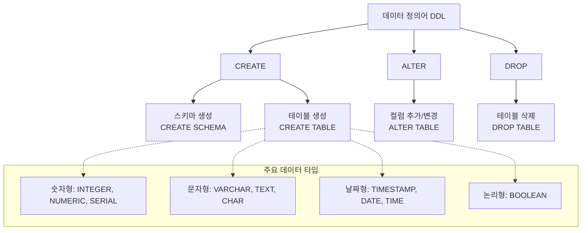

# 2강: 데이터 타입과 DDL

## 개요 
본 강의에서는 PostgreSQL에서 제공하는 기본 데이터 타입(정수, 문자, 날짜, 논리형 등)의 특징을 이해하고, 스키마 및 테이블을 정의, 변경, 삭제하는 DDL(Data Definition Language)의 기본 및 고급 사용법을 익힙니다. 올바른 데이터 타입의 선택과 구조 설계는 데이터의 무결성을 유지하고 데이터베이스 성능을 최적화하는 핵심 요소입니다.



## 사용형식 / 메뉴얼 

**스키마(Schema) 생성 및 설정**
```sql
-- 스키마 생성
CREATE SCHEMA 스키마명;

-- 현재 세션의 스키마 검색 경로 설정
SET search_path TO 스키마명, public;
```

**테이블(Table) 생성 기본 기법**
```sql
CREATE TABLE 스키마명.테이블명 (
    컬럼명1 데이터타입 [제약조건],
    컬럼명2 데이터타입 [제약조건],
    ...
);
```

**테이블 구조 변경 (ALTER)**
```sql
-- 컬럼 추가
ALTER TABLE 테이블명 ADD COLUMN 컬럼명 데이터타입;

-- 컬럼 타입 변경 (형변환 필요시 USING 절 사용)
ALTER TABLE 테이블명 ALTER COLUMN 컬럼명 TYPE 새로운타입 USING 표헌식;

-- 컬럼 이름 변경
ALTER TABLE 테이블명 RENAME COLUMN 기존컬럼명 TO 새컬럼명;

-- 테이블 이름 변경
ALTER TABLE 기존테이블명 RENAME TO 새테이블명;
```

**데이터 및 테이블 삭제 (TRUNCATE / DROP)**
```sql
-- 테이블 내 모든 데이터 일괄 삭제 (구조는 유지하고 데이터만 초고속 삭제)
TRUNCATE TABLE 테이블명;

-- 테이블 구조 및 데이터 완전 삭제
DROP TABLE 테이블명 [CASCADE | RESTRICT];
```

## 샘플예제 5선 

[샘플 예제 1: 스키마 생성 및 검색 경로 지정]
- 업무 도메인별로 테이블을 분리 관리하기 위해 새로운 `hr` 스키마를 만들고 접속 세션의 `search_path`를 변경합니다.
```sql
CREATE SCHEMA hr;
SET search_path TO hr, public;
```

[샘플 예제 2: 부서(departments) 테이블 생성]
- `SERIAL` 자료형을 사용해 자동 증가하는 식별자(PK)를 만들고, 가장 기본적인 구조의 테이블을 정의합니다.
```sql
CREATE TABLE departments (
    dept_id SERIAL PRIMARY KEY,
    dept_name VARCHAR(100) NOT NULL,
    location TEXT
);
```

[샘플 예제 3: 직원(employees) 테이블 생성 및 다양한 타입 적용]
- 숫자형(`INTEGER`, `NUMERIC`), 문자형(`VARCHAR`, `TEXT`), 날짜형(`DATE`), 논리형(`BOOLEAN`) 타입을 적절히 조합해 테이블을 구성합니다.
```sql
CREATE TABLE employees (
    emp_id SERIAL PRIMARY KEY,
    emp_name VARCHAR(50) NOT NULL,
    hire_date DATE DEFAULT CURRENT_DATE,
    salary NUMERIC(15, 2),
    is_active BOOLEAN DEFAULT true,
    dept_id INTEGER REFERENCES departments(dept_id)
);
```

[샘플 예제 4: 테이블 컬럼 추가 및 타입 변경 (ALTER TABLE)]
- `employees` 테이블에 연락처 컬럼을 추가한 뒤, 요구사항 변경에 맞춰 데이터 길이를 제한하는 형식을 적용해봅니다.
```sql
ALTER TABLE employees ADD COLUMN phone_number TEXT;
ALTER TABLE employees ALTER COLUMN phone_number TYPE VARCHAR(20);
```

[샘플 예제 5: 테이블 데이터 삭제 및 완전 삭제 (TRUNCATE / DROP)]
- 데이터만 빠르게 비우는 방식과 테이블 객체 자체를 파기하는 방법을 구분하여 실행합니다.
```sql
TRUNCATE TABLE dummy_table;
DROP TABLE dummy_table;
```

*(상세한 쿼리와 추가 5가지 실전 예제는 `sample.sql` 파일을 확인해주세요.)*

## 주의사항 
- `VARCHAR(N)`과 `TEXT` 타입은 PostgreSQL 내부적으로 처리 방식이 거의 동일하므로 성능상 큰 차이가 없습니다. 무의미하게 글자수 제한을 하느라 `VARCHAR` 길이를 나중에 튜닝하는 작업을 피하기 위해, 일반적으로 길이 제약이 엄격한 데이터 외에는 `TEXT`를 사용하는 것이 실무에서 시스템 유지보수에 더 유리할 수 있습니다.
- `DROP TABLE ... CASCADE` 명령은 현재 테이블뿐만 아니라 이를 참조하는 뷰(View)나 외래키(FK) 등 의존 객체까지 연쇄 삭제합니다. 프로덕션 데이터베이스에서는 매우 위험하므로 항상 신중히 판단하고, 되도록 기본값인 `RESTRICT` 조건 상태에서 실행해야 합니다.
- 금전/화폐와 같이 정확한 계산이 요구되는 데이터는 부동소수점 오차가 발생할 수 있는 `FLOAT`이나 `REAL` 타입 대신 반드시 고정소수점 타입인 `NUMERIC(전체자리수, 소수자리수)`을 사용해야 합니다.

## 성능 최적화 방안
[테이블 크기 절감을 위한 타입 최적화 예제]
```sql
-- 비효율적인 CHAR 타입 대신 VARCHAR나 TEXT를 사용
-- 공간 낭비 방지 
CREATE TABLE optimized_users (
    id BIGSERIAL PRIMARY KEY,
    status BOOLEAN NOT NULL DEFAULT true,  -- 1바이트
    email VARCHAR(255) NOT NULL,           -- 가변 길이로 디스크/메모리 절약
    salary NUMERIC(15, 2) NOT NULL         -- 정확한 계산용 공간 최적화
);
```
- **성능 개선이 되는 이유**: PostgreSQL은 데이터를 페이지(Page, 8KB) 단위로 디스크에 저장합니다. 레코드 크기가 작고 패딩(비어있는 공백 바이트)이 배제될수록 한 페이지 안에 더 많은 정보가 들어가게 됩니다. 이는 데이터를 읽을 때 발생하는 디스크 I/O (블록 읽기) 횟수를 줄여주며, 메모리(Shared Buffers) 캐시 효율을 비약적으로 극대화합니다. `CHAR(100)`에 'abc'를 저장하면 무조건 공백으로 채워져서 남은 공간이 낭비되지만, `VARCHAR`나 `TEXT`는 실제 글자수+오버헤드 크기만 차지하여 I/O 비용과 공간을 크게 절감할 수 있습니다.
