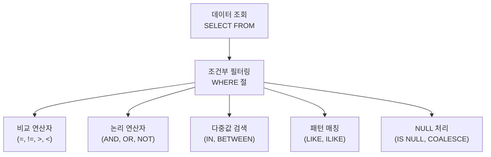

# 4강: 조건부 검색과 연산자

## 개요 
데이터베이스의 가장 핵심적인 역할은 저장된 방대한 데이터 속에서 **원하는 정보만 정확하게 추출하는 것**입니다. 본 강의에서는 데이터를 읽어오는 `SELECT` 구문의 기초와, 특정 조건을 만족하는 데이터로 필터링하는 `WHERE` 조건절, 그리고 실무에서 자주 쓰이는 다양한 연산자(비교, 논리, 패턴매칭, `NULL` 처리)에 대해 깊이 있게 다룹니다.



## 사용형식 / 메뉴얼 

**기본 데이터 조회 (SELECT ... FROM)**
```sql
SELECT 컬럼1, 컬럼2 
FROM 테이블명;

-- 전체 데이터 조회 (권장하지 않음)
SELECT * FROM 테이블명;
```

**조건부 필터링 (WHERE 절)**
```sql
SELECT 컬럼_목록 
FROM 테이블명 
WHERE 조건식;
```

**주요 연산자 목록**
- `A = B` : 두 값이 같음 (PG에서는 `==` 대신 `=` 사용)
- `A <> B` 또는 `A != B` : 두 값이 다름
- `A IN (X, Y, Z)` : A가 리스트 중 하나와 일치함
- `A BETWEEN X AND Y` : A가 X와 Y 사이에 있음 (경계값 포함)
- `A LIKE '패턴'` : 문자열이 패턴과 일치함 (`%`: 모든 문자, `_`: 한 글자)
- `A ILIKE '패턴'` : 대소문자 구분 없이 패턴 매칭 (PostgreSQL 특화)
- `A IS NULL` / `A IS NOT NULL` : 값이 비어있는지(`NULL`) 논리 비교

## 샘플예제 5선 

[샘플 예제 1: 다중값 포함 여부 검색 (IN)]
- 부서가 영업(Sales)이거나 엔지니어링(Engineering)인 직원 목록을 조회합니다.
```sql
SELECT emp_name, dept_name 
FROM employees 
WHERE dept_name IN ('Sales', 'Engineering');
```

[샘플 예제 2: 범위 검색 (BETWEEN)]
- 급여가 4000 이상 6000 이하인 직원들을 찾습니다.
```sql
SELECT emp_name, salary 
FROM employees 
WHERE salary BETWEEN 4000 AND 6000;
```

[샘플 예제 3: 문자열 패턴 매칭 (LIKE / ILIKE)]
- 이름이 'J'로 시작하는 직원(`LIKE`)과, 대소문자 상관없이 이름 중간에 'smith'가 들어가는 직원(`ILIKE`)을 검색합니다.
```sql
-- 대소문자 구분
SELECT emp_name FROM employees WHERE emp_name LIKE 'J%';

-- 대소문자 무시 (PostgreSQL 전용)
SELECT emp_name FROM employees WHERE emp_name ILIKE '%smith%';
```

[샘플 예제 4: 논리 연산자 복합 사용 (AND, OR)]
- 급여가 5000 이상이면서, 부서가 1번이거나 2번인 직원을 검색합니다. (우선순위를 위해 괄호 필히 사용)
```sql
SELECT emp_name, salary, dept_id
FROM employees 
WHERE salary >= 5000 
  AND (dept_id = 1 OR dept_id = 2);
```

[샘플 예제 5: NULL 데이터 검색 및 치환 처리 (IS NULL, COALESCE)]
- 연락처가 미기입된 직원을 검색하거나, 결과 출력 시 `NULL` 값을 대체 텍스트로 치환하여 보여줍니다.
```sql
-- 검색 조건으로 사용할 때
SELECT emp_name FROM employees WHERE phone_number IS NULL;

-- 데이터 조회 출력 시 대체값(COALESCE)
SELECT emp_name, COALESCE(phone_number, '미입력') as phone_num
FROM employees;
```

*(상세한 쿼리와 추가 실전 예제는 `sample.sql` 파일을 확인해주세요.)*

## 주의사항 
- **`NULL` 값의 비교 연산**: SQL에서 `NULL`은 '값이 없음' 혹은 '알 수 없는 값'을 의미합니다. 수학적으로 측정이 불가능하기 때문에, `WHERE email = NULL` 이나 `WHERE email != NULL` 처럼 동등 연산자(`=`, `!=`)를 사용하면 100% 아무 레코드도 나오지 않거나(False), 알수없음(Unknown)으로 처리되어 오작동합니다. **반드시 `IS NULL` 또는 `IS NOT NULL` 을 사용해야 합니다.**
- **`LIKE` 앞부분 와일드카드 성능 저하**: `LIKE '%키워드'` 처럼 검색어 앞에 `%`가 들어가면, 기존에 생성된 일반적인 B-Tree 인덱스를 타지 못하고 테이블 전체를 스캔(Full Scan)하기 때문에 대용량 시스템에서는 심각한 성능 지연을 초래할 수 있습니다.
- 복합 AND, OR 쿼리를 짤 때는, 본인이 의도하는 필터링 우선순위가 헷갈리지 않도록 위 4번 예제처럼 반드시 괄호`()`를 통해 논리 연산의 묶음을 명시해 주는 것이 버그를 예방하는 지름길입니다.

## 성능 최적화 방안
[효율적인 범위 검색 연산 작성]
```sql
-- 1. 비효율적인 함수 변형 방식 (인덱스 못탐)
SELECT * FROM orders 
WHERE TO_CHAR(order_date, 'YYYY-MM') = '2023-10';

-- 2. 최적화된 올바른 스캔 방식 (인덱스 탐색 가능)
SELECT * FROM orders 
WHERE order_date >= '2023-10-01'
  AND order_date < '2023-11-01'; 
```
- **성능 개선이 되는 이유**: `WHERE` 절에서 조회할 컬럼 자체를 함수(예: `TO_CHAR`)로 씌워 가공해버리면 해당 컬럼에 걸려있던 원본 인덱스를 전혀 사용할 수 없는 '인덱스 숨김' 또는 '함수 종속' 현상이 발생합니다. 함수 변환 없이 **원시 컬럼은 그대로 둔 채, 비교하는 우측 피연산자 상수값 쪽의 범위를 명확히 잡아주는 것**이 데이터베이스 엔진이 인덱스 트리를 고속으로 탐색(Index Range Scan)할 수 있도록 돕는 SQL 작성의 기본 공식입니다.
