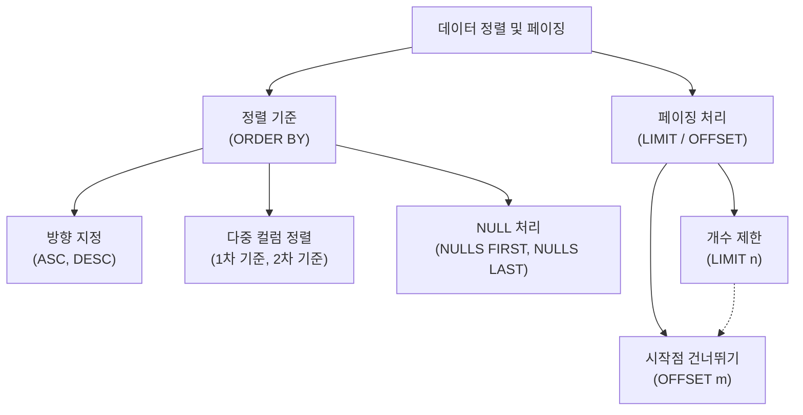

# 5강: 데이터 정렬과 페이징

## 개요 
수백, 수천만 건의 데이터를 가진 테이블에서 사용자가 원하는 정보를 보기 좋게 정렬해서 보여주고, 한 번에 볼 수 있는 만큼 잘라서(페이징) 전달하는 것은 웹 서비스나 애플리케이션 개발에서 필수적인 요소입니다. 본 강의에서는 데이터를 특정 기준에 따라 정렬하는 `ORDER BY` 절과, 조회할 데이터의 개수와 시작 지점을 제어하는 `LIMIT` 및 `OFFSET` 구문을 학습하여 실무 페이징 처리 기법을 익힙니다.



## 사용형식 / 메뉴얼 

**데이터 정렬 (ORDER BY)**
```sql
-- 단일 컬럼 정렬 (기본값은 ASC 오름차순)
SELECT 컬럼명 FROM 테이블명 
ORDER BY 컬럼명 [ASC | DESC];

-- 다중 컬럼 정렬 (첫 번째 기준으로 먼저 정렬 후, 동일한 값들 안에서 두 번째 기준 정렬)
SELECT 컬럼명 FROM 테이블명 
ORDER BY 기준컬럼1 [ASC | DESC], 기준컬럼2 [ASC | DESC];

-- NULL 데이터 위치 강제 지정
SELECT 컬럼명 FROM 테이블명 
ORDER BY 컬럼명 DESC [NULLS FIRST | NULLS LAST];
```

**데이터 페이징 (LIMIT & OFFSET)**
```sql
-- 가져올 Row의 개수를 10개로 제한
SELECT 컬럼명 FROM 테이블명 LIMIT 10;

-- 처음 20개를 건너뛰고, 그 다음부터 10개를 가져옴 (게시판 3페이지 로드)
SELECT 컬럼명 FROM 테이블명 LIMIT 10 OFFSET 20;

-- (표준 SQL 호환 구문) 위 OFFSET 절과 동일한 동작
SELECT 컬럼명 FROM 테이블명 
OFFSET 20 ROWS FETCH FIRST 10 ROWS ONLY;
```

## 샘플예제 5선 

[샘플 예제 1: 단순 오름차순, 내림차순 정렬]
- 직원들을 급여가 높은 순서(내림차순, `DESC`)로 정렬하여 가장 돈을 많이 받는 사람부터 보여줍니다.
```sql
SELECT emp_name, salary 
FROM employees 
ORDER BY salary DESC;
```

[샘플 예제 2: 여러 조건을 혼합한 다중 컬럼 정렬]
- 먼저 소속 부서(`dept_id`) 번호 순으로 오름차순 정렬하고, 같은 부서 내에서는 입사일(`hire_date`)이 오래된 사람(오름차순, 빠른 날짜)부터 정렬합니다.
```sql
SELECT emp_name, dept_id, hire_date 
FROM employees 
ORDER BY dept_id ASC, hire_date ASC;
```

[샘플 예제 3: NULL 데이터 정렬 위치 조정]
- 보너스나 이메일 등 아직 입력되지 않은 상태인 `NULL` 값을 가진 레코드를 가장 마지막(`NULLS LAST`)에 배치시켜 조회합니다.
```sql
SELECT emp_name, email 
FROM employees 
ORDER BY email DESC NULLS LAST;
```

[샘플 예제 4: Top-N 쿼리 (제한된 데이터 가져오기)]
- 모든 직원 중 급여를 가장 많이 받는 상위 3명만 추출합니다. (반드시 `ORDER BY` 가 먼저 수행되어야 합니다.)
```sql
SELECT emp_name, salary 
FROM employees 
ORDER BY salary DESC 
LIMIT 3;
```

[샘플 예제 5: 게시판 형태의 페이징 처리]
- 한 페이지당 10개씩 보여준다고 가정할 때, 2페이지(11번째 데이터부터)의 정보를 가져옵니다. `OFFSET` 은 '건너뛸 개수'이므로 `1페이지 = OFFSET 0`, `2페이지 = OFFSET 10`이 됩니다.
```sql
SELECT emp_name, hire_date 
FROM employees 
ORDER BY hire_date DESC 
LIMIT 10 OFFSET 10;
```

*(상세한 쿼리와 추가 실전 예제는 `sample.sql` 파일을 확인해주세요.)*

## 주의사항 
- `LIMIT` 나 `OFFSET` 연산을 수행할 때, 짝을 이루는 **`ORDER BY` 절이 없으면 출력할 때마다 순서가 미세하게 뒤바뀌어 중복된 데이터가 나오거나 누락되는 현상**이 발생합니다. 이는 RDBMS가 내부적으로 디스크의 어느 블록을 먼저 스캔하느냐에 따라 반환 순서가 매번 달라지기 때문입니다. **반드시 명확한 정렬 기준선(`ORDER BY`)을 세운 뒤 자르는 습관을 들이세요.**
- `OFFSET` 수치가 엄청나게 커질수록 (예: 게시판의 수백, 수천 번째 페이지 클릭) 데이터베이스는 앞쪽의 불필요한 데이터를 모두 읽고 난 뒤에야 무시(Skip)하기 때문에 시스템에 엄청난 부하와 느린 지연(Latency)이 동반됩니다. 데이터가 방대하다면 아래 성능 최적화 방안에 기술될 '커서 기반 페이지네이션' 기법으로 마이그레이션을 고민해야 합니다.

## 성능 최적화 방안
[오프셋(OFFSET) 부하를 해결하는 커서 기반 페이징 (Cursor-based / Keyset Pagination)]
```sql
-- 1. 느린 기존 O(N) 방식 (게시판의 1,000번째 페이지 조회)
-- DB는 앞의 10,000건을 다 읽어서 쳐내고 10건만 돌려줌 -> 매우 느림
SELECT emp_name, salary FROM employees 
ORDER BY emp_id DESC 
LIMIT 10 OFFSET 10000;

-- 2. 혁신적으로 빠른 O(1) 방식 (No Offset 기반 방식)
-- 이전 페이지의 마지막 emp_id (예: 15423) 를 앱에서 저장해 뒀다가 그걸 조건으로 바로 잘라버림 
SELECT emp_name, salary FROM employees 
WHERE emp_id < 15423
ORDER BY emp_id DESC 
LIMIT 10;
```
- **성능 개선이 되는 이유**: 거대한 `OFFSET M` 은 치명적인 성능 저하의 주범입니다. 100만 건 중 90만 번째를 보려면 90만 건을 다 훑고 지나가야 하기 때문입니다. 그러나 이전 페이지에서 보았던 가장 마지막 로우의 식별자 값(예방하고자 하는 PK)을 백엔드가 인지하여 `WHERE` 절 조건으로 넘겨주면, 데이터베이스는 B-Tree 인덱스를 통해 해당 식별자 지점으로 직접 수직 다이빙(Index Lookup) 을 한 뒤, 그 직후 데이터부터 `LIMIT` 개수 만큼만 스캔하고 바로 끝납니다. 이 방법을 흔히 **무한 스크롤(Infinite Scroll)** UI나 대용량 시스템의 페이징 쿼리에서 필수 스킬로 사용합니다.
