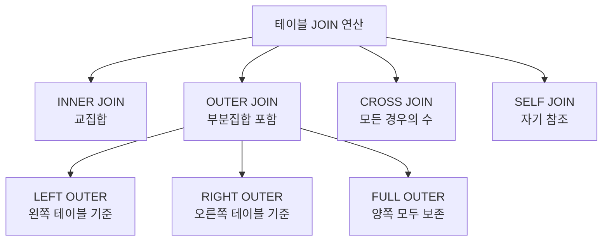

# 6강: 다중 테이블 연결 (JOIN)

## 개요 
관계형 데이터베이스(RDBMS)의 꽃이라 불리는 **JOIN(조인)**은 두 개 이상의 파편화된 테이블에 나누어져 있는 데이터를 공통된 컬럼(일반적으로 Primary Key와 Foreign Key)을 기준으로 연결하여 하나의 결과 테이블로 병합하는 강력한 기능입니다. 본 강의에서는 다양한 JOIN의 종류(내부, 외부, 완전, 교차 조인 등) 동작 원리와 데이터 분석 시 활용법을 마스터합니다.



## 사용형식 / 메뉴얼 

**INNER JOIN (교집합: 양쪽 테이블에 공통으로 존재하는 데이터만 조회)**
```sql
SELECT A.컬럼, B.컬럼 
FROM 테이블A AS A
INNER JOIN 테이블B AS B ON A.공통컬럼 = B.공통컬럼;
-- (INNER는 생략 가능하여 JOIN 으로만 써도 내부 조인이 됩니다)
```

**LEFT OUTER JOIN (왼쪽 기준집합: 왼쪽 테이블의 데이터는 100% 살리고, 매칭되는 오른쪽 테이블 값 가져오기)**
```sql
SELECT A.컬럼, B.컬럼 
FROM 테이블A AS A
LEFT JOIN 테이블B AS B ON A.공통컬럼 = B.공통컬럼;
-- 매칭되는 데이터가 없다면 B.컬럼에는 전부 NULL 이 채워집니다.
```

**RIGHT / FULL OUTER JOIN (오른쪽 및 합집합)**
```sql
-- 오른쪽 중심 조인 (실무에서는 LEFT 를 뒤집어서 자주 표현하기에 사용 빈도 낮음)
SELECT * FROM 테이블A RIGHT JOIN 테이블B ON 조건;

-- 양쪽 테이블의 모든 데이터를 보존, 짝이 없으면 양쪽 다 NULL 처리 (합집합)
SELECT * FROM 테이블A FULL OUTER JOIN 테이블B ON 조건;
```

**CROSS JOIN (카테시안 곱: A테이블 M건 * B테이블 N건 = 총 M*N 건 생성)**
```sql
SELECT * FROM 테이블A CROSS JOIN 테이블B;
```

## 샘플예제 5선 

[샘플 예제 1: 기준키 연결 (INNER JOIN)]
- 사원 테이블(`employees`)과 부서 테이블(`departments`)을 병합하여, 각 직원이 어느 부서에서 일하는지 소속 부서명(`dept_name`)을 정확히 출력합니다.
```sql
SELECT e.emp_id, e.emp_name, d.dept_name
FROM employees AS e
INNER JOIN departments AS d ON e.dept_id = d.dept_id;
```

[샘플 예제 2: 미배치 사원까지 전부 가져오기 (LEFT OUTER JOIN)]
- 부서를 아직 배정받지 않은 신입 사원(dept_id가 NULL인 직원)의 정보도 누락되지 않고 모두 화면에 나오도록 `employees` 테이블을 기준으로 왼쪽 조인합니다.
```sql
SELECT e.emp_name, COALESCE(d.dept_name, '미배정') AS dept_info
FROM employees AS e
LEFT JOIN departments AS d ON e.dept_id = d.dept_id;
```

[샘플 예제 3: 짝이 없는 유령 데이터 찾기 (LEFT JOIN 응용)]
- 사원은 1명도 속해있지 않은, 즉 개설만 되어 있는 비어있는 깡통 부서를 찾아냅니다. (우측 값이 NULL인 행만 필터링)
```sql
SELECT d.dept_name 
FROM departments AS d
LEFT JOIN employees AS e ON d.dept_id = e.dept_id
WHERE e.emp_id IS NULL;
```

[샘플 예제 4: 두 테이블의 교차 시나리오 도출 (CROSS JOIN)]
- 부서 목록(3건)과 직급 목록(3건)이 있을 때, 생성 가능한 '부서-직급' 포지션의 모든 경우의 수(3*3=9건) 테이블을 그립니다.
```sql
SELECT d.dept_name, p.position_name 
FROM departments AS d
CROSS JOIN job_positions AS p;
```

[샘플 예제 5: 자신을 재귀적으로 바라보기 (SELF JOIN)]
- 직원의 상사(`manager_id`)가 같은 `employees` 테이블 내에 있을 때, 직원 이름과 그의 직속 상사 이름을 나란히 출력합니다. (테이블에 각각 `emp`, `mgr` 등의 별칭 필수)
```sql
SELECT emp.emp_name AS 직원명, 
       mgr.emp_name AS 담당매니저명
FROM employees AS emp
LEFT JOIN employees AS mgr ON emp.manager_id = mgr.emp_id;
```

*(상세한 쿼리와 임시 데이터 기반의 추가 5가지 실전 예제는 `sample.sql` 파일을 확인해주세요.)*

## 주의사항 
- **단일 테이블의 `COUNT` 증가 (뻥튀기 현상)**: 테이블 간의 관계가 `1:N` 인데, 조인 기준이 잘못 잡히게 되면 `1` 쪽 테이블의 결과 데이터가 `N` 개 수만큼 중복 생성되는 이른바 '데이터 뻥튀기(Cartesian explosion)' 현상이 발생합니다. 이런 경우엔 공통 키(JOIN 조건)가 유일성을 충분히 보장하는지를 반드시 검증해야하며 `DISTINCT`나 `GROUP BY`가 필요할 수 있습니다.
- `ON` 절의 조건과 `WHERE` 절의 조건은 실행 순서와 필터링 원리가 완벽히 다릅니다. 기준 테이블의 데이터를 살리기 위한 `LEFT JOIN`에서 매칭되는 자식 데이터의 제한은 `ON` 절에 작성하고, 조인 완료 후 불필요한 전체 결과 집합의 행 삭제는 `WHERE` 절에 작성해야 함을 구분해야 합니다.

## 성능 최적화 방안
[조인 실행 계획 컨트롤에 따른 성능 최적화 (Nested Loop vs Hash Join)]
```sql
-- 두 테이블 모두 적절한 인덱스를 갖고 소량의 데이터만 조인할 때 (매우 빠름, NL Join)
SELECT * FROM users u 
INNER JOIN orders o ON u.user_id = o.user_id 
WHERE u.status = 'ACTIVE';

-- 대용량 테이블끼리 조건 없이 전체 통계 조인을 돌려버릴 때
-- PostgreSQL 엔진은 인덱스를 포기하고 Hash Join 이나 Merge Join 을 선택
SELECT * FROM logs l 
INNER JOIN users u ON l.user_id = u.user_id; 
```
- **성능 개선이 되는 이유**: PostgreSQL 은 조인 시 내부적으로 최적자(Optimizer)가 3가지의 조인 알고리즘(Nested Loop / Hash / Merge) 중 가장 비용(Cost)이 저렴한 것을 골라 돌립니다. 보통 드라이빙(먼저 읽는) 테이블의 `WHERE` 조건으로 데이터 모수를 수 십~수 백건으로 크게 줄여주고(Filter), 줄여진 ID를 가지고 조인 당하는(Driven) 테이블의 `PK` 나 외래키 **인덱스를 찔러서 고속으로 가져오는 Nested Loop Join 형태**로 유도하는 것이 OLTP (웹, 앱 서비스) 환경의 쿼리 튜닝 기본이자 핵심입니다.
