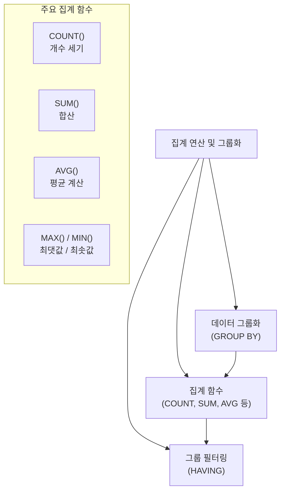

# 7강: 집계 함수와 데이터 그룹화

## 개요 
데이터의 단순 조회를 넘어서, 특정 기준(예: 부서별, 연도별, 직급별 등)으로 데이터를 묶어(Grouping) 합계, 평균, 개수 등의 통계치를 뽑아내는 것은 데이터 분석의 기본입니다. 본 강의에서는 PostgreSQL이 제공하는 강력한 내장 집계 함수(Aggregate Functions)의 종류와 활용, 그리고 데이터를 묶는 `GROUP BY` 구문과 그룹화된 결과에 필터를 거는 `HAVING` 절에 대해 학습합니다.



## 사용형식 / 메뉴얼 

**기본 집계 함수 사용 (전체 테이블 단위 통계)**
```sql
SELECT 
    COUNT(*) AS 전체인원수,
    SUM(salary) AS 연봉총액,
    AVG(salary) AS 연봉평균,
    MAX(salary) AS 최고연봉
FROM 테이블명;
```

**데이터 그룹화 (GROUP BY)**
특정 컬럼의 같은 값들끼리 묶어서 집계를 수행합니다.
```sql
SELECT 분류컬럼, SUM(측정컬럼)
FROM 테이블명
GROUP BY 분류컬럼;
-- 일반 조회 컬럼(분류컬럼) 들은 모두 반드시 GROUP BY 구문에 선언되어야 에러가 나지 않습니다.
```

**그룹화된 데이터 필터링 제어 (HAVING)**
`WHERE` 절이 집계 전 원본 데이터를 거르는 역할이라면, `HAVING` 절은 집계 산출이 끝난 결과 데이터를 필터링합니다. 
```sql
SELECT 부서명, SUM(연봉) 
FROM 직원테이블
GROUP BY 부서명
HAVING SUM(연봉) > 50000;  -- 총 연봉 5만 초과인 부서만 출력
```

## 샘플예제 5선 

[샘플 예제 1: 전체 데이터 대상 기본 집계]
- 사원 테이블(`employees`)에 있는 전체 인원수, 급여 합계, 가장 높은 급여와 최저 급여를 구합니다.
```sql
SELECT COUNT(*) AS total_employees,
       SUM(salary) AS total_salary,
       MAX(salary) AS max_salary,
       MIN(salary) AS min_salary
FROM employees;
```

[샘플 예제 2: 부서별 인원 및 급여 평균 구하기 (GROUP BY)]
- 각 부서 ID별로 직원이 몇 명인지 세고, 해당 부서 급여의 평균값(`AVG`)을 소수점 둘째 자리까지 반올림(`ROUND`)하여 확인합니다.
```sql
SELECT dept_id, 
       COUNT(*) AS cur_emp_count,
       ROUND(AVG(salary), 2) AS avg_salary
FROM employees
GROUP BY dept_id
ORDER BY dept_id;
```

[샘플 예제 3: 여러 기준으로 묶기 (다중 GROUP BY)]
- 여러 개의 카테고리(예: 부서와 일자)로 상세하게 묶어 집계합니다.
```sql
SELECT dept_id, hire_date, COUNT(*) AS hire_count
FROM employees
GROUP BY dept_id, hire_date
ORDER BY dept_id, hire_date;
```

[샘플 예제 4: 그룹화 후 통계치에 대한 조건 필터 필터링 (HAVING)]
- 부서별 총 급여 산출을 끝낸 이후, 총 급여가 10,000 을 넘어서는 알짜 부서만 추출합니다. (이때 `WHERE` 를 쓰면 문법 에러가 발생합니다.)
```sql
SELECT dept_id, SUM(salary) AS total_salary
FROM employees
GROUP BY dept_id
HAVING SUM(salary) > 10000;
```

[샘플 예제 5: WHERE 와 HAVING의 결합]
- 입사일이 2021년 이후인 최신 사원들만을 대상(`WHERE`)으로, 부서별 급여 합을 구한(`GROUP BY`) 뒤, 그 급여 합이 5000 초과인 부서만(`HAVING`) 찾습니다. 
```sql
SELECT dept_id, SUM(salary) AS sub_salary
FROM employees
WHERE hire_date >= '2021-01-01'
GROUP BY dept_id
HAVING SUM(salary) > 5000;
```

*(상세한 쿼리와 추가 실전 예제는 `sample.sql` 파일을 확인해주세요.)*

## 주의사항 
- **`COUNT(*)` 과 `COUNT(컬럼명)` 의 차이**: `COUNT(*)` 는 해당하는 조건의 모든 행(Row) 자체의 건수를 그대로 셉니다. 하지만 `COUNT(salary)` 와 같이 컬럼명을 기재하면, 그 컬럼의 데이터가 **`NULL` 인 행은 계산에서 제외(무시)** 됩니다. 이 특징을 잘못 이해하면 통계에 심각한 오류가 생길 수 있습니다.
- **GROUP BY 작성 규칙 (가장 흔한 에러)**: `SELECT` 로 출력하겠다는 컬럼 목록 중에 집계함수(SUM, AVG 등)로 감싸져있지 않은 '일반 컬럼'이 있다면, 그 데이터는 무조건 `GROUP BY` 구문에 모두 포함되어야만 올바른 문법으로 인식됩니다. 부서별 묶음 결과를 뽑는데 이름을 출력하려다 나는 에러가 대표적입니다.
- 집계 연산을 수행하는 쿼리는 디스크 I/O와 메모리 연산 비용이 굉장히 높기 때문에, 대용량 트랜잭션 도중 자주 돌리게 되면 서비스가 다운될 우려가 높습니다. 

## 성능 최적화 방안
[대형 집계 쿼리의 속도 개선 - 부분 구체화 뷰 연동 (Materialized View)]
```sql
-- 매번 주문 1,000만건 테이블을 뒤져서 연도별 합을 런타임에 계산하는 방식 (무겁고 느림)
SELECT EXTRACT(YEAR FROM order_date) AS yr, SUM(amount) 
FROM massive_orders 
GROUP BY EXTRACT(YEAR FROM order_date);

-- 해결책: 미리 계산해 두는 '구체화된 뷰' 테이블 형태에 미리 집계 결과를 캐싱하고
-- 야간 배치 스케줄러 등을 통해 하루에 한번만 갱신(REFRESH) 하도록 설계합니다.
CREATE MATERIALIZED VIEW monthly_sales_summary AS
SELECT DATE_TRUNC('month', order_date) AS order_month, SUM(amount) AS total_amt
FROM massive_orders
GROUP BY 1;

-- 조회는 이미 계산해둔 테이블을 가볍게 SELECT 만 하면 됨
SELECT * FROM monthly_sales_summary;
```
- **성능 개선이 되는 이유**: `GROUP BY` 연산은 본질적으로 엄청난 데이터를 메모리에 꺼내어 정렬(Sort)하고 병합(Hash Aggregate)하는 무거운 물리적 비용을 소모합니다. 실시간으로 자주 쓰이는 거대한 OLAP(분석형 집계) 쿼리가 화면단 요청에서 반복될 경우, `Materialized View` (구체화된 뷰) 라는 기능을 써서 집계 결과를 디스크 물리 파일로 '미리 찍어(저장해)' 놓고 애플리케이션에서는 구체화 뷰를 쏜살같이(1ms 미만) 셀렉트하는 방식이 대규모 데이터 환경 아키텍처의 필수 정석입니다.
