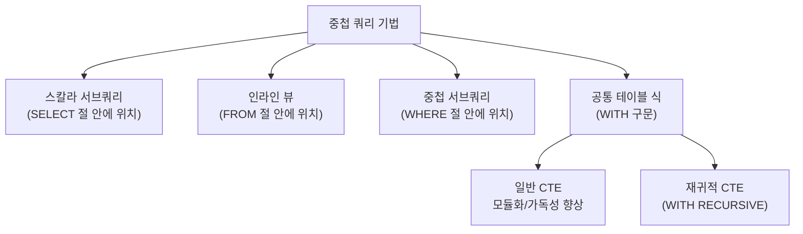

# 8강: 서브쿼리와 공통 테이블 식

## 개요 
단일 쿼리만으로는 표현하기 힘든 복잡한 로직을 처리할 때, 쿼리 안에 또 다른 쿼리를 중첩시켜 사용하는 **서브쿼리(Subquery)** 와, 코드를 직관적으로 모듈화하고 재사용성을 획기적으로 높여주는 **공통 테이블 식(CTE, Common Table Expression)** 에 대해 알아봅니다.



## 사용형식 / 메뉴얼 

**1. 스칼라 서브쿼리 (Scalar Subquery)**
`SELECT` 절 내부에서 사용되며, **반드시 단 하나의 열(Column)과 행(Row)만 반환**해야 합니다. (단일값 리턴)
```sql
SELECT 컬럼명, 
       (SELECT 집계함수(컬럼) FROM 메인테이블과_연관된테이블) AS 서브결과
FROM 메인테이블;
```

**2. 인라인 뷰 (Inline View)**
`FROM` 절 내부에서 마치 테이블처럼 사용되는 서브쿼리입니다.
```sql
SELECT A.컬럼1, B.통계
FROM 메인테이블 A
JOIN (SELECT 그룹키, 집계함수() AS 통계 FROM 테이블 GROUP BY 그룹키) B
  ON A.매칭키 = B.그룹키;
```

**3. 중첩 서브쿼리 (Nested Subquery)**
`WHERE` 조건절에서 단일행 비교(=, >) 또는 다중행 비교(IN, EXISTS, ANY, ALL) 필터링에 사용됩니다.
```sql
SELECT 컬럼명 
FROM 테이블 
WHERE 컬럼 IN (SELECT 특정컬럼 FROM 다른테이블 WHERE 조건);
```

**4. 공통 테이블 식 (CTE - WITH 절)**
복잡한 서브쿼리를 메인 쿼리 위쪽으로 빼내어 임시 테이블처럼 이름을 붙히고, 본문에서는 이를 깔끔하게 재사용하는 문법입니다.
```sql
WITH 임시테이블명 AS (
    SELECT 컬럼 FROM 테이블 WHERE 복잡한조건
)
SELECT * FROM 메인테이블 M JOIN 임시테이블명 CTE ON M.키 = CTE.키;
```

## 샘플예제 5선 

[샘플 예제 1: 스칼라 서브쿼리로 부서의 평균 급여와 현재 내 급여 비교]
- 내가 속한 부서의 평균 연봉 데이터를 메인 테이블의 각 줄마다 매핑해옵니다. (상관 서브쿼리 형태)
```sql
SELECT emp_name, salary,
       (SELECT ROUND(AVG(salary),0) 
        FROM employees sub 
        WHERE sub.dept_id = main.dept_id) AS cur_dept_avg
FROM employees main;
```

[샘플 예제 2: 인라인 뷰를 이용한 Top N 추출 조인]
- `FROM` 절에서 부서별 최대 급여를 받는 사원의 통계 정보(임시 가상 테이블)를 먼저 뽑아내고 원본 테이블과 조인합니다.
```sql
SELECT e.emp_name, e.salary, e.dept_id
FROM employees e
INNER JOIN (
    SELECT dept_id, MAX(salary) AS max_sal
    FROM employees
    GROUP BY dept_id
) max_emp ON e.dept_id = max_emp.dept_id AND e.salary = max_emp.max_sal;
```

[샘플 예제 3: 대상 여부만 확인하는 EXISTS 필터링]
- 직원이 1명이라도 배치된 적이 있는 '실제 운영 중인 부서'만 `EXISTS` 구문으로 가져옵니다.
```sql
SELECT dept_name 
FROM departments d
WHERE EXISTS (
    SELECT 1 FROM employees e 
    WHERE e.dept_id = d.dept_id
);
```

[샘플 예제 4: WITH 절을 통한 메인 쿼리 단순화 (CTE)]
- 복잡하게 얽힌 부서별 평균 급여 계산 로직을 위쪽 `WITH dept_avg` 로 선언해 두고, 메인 `WHERE` 아래쪽 코드는 직관적으로 구성합니다.
```sql
WITH dept_avg AS (
    SELECT dept_id, AVG(salary) as average_sal
    FROM employees
    GROUP BY dept_id
)
SELECT e.emp_name, e.salary, b.average_sal 
FROM employees e
JOIN dept_avg b ON e.dept_id = b.dept_id
WHERE e.salary > b.average_sal; -- 부서 평균보다 돈을 더 많이 받는 직원 추출
```

[샘플 예제 5: 계층형 데이터를 푸는 재귀적 트리 구조 (WITH RECURSIVE)]
- 대표이사부터 일반 사원까지, 누가 누구의 부하직원인지(조직도 구조)를 파악하기 위해 스스로를 반복 호출하는 재귀 테이블(Recursive CTE)을 구축합니다.
```sql
WITH RECURSIVE org_chart AS (
    -- 기준점(Anchor): 최상위 관리자 (상사가 NULL인 사람)
    SELECT emp_id, emp_name, manager_id, 1 as level
    FROM employees WHERE manager_id IS NULL
    
    UNION ALL
    
    -- 재귀 단계(Recursive Step): 내 매니저 ID가 직전 임시테이블의 emp_id와 같은 부하직원 찾기
    SELECT e.emp_id, e.emp_name, e.manager_id, o.level + 1
    FROM employees e
    INNER JOIN org_chart o ON e.manager_id = o.emp_id
)
SELECT * FROM org_chart ORDER BY level, emp_id;
```

*(상세한 쿼리와 추가 실전 5선 예제는 `sample.sql` 파일을 확인해주세요.)*

## 주의사항 
- `스칼라 서브쿼리(SELECT 안의 서브쿼리)` 는 조회된 행의 건수만큼 즉, 10만 건이면 10만 번 루프를 도는 것과 같이 매번 반복 실행됩니다. 엄청난 부하를 유발하므로 대용량 데이터 환경에서는 가급적 `JOIN` 방식이나 `인라인 뷰`, `CTE` 형태로 성능을 튜닝하는 것이 좋습니다.
- `IN` 절 안의 서브쿼리는 요소가 극단적으로 많아질 경우 인덱스를 타지 못하고 속도가 기하급수적으로 버벅거리게 됩니다. 긍정(존재함) 조건일 경우 `EXISTS` 형태의 서브쿼리로 바꾸거나 아예 조인으로 교체하는 것을 고려해야 합니다.
- CTE(`WITH` 구문)은 코드 관점에서는 대단히 유용하지만, PostgreSQL 12 버전 이전에서는 항상 Materialization(메모리에 임시로 파일화함) 방식으로 동작하여 최적화기(Optimizer)가 바깥 조건을 뷰 안으로 밀어넣지 못하는 부작용이 있었습니다. 현대 버전에서는 해결되었지만, 맹목적으로 남발하면 인덱스 계획이 꼬일 수 있습니다.

## 성능 최적화 방안
[IN 서브쿼리와 EXISTS 구조의 차이점 및 개선]
```sql
-- 비효율적인 IN 서브쿼리 방식 (수 만개의 임시 테이블을 메모리에 올리고 필터 비교)
SELECT * FROM sales 
WHERE user_id IN (SELECT user_id FROM blacklists);

-- 최적화된 EXISTS 방식 (데이터가 1건이라도 일치하는 즉시 스캔 패스 = Semi-Join 동작)
SELECT * FROM sales s
WHERE EXISTS (
    SELECT 1 FROM blacklists b 
    WHERE b.user_id = s.user_id
);
```
- **성능 개선이 되는 이유**: `IN` 안에 걸어둔 서브쿼리는 서브쿼리 안의 데이터를 모조리 뒤져 내부적으로 커다란 리스트 집합 가상 테이블을 메모리에 만듭니다. 반면 `EXISTS` 를 통한 상관 서브쿼리는 메인 데이터의 `user_id`를 건네받아 블랙리스트 테이블을 인덱스로 딱 한번 찔러보고, 그 값이 있다고 판별되면 단 1건만 읽은 직후 곧바로 `Boolean(True)` 평가를 내리고 탐색을 조기 종료합니다. 특히 부정형인 `NOT EXISTS` 의 경우 `NOT IN` 과 비교할 수 없을 정도로 월등한 성능 향상을 이뤄냅니다.
