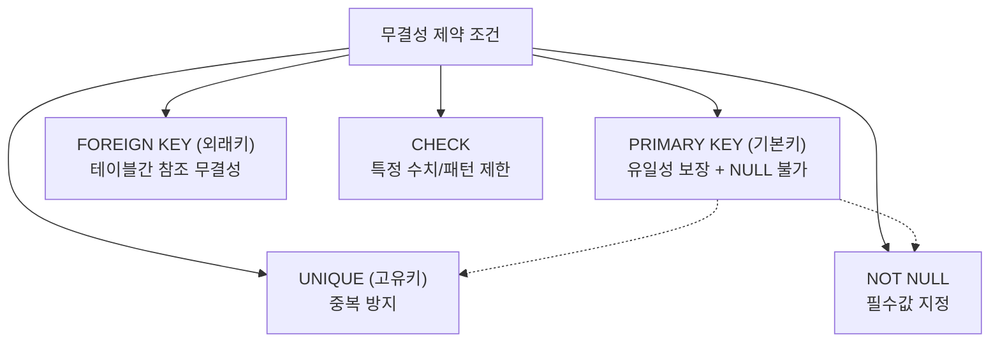

# 9강: 무결성과 제약 조건

## 개요 
데이터베이스에 들어오는 데이터가 규칙에 어긋나는 등 논리적으로 오염되는 것을 막아주는 방어 시스템인 **제약 조건(Constraints)** 에 대해 학습합니다. 결함이 있는 쓰레기 데이터가 들어오지 못하게 사전에 차단함으로써, 데이터의 무결성(Data Integrity)과 신뢰성을 데이터베이스 자체 엔진 레벨에서 보장합니다.



## 사용형식 / 메뉴얼 

**1. 제약 조건의 종류와 역할**
- `PRIMARY KEY` (기본키): 행을 유일하게 식별합니다. (테이블당 1개만 지정 권장, 내부적으로 `UNIQUE` + `NOT NULL` 결합)
- `FOREIGN KEY` (외래키): 다른 테이블의 `PRIMARY KEY` (또는 `UNIQUE` 키)를 참조하여, 존재하지 않는 부모 데이터가 들어오는 것을 막습니다.
- `UNIQUE` (고유): 해당 컬럼에 중복된 값이 들어오는 것을 방지하지만, `PRIMARY KEY` 와 달리 `NULL` 값은 여러 개 허용합니다.
- `NOT NULL` (필수값): 데이터셋에 `NULL` (빈 값)이 들어오지 못하게 강제합니다.
- `CHECK` (체크): 해당 데이터가 주어진 조건식(예: 양수, 특정 도메인 값)을 만족하는지만 검사합니다.

**2. 테이블 생성 시 제약 조건 부여**
```sql
CREATE TABLE users (
    user_id SERIAL PRIMARY KEY,                     -- 기본키 선언
    username VARCHAR(50) UNIQUE NOT NULL,           -- 고유값이며 필수 등록
    age INT CHECK (age >= 18),                      -- 성인(18세 이상)인지 체크
    department_id INT REFERENCES departments(id)    -- 외래키(조직테이블_id) 참조
);
```

**3. 기존 테이블에 제약 조건 추가 및 수정 (ALTER)**
```sql
-- 제약조건 이름(constraint_name)을 붙여서 추가 (권장 방법 - 삭제 관리에 용이)
ALTER TABLE users ADD CONSTRAINT chk_age CHECK (age >= 0);

-- 고유 제약조건 부여
ALTER TABLE users ADD CONSTRAINT uk_email UNIQUE (email);

-- 제약 조건 삭제
ALTER TABLE users DROP CONSTRAINT chk_age;
```

## 샘플예제 5선 

[샘플 예제 1: 복합 PRIMARY KEY 생성]
- 두 개 이상의 컬럼을 묶어서 단일 식별자로 취급하는 복합 기본키(Composite Primary Key) 형태입니다. (예: `주문번호` + `상품번호` = 유일한 주문상세 내역)
```sql
CREATE TABLE order_items (
    order_id INT,
    product_id INT,
    quantity INT,
    PRIMARY KEY (order_id, product_id)
);
```

[샘플 예제 2: 논리 오류를 막는 CHECK 제약 조건]
- 상품 가격(`price`)이 무조건 0원보다 커야 하며, 성별(`gender`)에는 지정된 규격('M', 'F') 기호 외에는 삽입 불가하도록 방어막을 설계합니다.
```sql
CREATE TABLE products (
    product_id SERIAL PRIMARY KEY,
    price NUMERIC(10,2) CHECK (price > 0),
    gender CHAR(1) CHECK (gender IN ('M', 'F'))
);
```

[샘플 예제 3: 기존의 일반 열을 필수(NOT NULL) 열로 변경]
- 기존에는 이메일 값이 없어도(`NULL`) 허락되었으나 정책이 변경되어 무조건 이메일을 수집해야 할 때 테이블을 수정(`ALTER`)합니다.
```sql
ALTER TABLE products 
ALTER COLUMN gender SET NOT NULL;
```

[샘플 예제 4: 외부 키(FOREIGN KEY) 삭제 작업 지정 (ON DELETE CASCADE)]
- 쇼핑몰에서 사용자가 탈퇴(부모 레코드 삭제)했을 때, 회원의 리뷰 등 딸려있는 파생 데이터(자식 레코드)를 DB가 직접 알아서 연쇄 삭제해주도록 옵션을 추가합니다.
```sql
CREATE TABLE user_reviews (
    review_id SERIAL PRIMARY KEY,
    user_id INT,
    content TEXT,
    CONSTRAINT fk_user 
      FOREIGN KEY (user_id) 
      REFERENCES users(user_id) ON DELETE CASCADE
);
```

[샘플 예제 5: 기본값을 부여해주는 열 (DEFAULT 제약)]
- 회원 가입 시간(`created_at`)을 애플리케이션에서 별도로 전송하지 않아도 테이블 자체적으로 오늘 현재 시간(`NOW()`)을 기록합니다.
```sql
CREATE TABLE member_logs (
    log_id INT PRIMARY KEY,
    created_at TIMESTAMP DEFAULT NOW()
);
```

*(상세한 쿼리와 추가 5선 실전 예제는 `sample.sql` 파일을 확인해주세요.)*

## 주의사항 
- `FOREIGN KEY` 를 설정하게 되면, 데이터를 삽입(INSERT) 하거나 삭제(DELETE) 할 때마다 데이터베이스 엔진이 매번 부모-자식 테이블간의 유효성 검증을 수행하므로 **상당한 INSERT 지연 시간(Overhead)** 이 발생할 수 있습니다. 그래서 극단적인 퍼포먼스와 엄청난 트래픽(대량의 로그성 데이터 등)이 오가는 이커머스 실무에서는 DB 외래키를 완전히 끊어버리고, 로직(JAVA 등 애플리케이션)으로 관계를 처리하는 모델링 기법도 흔히 사용됩니다.
- 제약 조건에 이름을 명시(`CONSTRAINT my_custom_name CHECK (...)`)하지 않고 설정해버리면 PostgreSQL이 알아서 난해한 랜덤 영문 이름표를 붙여버립니다. 훗날 관리를 위해 이 조건을 찾아 지우거나 비활성화하고 싶을 때(예: `ALTER TABLE DROP CONSTRAINT ...`) 고생할 수 있으므로, 제약 조건엔 항상 직관적인 이름을 할당하는 것이 좋은 습관입니다.

## 성능 최적화 방안
[대용량 테이블에서 무정지 제약 조건 추가 (NOT VALID)]
```sql
-- 1. 최악의 시나리오 (기존 수백만건 검증을 위해 전체 테이블이 락킹되어 시스템 장애)
ALTER TABLE transactions ADD CONSTRAINT chk_amount CHECK (amount > 0);

-- 2. 혁신적으로 무정지 안전 적용 방식 (NOT VALID)
-- 일단 미래의 데이터부터는 걸러내도록 틀만 올리고 기존 데이터 점검은 유보시킴 (수초 내로 적용)
ALTER TABLE transactions 
ADD CONSTRAINT chk_amount CHECK (amount > 0) NOT VALID;

-- 기존 데이터에 대한 검증은 사용자 트래픽이 적은 밤 시간에 시스템 Lock 없이 백그라운드에서 여유롭게 수행 
ALTER TABLE transactions VALIDATE CONSTRAINT chk_amount;
```
- **성능 개선이 되는 이유**: `ALTER TABLE` 로 유효성 체크 제약(`CHECK` 등)이나 외부키(`FOREIGN KEY`)를 기존 마이그레이션 도중에 욱여넣으면 데이터베이스는 삽입되어있는 **기존의 전체 모든 데이터를 하나하나 다 검사할 때까지 테이블에 거대한 락(Table Lock)** 을 씌워 놓습니다. 서비스 요청은 전부 무한 대기 타임아웃 오류를 일으키게 됩니다. 이때 `NOT VALID` 옵션을 던져주면, 방어막만 생성해서 신규 데이터부터는 막지만 예전 데이터는 나중에 검사하겠다고 유예시켜주기 때문에 무중단 라이브 배포/업데이트에 절대적인 스킬입니다.
