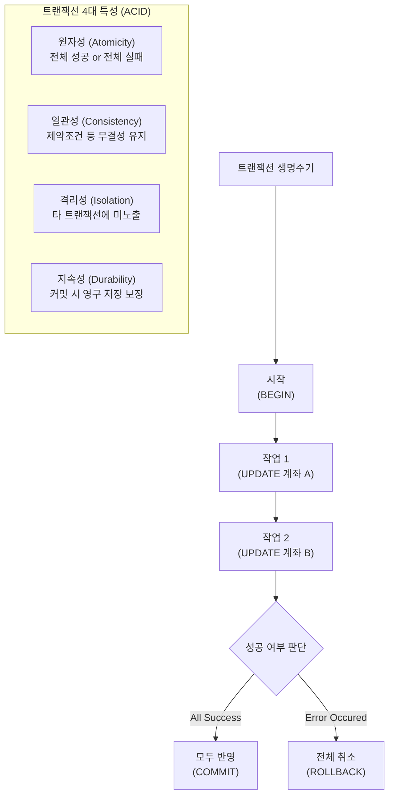

# 10강: 트랜잭션의 이해

## 개요 
수많은 사용자가 동시에 데이터를 쓰고 지우는 데이터베이스 환경에서, 논리적인 하나의 작업 단위를 완전히 성공시키거나(`COMMIT`), 도중에 실패하면 이전 상태로 완벽히 되돌리는(`ROLLBACK`) 제어 장치인 **트랜잭션(Transaction)** 에 대해 학습합니다. 데이터의 무결성을 지키는 근간이 되는 트랜잭션의 4가지 핵심 속성(ACID) 이론과 그 실무적 제어 방법을 마스터합니다.



## 사용형식 / 메뉴얼 

**1. 트랜잭션의 시작**
```sql
BEGIN;
-- 또는 표준 SQL
START TRANSACTION;
```

**2. 트랜잭션의 저장 (영구 반영)**
시작된 시점부터 이 명령어가 실행될 때까지 이뤄진 모든 삽입, 수정, 삭제(DML) 구문을 데이터베이스에 완벽하게 확정 지어 저장합니다.
```sql
COMMIT;
-- 또는
END;
```

**3. 트랜잭션의 취소 (되돌리기 / 원복)**
비즈니스 로직에 에러가 났거나 강제로 작업 내용을 취소하고 싶을 때, `BEGIN` 바로 전의 원본 상태로 데이터를 되감기(Undo)합니다.
```sql
ROLLBACK;
```

**4. 셰이브포인트(Savepoint) - 중간 저장 기능**
전체를 되돌리는 것이 아니라, 긴 트랜잭션 도중 특정 세이브포인트 시점까지만 부분 취소할 때 사용합니다.
```sql
SAVEPOINT 포인트명;      -- 특정 지점 메모리 저장
ROLLBACK TO 포인트명;    -- 해당 지점까지만 변경분 삭제
RELEASE SAVEPOINT 포인트명; -- 세이브포인트 제거
```

## 샘플예제 5선 

[샘플 예제 1: 모두 성공하여 데이터베이스에 반영 (COMMIT)]
- 회사 자금 `5,000`을 이체하기 위해, A부서의 예산 테이블에서 차감하고 즉시 B부서 예산을 증액시키는 일련의 세트 작업을 수행합니다.
```sql
BEGIN;

UPDATE budgets SET amount = amount - 5000 WHERE dept_id = 'A';
UPDATE budgets SET amount = amount + 5000 WHERE dept_id = 'B';

COMMIT; -- 양쪽 테이블 수정 반영 
```

[샘플 예제 2: 중간에 오류를 감지하여 원상 복원 (ROLLBACK)]
- 예산을 수정하던 중 실수로 B부서가 아닌 존재하지 않는 C부서로 데이터를 날렸음을 발견하고, 변경점 전체를 없던 일로 되돌립니다.
```sql
BEGIN;

UPDATE budgets SET amount = amount - 3000 WHERE dept_id = 'A';
-- (수동 검증이나 시스템 에러 발생 시)
ROLLBACK; -- A부서의 차감액 원위치 및 복구
```

[샘플 예제 3: 세이브포인트를 활용한 부분 취소 (SAVEPOINT)]
- 1번 직원을 삭제한 건 맞게 처리했으나, 이어서 2번 직원을 삭제하려다 잘못 지웠다는 걸 깨달았다면 2번 직원 내용(Savepoint 이후) 기능만 부분 롤백시킵니다.
```sql
BEGIN;

DELETE FROM employees WHERE emp_id = 1;

SAVEPOINT keep_emp1; -- 여기까진 맞음

DELETE FROM employees WHERE emp_id = 2; -- 아차 실수!

ROLLBACK TO keep_emp1; -- 제일 처음으로 가지 않고, 1번 지운 시점까지만 복구

COMMIT;
```

[샘플 예제 4: DDL 도 트랜잭션 롤백이 가능한 PostgreSQL의 강력함]
- Oracle 등 과거 DB들은 테이블 구조를 바꾸는 `ALTER`나 `DROP` 쿼리는 트랜잭션이 불가능하여 막무가내로 삭제(Auto-Commit)되었지만, PostgreSQL 엔진은 DDL 설계/변경마저도 원복(`ROLLBACK`)이 가능합니다.
```sql
BEGIN;
DROP TABLE critical_data_table; -- 심각한 실수!
ROLLBACK; -- 테이블 완전 복구!
```

[샘플 예제 5: 암시적(Implicit) 트랜잭션 (오토커밋)]
- `BEGIN` 을 선언하지 않고 쿼리를 한 줄 날리면, 모든 쿼리는 내부적으로 0.01초 단위의 가상 `BEGIN` ~ `COMMIT` 통에 감싸져 자동 반영됩니다. (Auto-commit = on)
```sql
-- BEGIN 없이 혼자 돌렸을 경우 (오토커밋 상태)
UPDATE users SET is_active = true WHERE user_id = 99;
-- 이미 커밋 처리되었으므로 ROLLBACK 불가
```

*(상세한 쿼리와 추가 실전 사례 5개는 `sample.sql` 파일을 확인해주세요.)*

## 주의사항 
- `BEGIN` 으로 트랜잭션(락, Lock) 문을 열어놓고 `COMMIT` 이나 `ROLLBACK` 을 통해 제때 종료(Release)시켜주지 않으면, 해당 테이블(혹은 Row)은 **무기한 대기(Deadlock Timeout)** 상태에 빠집니다. 화면 단이나 앱 단에서는 코드가 정지해서 프로그램 서버가 다운될 수 있으므로 트랜잭션 구문 처리는 신속하게 끝맺어야 합니다.
- PostgreSQL 내부에서 DML 도중 오류(예: 제약 조건 위배 에러 등)를 내뿜게 되면, 해당 트랜잭션 전체 블록은 강제로 **치명적 오류 모드(Aborted state)** 로 변경됩니다. 그 이후에 `SELECT`를 비롯한 어떠한 쿼리를 날려도 무조건 "current transaction is aborted" 오류가 뜨므로 반드시 명시적인 `ROLLBACK;` 을 치고 나서 새 작업을 수행해야 합니다.

## 성능 최적화 방안
[오토커밋 끄고 다량의 데이터 묶어치기(Batching)]
```sql
-- 1. 비효율 방식: 커넥션 및 트랜잭션 1,000번 개별 열고 닫기 수행 (느림)
INSERT INTO logs (val) VALUES (1);
INSERT INTO logs (val) VALUES (2);
-- ... (1,000번 반복)

-- 2. 최적화: BEGIN 으로 묶어서 다수의 데이터를 메모리에 한방에 밀어넣고 커밋 1번 통신 (엄청나게 빠름)
BEGIN;
INSERT INTO logs (val) VALUES (1);
INSERT INTO logs (val) VALUES (2);
-- ... (1,000번 반복)
COMMIT;
```
- **성능 개선이 되는 이유**: 매 `INSERT` 마다 데이터베이스는 트랜잭션 일관성을 기록(디스크의 트랜잭션 로그, WAL 저장 등)하는 무거운 I/O 동기화 작업을 거칩니다. 다수의 작업을 `BEGIN` 과 `COMMIT` 안으로 감싸버리면, 메모리 공유 버퍼에서 1,000건의 작업량을 다 들고 있다가 `COMMIT` 명령이 떨어질 때 단 1번만 디스크에 통신하여 확정(`fsync`) 시켜버립니다. 실무에서 대량 엑셀 다운로드나 로그 배치 적재(Bulk Insert) 시 I/O 병목을 해결하는 궁극의 튜닝 비기입니다.
