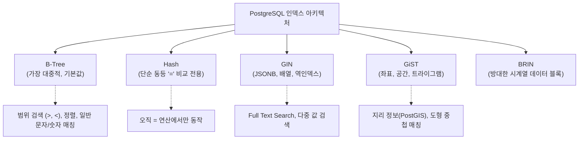

# 11강: 인덱스 아키텍처와 종류

## 개요 
수백만 건의 데이터를 풀 스캔(전체 탐색)하지 않고, 책의 색인(목차)처럼 원하는 데이터를 찾을 수 있는 지름길을 만들어주는 **인덱스(Index)** 에 대해 알아봅니다. 특히 PostgreSQL은 기본 데이터베이스들이 주로 제공하는 `B-Tree` 외에도, 다양한 자료형(JSON, 배열, 텍스트 검색 등)에 특화된 `GIN`, `GiST`, `Hash` 등의 풍부한 인덱스 아키텍처를 지원하는 것이 가장 큰 장점입니다. 본 강의에서는 각 인덱스의 특징과 상황에 맞는 올바른 선택 전략을 학습합니다.



## 사용형식 / 메뉴얼 

**1. 기본 인덱스 생성 및 삭제 (기본값 B-Tree)**
```sql
-- 단일 컬럼 인덱스 생성
CREATE INDEX 인덱스명 ON 테이블명 (컬럼명);

-- 다중 컬럼(결합) 인덱스 생성
CREATE INDEX 인덱스명 ON 테이블명 (컬럼1, 컬럼2);

-- 인덱스 삭제
DROP INDEX 인덱스명;
```

**2. 특정 아키텍처(타입) 명시하여 인덱스 생성**
```sql
CREATE INDEX 인덱스명 ON 테이블명 USING hash (컬럼명);
CREATE INDEX 인덱스명 ON 테이블명 USING gin (컬럼명);
CREATE INDEX 인덱스명 ON 테이블명 USING gist (컬럼명);
```

**3. 부분 인덱스 (Partial Index)**
특정 조건을 만족하는 쓸만한 데이터 영역만 색인화하여, 인덱스의 크기(디스크/메모리)를 혁신적으로 줄입니다.
```sql
CREATE INDEX 인덱스명 ON 테이블명 (컬럼명) WHERE (조건식);
```

## 샘플예제 5선 

[샘플 예제 1: 기본 B-Tree 인덱스 생성 및 활용]
- 이메일이나 가입일 등 `[정렬, 등호(=), 범위(BETWEEN)]` 검색이 잦은 곳에는 일반적인 B-Tree 인덱스를 겁니다.
```sql
-- 가입일 기준 조회/정렬을 위한 기본 인덱스
CREATE INDEX idx_users_created_at ON users (created_at);
```

[샘플 예제 2: 메모리를 아끼는 부분 인덱스 (Partial Index)]
- 휴면 계정이 아닌 실제 '활성 회원(status = ACTIVE)' 중 특정 부서원만 검색하는 경우가 많다면, 탈퇴 회원이나 휴면 회원을 뺀 알짜 데이터만 인덱싱합니다.
```sql
CREATE INDEX idx_active_users_dept 
ON users (dept_id) 
WHERE status = 'ACTIVE';
```

[샘플 예제 3: JSONB 데이터를 찢어서 탐색하는 GIN 인덱스]
- 부가 속성(Attributes)이 JSON 행태로 저장되어 있을 때, JSON 내부의 Key-Value를 단숨에 찔러보기 위해 특수 인덱스인 GIN 을 씁니다.
```sql
CREATE INDEX idx_products_attributes_gin 
ON products USING gin (attributes);
```

[샘플 예제 4: 대소문자 무시 검색(ILIKE)을 위한 함수형 인덱스]
- 컬럼 원본에는 인덱스가 걸려있지만, 검색을 `LOWER(email) = 'test@a.com'` 처럼 변형해서 하면 인덱스를 못 탑니다. 아예 변형된 스키마 자체를 인덱스로 구워버립니다.
```sql
CREATE INDEX idx_users_lower_email 
ON users (LOWER(email));
```

[샘플 예제 5: 무정지 인덱스 생성 (CONCURRENTLY)]
- 수백만 건이 넘는 라이브 환경의 운영 테이블에 백업 없이 일반 `CREATE INDEX` 를 치면 시스템 전체가 순간적으로 락(Lock)이 걸려버립니다. `CONCURRENTLY` 옵션을 주면 서비스 중단 없이 뒤에서 조용히 생성해냅니다.
```sql
CREATE INDEX CONCURRENTLY idx_orders_status 
ON orders (status);
```

*(상세한 쿼리와 추가 실전 사례 5개는 `sample.sql` 파일을 확인해주세요.)*

## 주의사항 
- **은탄환은 없습니다**: 인덱스는 `SELECT`(읽기) 속도를 극단적으로 올려주는 대신, 반대급부로 `INSERT / UPDATE / DELETE`(읽고 쓰기) 작업이 일어날 때마다 원본 데이터와 인덱스 테이블을 둘 다 갱신하면서 **쓰기 속도를 크게 깎아먹습니다.** 따라서 조회 조건으로 잘 안 쓰이거나 수정이 잦은 컬럼에 인덱스를 남발하는 것은 튜닝의 최악의 수입니다.
- **카디널리티(Cardinality, 중복도)의 이해**: 성별(남/녀/기타) 처럼 값의 종류가 극단적으로 적고 중복이 많은(카디널리티가 낮은) 컬럼에 단일 B-Tree 인덱스를 거는 것은 효과가 사실상 없습니다. 데이터베이스 최적화기(Optimizer)는 '데이터 절반이 남성인데 굳이 인덱스를 탈 바에 테이블 전체 풀 스캔을 때리는게 더 빠르다'고 판단해버립니다.

## 성능 최적화 방안
[인덱스 전용 스캔 (Index-Only Scan) 유도 (INCLUDE 절)]
```sql
-- [상황] user_id 로 검색해서 항상 username 과 created_at 을 함께 보여줘야 하는 경우
-- 1. 일반 인덱스: 인덱스를 찾아가서 user_id 위치를 획득 -> 다시 디스크 원본 행(Heap)으로 가서 username 등 수집 (Index Scan)
CREATE INDEX idx_user_id ON users (user_id);

-- 2. 최적화된 인덱스 (INCLUDE): 찾아볼 부가 정보까지 아예 인덱스 객체 안에 곁들여서(Include) 복사해줌
-- 이 경우 디스크(Heap)로 갈 필요 없이 인덱스 스캔 1번으로 모든 정보를 곧바로 반환함 (커버링 인덱스)
CREATE INDEX idx_user_id_include 
ON users (user_id) INCLUDE (username, created_at);

SELECT user_id, username, created_at FROM users WHERE user_id = 123;
```
- **성능 개선이 되는 이유**: `INCLUDE` 조건은 PostgreSQL 11버전부터 도입된 강력한 튜닝 기능입니다. 보통 인덱스는 `[검색할 키워드 : 원본 데이터 블록의 물리적 주소]` 만 갖고 있습니다. 그래서 인덱스를 탄 직후 원본 테이블로 한 번 더 점프를 뛰는 디스크 I/O가 발생합니다. 하지만 `INCLUDE` 에 자주 함께 출력되는 컬럼을 욱여넣으면(커버링 인덱스), 부가적인 데이터 점프 없이 온전히 인덱스 메모리 구조 안에서만 조회를 끝내는 **Index Only Scan** 이 발생하여 궁극의 SELECT 속도를 얻을 수 있습니다.
