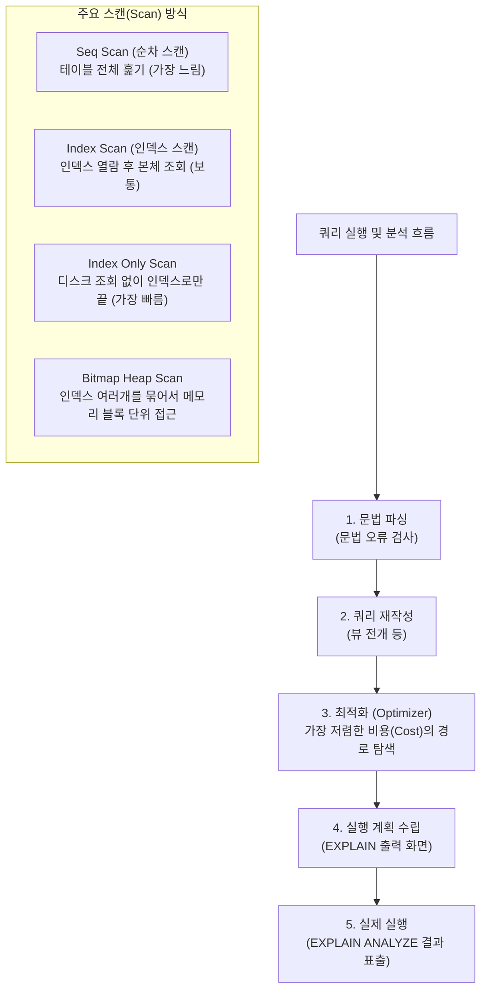

# 12강: 실행 계획과 쿼리 튜닝

## 개요 
단순히 "결과가 올바르게 나오는 쿼리"를 넘어, "어떻게 가장 빠르고 효율적으로 동작하는가"를 파악하는 것은 데이터베이스 전문가의 핵심 역량입니다. PostgreSQL의 백과사전 격인 최적화기(Optimizer)가 쿼리를 어떻게 해석하고 데이터를 가져올지(풀 스캔, 인덱스 스캔 등)를 보여주는 **실행 계획(Execution Plan)** 과 이를 해석하여 악성 쿼리를 튜닝하는 기법을 학습합니다.



## 사용형식 / 메뉴얼 

**1. 실행 계획 미리보기 (EXPLAIN)**
실제 커밋이나 쿼리 구동을 하지 않고, "이 쿼리를 날린다면 DB가 대충 이런 순서와 비용(예상치)으로 찾을 것이다" 라는 설계도만 텍스트로 보여줍니다. 삽입/삭제 문에도 위험 없이 써볼 수 있습니다.
```sql
EXPLAIN SELECT * FROM users WHERE age > 30;
```

**2. 실제 실행 후 타이머 측정 결과까지 보기 (EXPLAIN ANALYZE)**
**주의!** 이 명령어는 실제로 쿼리를 구동시킨 뒤(DML이면 데이터가 진짜 변경됨), 예상치와 **실제 소요된 시간(Actual Time)** 을 비교하여 출력합니다. 가장 많이 쓰이는 튜닝의 핵심 도구입니다.
```sql
EXPLAIN ANALYZE SELECT * FROM users WHERE age > 30;
```

**3. 버퍼(메모리 I/O) 통계까지 포함(EXPLAIN ANALYZE BUFFERS)**
실행 시간뿐만 아니라, 캐시 메모리(Shared Read/Hit)를 얼마나 긁어왔고 디스크 물리 I/O는 얼마나 발생했는지의 진짜 '비용'을 눈으로 확인할 수 있습니다.
```sql
EXPLAIN (ANALYZE, BUFFERS) SELECT * FROM users;
```

## 샘플예제 5선 

[샘플 예제 1: 인덱스가 없는 최악의 풀 스캔 (Seq Scan)]
- 조건절에 인덱스가 걸려있지 않아서, 데이터베이스가 1번부터 100만 번째 줄까지 모든 데이터를 다 꺼내서 확인하는 악성 형태를 판별합니다.
```sql
-- "Seq Scan on users" 문구가 뜨면 테이블을 통째로 뒤졌다는 뜻입니다.
EXPLAIN ANALYZE SELECT * FROM users WHERE name = 'John Doe';
```

[샘플 예제 2: 인덱스를 정확히 타는 스캔 (Index Scan)]
- `user_id` (PK) 등에 인덱스가 예쁘게 걸려 있어서 지름길로 쏙 데이터를 가져온 이상적인 실행 계획입니다.
```sql
-- "Index Scan using users_pkey on users" 문구가 표시됩니다.
EXPLAIN ANALYZE SELECT * FROM users WHERE user_id = 999;
```

[샘플 예제 3: 오직 인덱스 메모리만으로 해치우기 (Index Only Scan)]
- 조회하려는 데이터 자체가 모두 인덱스 메모리 안에 들어있어서, 느려터진 실제 디스크(Heap Block)까지 내려가지 않고 끝낸 초고속 형태입니다.
```sql
-- "Index Only Scan on idx_usr_email" 표식을 확인하세요.
EXPLAIN SELECT email FROM users WHERE email = 'test@example.com';
```

[샘플 예제 4: JOIN 알고리즘의 3가지 모습 파악하기]
- `EXPLAIN` 을 통해 두 테이블을 합칠 때 옵티마이저가 택한 알고리즘을 봅니다.
- **Nested Loop Join**: 1번 테이블 한 줄을 들고 2번 테이블 전체를 돌고, 다음 줄 들고 또 도는 방식 (소량 데이터에 유리)
- **Hash Join**: 1번 테이블을 통째로 메모리 Hash 화 한 뒤, 2번에서 찍어보는 방식 (대량 동등 '=' 조인에 압도적)
- **Merge Join**: 양쪽을 먼저 정렬시킨 뒤, 지퍼처럼 맞물리며 합치는 방식
```sql
EXPLAIN SELECT e.emp_name, d.dept_name 
FROM employees e JOIN departments d ON e.dept_id = d.dept_id;
-- Hash Join 또는 Nested Loop 플랜 노드가 찍힙니다.
```

[샘플 예제 5: 무거운 정렬(Sort) 병목 찾기와 LIMIT 튜닝]
- ORDER BY 연산은 모든 데이터를 메모리에 펼쳐놔야 하므로 매우 비싼 작업입니다. "Sort Method: external merge disk" 와 같은 문구가 뜨면 메모리가 부족해 하드디스크까지 긁고 있다는 뜻이니, 인덱스 정렬이나 LIMIT 최적화가 시급한 상태입니다.
```sql
EXPLAIN ANALYZE 
SELECT * FROM sales_logs ORDER BY created_at DESC LIMIT 10;
```

*(상세한 10개의 튜닝 시연 시나리오 쿼리는 `sample.sql` 파일을 확인해주세요.)*

## 주의사항 
- `EXPLAIN ANALYZE` 를 `UPDATE` 나 `DELETE` 뒤에 붙여서 실행하면 **진짜로 데이터가 수정되거나 삭제됩니다**. 옵티마이저가 '실제로 실행 해보고' 걸린 초시계를 재서 갖다 바치기 때문입니다. 그래서 실무 데이터를 건들 땐 반드시 `BEGIN; EXPLAIN ANALYZE UPDATE ...; ROLLBACK;` 형태로 트랜잭션을 씌워 파기해야 합니다.
- 옵티마이저가 실행 계획(추측치)을 세우는 근거는 `통계 정보(Statistics)` 입니다. 테이블에 데이터를 대량으로 밀어넣었는데 통계가 갱신 안되어 있으면, 데이터가 100만개인데 0개인 줄 알고 옵티마이저가 바보 같은 계획을 세웁니다. 이럴 땐 수동으로 `ANALYZE 테이블명;` 을 쳐서 뇌(통계)를 업데이트해주어야 합니다.

## 성능 최적화 방안
[인덱스를 실수로 무효화시키는 나쁜 쿼리 습관 고치기]
```sql
-- 1. [최악] 컬럼을 함수나 사칙연산으로 감싸버려 인덱스가 박살(Seq Scan)나는 경우
EXPLAIN SELECT * FROM orders WHERE EXTRACT(YEAR FROM order_date) = 2023;
EXPLAIN SELECT * FROM products WHERE price * 0.9 < 1000;

-- 2. [최적화] 인덱스 컬럼 원본을 가만히 놔두고, 우측 상수(비교값) 쪽을 수식 처리
EXPLAIN SELECT * FROM orders 
WHERE order_date >= '2023-01-01' AND order_date < '2024-01-01';

EXPLAIN SELECT * FROM products 
WHERE price < (1000 / 0.9);
```
- **성능 개선이 되는 이유**: 인덱스 트리는 원본 데이터의 생김새 그대로 예쁘게 정렬되어 저장되어 있습니다. 그런데 `WHERE` 조건절에서 원본 컬럼에 함수(`LOWER`, `EXTRACT`)를 씌우거나 가공(`price * 0.9`)을 해버리면, 옵티마이저는 "정렬된 인덱스 책갈피를 못 쓰겠네, 연산 결과가 뭔지 다 뒤져보자" 라며 표지를 덮고 1번부터 끝까지 **전체 테이블 검사(Seq Scan)** 로 노선을 틀어버립니다. 튜닝의 제1법칙은 **"인덱스 컬럼 값 자체를 조작(가공)하지 말라"** 입니다.
