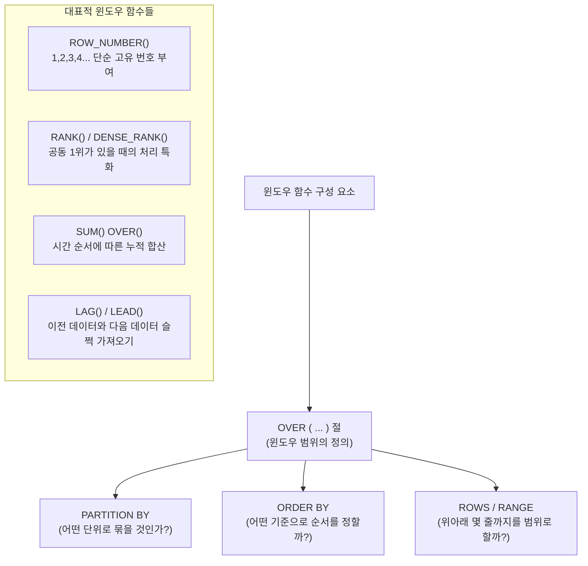

# 13강: 윈도우 함수 (Window Function)

## 개요 
기존의 `GROUP BY` 는 여러 개의 데이터를 하나로 압축해버려 원본 데이터의 디테일을 잃어버립니다. 반면 **윈도우 함수(Window Function)** 는 원본 데이터 형태(Number of Rows)를 그대로 유지하면서, 그 옆에 각 행마다 소속된 그룹의 통계값(순위, 누적합, 비율 등)을 마치 '라벨'이나 '배지'를 달아주듯 붙여서 출력하는 데이터 분석 분야의 꽃이자 최고의 핵심 기술입니다.



## 사용형식 / 메뉴얼 

**1. 윈도우 함수의 기본 구문 (OVER 절)**
모든 윈도우 함수 뒤에는 반드시 이 함수가 어느 범위(동네)에서 놀 것인지 지정하는 `OVER()` 키워드가 따라붙습니다.
```sql
SELECT 컬럼1, 컬럼2,
       윈도우함수() OVER (
           [PARTITION BY 그룹핑_컬럼]
           [ORDER BY 정렬_컬럼]
           [ROWS BEWTEEN 프레임_시작 AND 프레임_종료]
       ) AS 윈도우_결과
FROM 테이블명;
```

**2. 공동 순위 산정의 차이점 파악**
- `ROW_NUMBER()`: 공동 1위라도 그냥 무자비하게 (1, 2, 3) 랭킹을 매겨버림
- `RANK()`: 공동 1위가 2명이면, 다음 순위는 2위를 건너뛰고 (1, 1, 3) 등급이 됨
- `DENSE_RANK()`: 공동 1위라도 촘촘하게 건너뛰지 않고 (1, 1, 2) 등급으로 채움

**3. 전후 행 데이터의 가로채기**
- `LAG(컬럼명, 1)`: 현재 내 줄(Row) 기준, 바로 위(1칸 이전) 데이터를 가져옵니다. (ex: "어제" 매출액 비교)
- `LEAD(컬럼명, 1)`: 현재 내 줄(Row) 기준, 바로 아래(1칸 이후) 데이터를 가져옵니다.

## 샘플예제 5선 

[샘플 예제 1: 그룹 훼손 없는 전체 평균과 비교 (OVER 빈 괄호)]
- 각 직원의 현재 급여를 뽑으면서 동시에 옆 컬럼에 "회사 전체의 평균 급여"를 덧붙여 보여줍니다.
```sql
SELECT emp_name, salary,
       AVG(salary) OVER() AS company_avg_salary
FROM employees;
```

[샘플 예제 2: 부서별 최고 연봉자 서열 매기기 (PARTITION BY + RANK)]
- 전체가 아닌 `부서(dept_id)` 단위로 파티션을 나누어, 그 부서 안에서만 `연봉 높은 순`으로 순위를 매깁니다.
```sql
SELECT emp_name, dept_id, salary,
       RANK() OVER(PARTITION BY dept_id ORDER BY salary DESC) AS dept_rank
FROM employees;
```

[샘플 예제 3: 날짜가 지남에 따른 누적 매출 그래프액 산출 (ORDER BY 누적합)]
- 날짜순으로 데이터가 쌓일 때(`ORDER BY date`), 어제까지의 합에 오늘의 매출이 누적(`SUM() OVER()`)되어가는 통장 잔고 같은 지표를 추출합니다.
```sql
SELECT order_date, daily_amount,
       SUM(daily_amount) OVER(ORDER BY order_date) AS running_total
FROM daily_sales;
```

[샘플 예제 4: 어제 대비 매출 증감액 도출 (LAG 함수)]
- "전일 대비 +500 증가" 같은 기능을 구현하기 위해 `LAG` 함수로 하루 전날의 컬럼 값을 현재 행으로 슬쩍 복사해옵니다. (조인 불필요)
```sql
SELECT order_date, daily_amount,
       LAG(daily_amount, 1) OVER(ORDER BY order_date) AS yesterday_amount,
       daily_amount - LAG(daily_amount, 1) OVER(ORDER BY order_date) AS diff_from_yesterday
FROM daily_sales;
```

[샘플 예제 5: 주식 차트의 3일 이동 평균선 그리기 (ROWS BETWEEN)]
- 현재 관측중인 날짜를 기준으로, 하루 전(`1 PRECEDING`), 오늘(`CURRENT ROW`), 그리고 다음 날(`1 FOLLOWING`) 까지 총 3줄 범위만 싹둑 잘라서 평균을 냅니다.
```sql
SELECT order_date, daily_amount,
       ROUND(AVG(daily_amount) OVER(
           ORDER BY order_date 
           ROWS BETWEEN 1 PRECEDING AND 1 FOLLOWING
       ), 2) AS moving_avg_3_days
FROM daily_sales;
```

*(상세한 쿼리와 추가 5선 실무 활용 예제는 `sample.sql` 파일을 확인해주세요.)*

## 주의사항 
- 윈도우 함수는 쿼리 진행의 **가장 마지막 단계(WHERE 절 필터링을 다 마친 상태)** 에 적용됩니다. 따라서 `WHERE` 절 조건으로는 윈도우 함수의 결과를 사용할 수 없습니다. 만약 "부서 1위만 보고싶다" 하더라도 바로 `WHERE rank = 1` 로 쓸 수 없으며, 서브쿼리나 인라인 뷰, 혹은 `CTE(WITH 절)`에 한 번 싼 다음에 껍데기 밖에서 필터를 걸어야 합니다.
- `ORDER BY` 가 윈도우 OVER 절 안에 들어가게 되면 기본적으로 옵티마이저가 룰을 "지금 행부터 맨 위 처음 행까지의 누적(RANGE UNBOUNDED PRECEDING)" 으로 바꾸어버립니다. 이를 몰라서 부서 전체 합계를 내려다, 점진적 누적 합계가 나와버리는 실수가 가장 빈번합니다.

## 성능 최적화 방안
[Top-N 최적화를 위한 윈도우 한계(Limits) 이해]
```sql
-- 1. 비효율적인 Top-N (전체 파티션을 다 정렬하고 순위를 세운 뒤 마지막에 1명만 컷팅)
WITH RankedEmployees AS (
    SELECT emp_name, dept_id, salary, 
           ROW_NUMBER() OVER (PARTITION BY dept_id ORDER BY salary DESC) as rn
    FROM employees
)
SELECT * FROM RankedEmployees WHERE rn = 1;

-- 2. PostgreSQL 13버전 이후나 최적화를 고려한 FETCH 최적화 (가장 높은 급여 부서 순차 필터링)
SELECT e.emp_name, e.dept_id, e.salary
FROM employees e
INNER JOIN LATERAL (
    SELECT * FROM employees sub 
    WHERE e.dept_id = sub.dept_id 
    ORDER BY sub.salary DESC LIMIT 1
) sub ON true;
```
- **성능 개선이 되는 이유**: 만약 사원 데이터가 몇 억 건을 넘어가면 윈도우 함수는 모든 부서에 대해 `ROW_NUMBER()` 를 전부 모조리 발급(디스크 Write)한 뒤에야 밖에서 `WHERE = 1` 필터를 먹입니다. 반면 최신 문법이나 `JOIN LATERAL`을 이용한 한계 조회를 걸면, 데이터베이스는 각 부서별로 "제일 큰 놈 1개만 찾자마자" 바로 정렬을 중단하고 다음 부서로 넘어가 자원을 90% 이상 세이브할 수 있습니다. 윈도우의 `ORDER` 구문 남발은 대용량 트랜잭션에서 심각한 병목을 유발할 수 있음을 상기해야 합니다.
