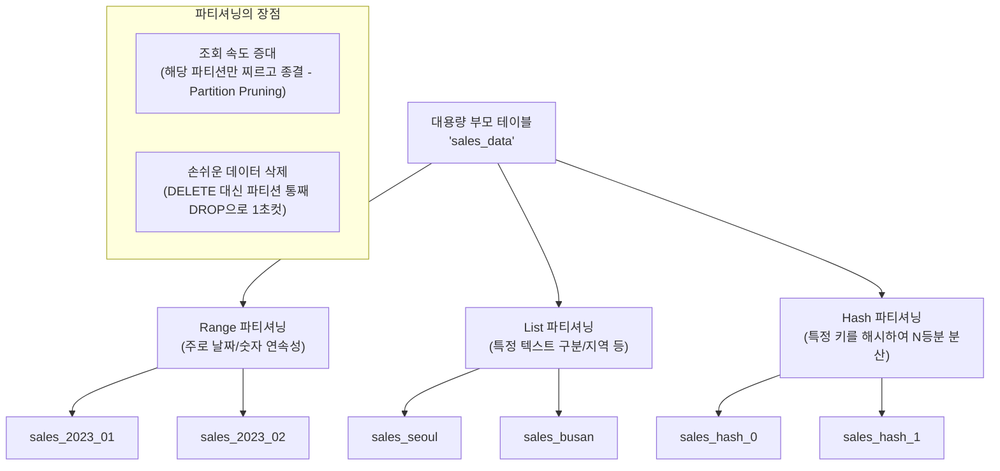

# 14강: 대용량 데이터 파티셔닝

## 개요 
수천만 건에서 수억 건 이상의 초대용량 데이터가 하나의 테이블에 몰려있으면, 조회(Select) 속도가 기하급수적으로 버벅거리게 되며 오래된 데이터를 주기적으로 지워주는(Delete) 아카이빙 작업 시간마저 며칠이 걸리는 시스템 장애를 유발합니다. 이를 스마트하게 해결하기 위해 커다란 단일 테이블을 일정 기준(날짜, 지역 등)을 바탕으로 여러 개의 '물리적인 작은 방(파티션)'으로 쪼개어 관리하는 **파티셔닝(Partitioning)** 기법에 대해 학습합니다. 사용자 앱 입장에서는 마치 1개의 테이블인 것처럼 투명하게(Transparent) 사용할 수 있습니다.



## 사용형식 / 메뉴얼 

**1. 부모 파티션 테이블 생성 (껍데기)**
데이터가 직접 저장되지는 않는, 파티션을 나누는 '기준(Key)'만을 정의한 최상위 부모 테이블을 만듭니다. 여기서 `PARTITION BY 기준(컬럼)` 을 선언합니다.
```sql
CREATE TABLE 테이블명 (
    id SERIAL,
    created_at DATE NOT NULL,
    amount INT
) PARTITION BY RANGE (created_at);
```

**2. 자식 파티션 테이블 생성 및 연결**
실제로 데이터가 물리적으로 저장될 하위 자식 테이블들을 범위(또는 리스트값)에 맞춰 선언하여 부모 밑으로 집어넣습니다.
```sql
CREATE TABLE 자식테이블_1월 PARTITION OF 부모테이블명
    FOR VALUES FROM ('2023-01-01') TO ('2023-02-01');

CREATE TABLE 자식테이블_2월 PARTITION OF 부모테이블명
    FOR VALUES FROM ('2023-02-01') TO ('2023-03-01');
```

**3. 기본 파티션 (Default Partition)**
만약 자식 파티션 조건에 해당하지 않는 생뚱맞은 데이터(예: 3월 데이터가 들어옴)가 `INSERT` 될 때 에러로 튕겨내지 않고 안전하게 수용할 쓰레기통(Default) 파티션을 준비합니다.
```sql
CREATE TABLE 자식테이블_기타 PARTITION OF 부모테이블명 DEFAULT;
```

## 샘플예제 5선 

[샘플 예제 1: Range (범위) 파티셔닝 - 월 단위 테이블 쪼개기]
- 매일 수백만 건씩 쏟아지는 로그 테이블을 월 단위의 데이터 덩어리로 잘라냅니다. `TO` 값 자체는 미포함(Exclusive) 되는 조건임(2월 1일 자정 직전까지)에 주의합니다.
```sql
CREATE TABLE web_logs (
    log_id BIGSERIAL,
    user_id INT,
    action VARCHAR(50),
    log_date DATE NOT NULL
) PARTITION BY RANGE (log_date);

CREATE TABLE web_logs_2023_01 PARTITION OF web_logs 
FOR VALUES FROM ('2023-01-01') TO ('2023-02-01');

CREATE TABLE web_logs_2023_02 PARTITION OF web_logs 
FOR VALUES FROM ('2023-02-01') TO ('2023-03-01');
```

[샘플 예제 2: List (목록) 파티셔닝 - 카테고리별 쪼개기]
- 날짜와 같은 연속 범위가 아니라, 판매 국가나 매장 코드처럼 뚝뚝 끊어져 있는 텍스트 속성을 기준으로 데이터를 격리합니다.
```sql
CREATE TABLE users (
    user_id SERIAL,
    username VARCHAR(50),
    country_code VARCHAR(10) NOT NULL
) PARTITION BY LIST (country_code);

CREATE TABLE users_korea PARTITION OF users FOR VALUES IN ('KR');
CREATE TABLE users_japan PARTITION OF users FOR VALUES IN ('JP');
CREATE TABLE users_others PARTITION OF users DEFAULT;
```

[샘플 예제 3: Hash 파티셔닝 - 공평하게 N 등분으로 부하 분산]
- 특정 기준이 명확하지 않고(예: UUID나 주문번호) 어떻게든 4등분으로 쪼개서 I/O 병목 부하만 골고루 분산시키고 싶은 백엔드 목적일 때 사용합니다.
```sql
CREATE TABLE transactions (
    tx_id UUID NOT NULL,
    amount NUMERIC
) PARTITION BY HASH (tx_id);

CREATE TABLE tx_part_0 PARTITION OF transactions FOR VALUES WITH (MODULUS 4, REMAINDER 0);
CREATE TABLE tx_part_1 PARTITION OF transactions FOR VALUES WITH (MODULUS 4, REMAINDER 1);
CREATE TABLE tx_part_2 PARTITION OF transactions FOR VALUES WITH (MODULUS 4, REMAINDER 2);
CREATE TABLE tx_part_3 PARTITION OF transactions FOR VALUES WITH (MODULUS 4, REMAINDER 3);
```

[샘플 예제 4: 파티션 푸르닝(Pruning) 실행 계획 확인]
- 애플리케이션 안에서는 계속해서 부모 테이블 이름(`web_logs`)으로 쿼리를 던져도, 옵티마이저가 지능적으로 2월 파티션으로만 점프를 뜁니다.
```sql
-- 실행계획(EXPLAIN)을 띄웠을 때 1월 테이블은 아예 스캔 목록에서 제외됨을 체크합니다.
EXPLAIN 
SELECT * FROM web_logs WHERE log_date = '2023-02-15';
```

[샘플 예제 5: 오래된 아카이빙 데이터의 1초 컷 삭제 (DROP PARTITION)]
- 트랜잭션 수백만 건을 대상으로 하는 일반적인 조건절 `DELETE FROM..` 은 테이블 락을 유발하고 대량의 트랜잭션 로그를 남기며 디스크 무리(오버헤드)를 발생시킵니다. 하지만 파티션으로 나눠두었을 경우, 그냥 자식 테이블(파티션) 자체를 물리적으로 지워버리면 수백만 건이 0.1초 만에 흔적도 없이 완전히 날아갑니다. 실무의 최애 핵심 기법입니다.
```sql
-- 엄청난 부하 유발: DELETE FROM web_logs WHERE log_date < '2023-02-01'; 
-- 최고의 해결책 (DROP/DETACH 적용):
DROP TABLE web_logs_2023_01; 
```

*(더 다양하고 고급스러운 파티션 매니지먼트 쿼리는 `sample.sql` 파일을 확인해주세요.)*

## 주의사항 
- **글로벌 인덱스의 부재**: 안타깝게도 PostgreSQL 파티셔니은 아직 타 벤더(Oracle 등)처럼 부모 테이블 전체를 아우르는 '글로벌 유니크 인덱스(Global Unique Index)' 기능을 완전하게 지원하지 않습니다. 즉, 파티션 키(날짜 등)가 포함되지 않은 Primary Key 나 Unique 키를 생성할 수 없으므로 테이블 설계 초기에 반드시 이 제약을 고려해야 합니다.
- 자식 테이블을 계속해서 수동으로 만드는 것은 심한 노가다이자 장애의 온상입니다. 1달짜리(혹은 1일 단위) Range 파티션을 구축했다면 반드시 이벤트 스케줄러(pg_cron 등)나 별도의 야간 배치 스크립트를 통해 '미래 한 달 치 파티션 껍데기'들을 미리 생성해두는 로직이 있어야 1년 뒤 갑자기 DB가 멈추는 불상사를 막을 수 있습니다.

## 성능 최적화 방안
[오래된 데이터의 온라인 분리 (DETACH) 와 압축(Archive 테이블로 강등)]
```sql
-- 1. [상황] 2022년도 데이터는 더 조회율이 극히 낮음 (버려도 되고 안 버려도 됨)
-- 바로 삭제(DROP) 하지 않고 부모 테이블의 조회 범위(Pruning)에서만 가볍게 연결을 끊어버립니다 (DETACH)
ALTER TABLE web_logs DETACH PARTITION web_logs_2022;

-- 2. 이제 web_logs_2022 는 메인조회(web_logs 쿼리) 에서는 아예 나타나지도 않아 메인 속도가 극강으로 빨라집니다.
-- 3. 독립된 테이블이 되어버린 web_logs_2022를 향후 저렴한 자기디스크(HDD 등) 테이블스페이스로 물리 저장소 위치 변경 등 유동적인 관리를 이어갑니다. 
ALTER TABLE web_logs_2022 SET TABLESPACE cold_storage_disk;
```
- **성능 개선이 되는 이유**: `DETACH` 명령어는 메인 앱에서 읽어 들이는 메인 테이블 조회 대상에서 가장 오래된 쓰레기 덩어리 파티션을 눈 깜짝할 새(Metadata 변경)에 제외시켜버립니다. 용량이 곧 느린 성능으로 직결되는 데이터베이스 특성상 분리된 아카이빙 전용 테이블을 만들면 메인 트랜잭션 성능(TPS)이 언제나 최적의 V1 상태를 유지하게 만들어주는 최상급 실무 운용 테크닉입니다.
