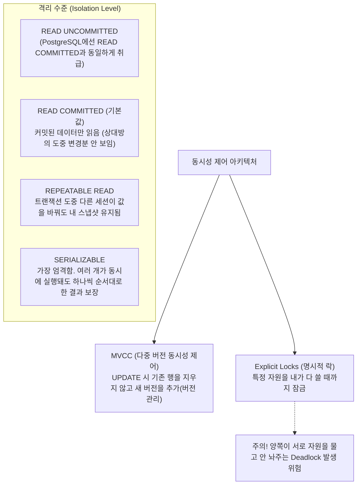

# 15강: 동시성 제어와 격리 수준

## 개요 
수만 명의 사용자가 동시에 같은 잔고 데이터를 읽고 쓸 때, 데이터베이스가 교통정리를 제대로 하지 못하면 돈이 사라지거나 중복 결제되는 대참사가 발생합니다. PostgreSQL이 이러한 다중 트랜잭션을 락(Lock) 없이도 안전하게 처리하는 핵심 아키텍처인 **MVCC(Multi-Version Concurrency Control)** 와 동시에 여러 트랜잭션이 엉켰을 때 교착 상태를 막기 위한 **격리 수준(Isolation Level)** 을 마스터합니다.



## 사용형식 / 메뉴얼 

**1. 트랜잭션 격리 수준 설정**
`BEGIN` 구문 시작 직후 이번 블록에 한해서만 격리 수준을 변경하여, 동시성 오류(Non-Repeatable Read, Phantom Read 등)를 방어합니다.
```sql
-- 보통의 은행 시스템이나 중요한 이력 백업 시
BEGIN TRANSACTION ISOLATION LEVEL REPEATABLE READ;

-- 최고 보안 수준 (단, 트랜잭션 실패로 롤백될 확률이 높음)
BEGIN TRANSACTION ISOLATION LEVEL SERIALIZABLE;
```

**2. 수동(비관적) 락 배포 (Select For Update / Share)**
데이터가 수정되는 것을 원천 차단하기 위해, 다른 트랜잭션이 내가 찍은 줄(Row)을 건드리지 못하게 직접 자물쇠를 겁니다.
```sql
BEGIN;
-- 배타적 락(Exclusive Lock): 읽기는 되는데 남들이 UPDATE / DELETE 절대 불가 조치
SELECT * FROM accounts WHERE id = 1 FOR UPDATE;

-- 공유 락(Shared Lock): 나도 안 바꾸지만 남들도 UPDATE 못하게 방어 (서로 SELECT만 가능)
SELECT * FROM accounts WHERE id = 1 FOR SHARE;
```

**3. NOWAIT 과 SKIP LOCKED 현업 기법**
자물쇠가 걸려 있으면 기본적으로 풀릴 때까지 '무한정 대기(Wait)' 합니다. 이를 우회합니다.
```sql
-- 락이 걸려있으면 기다리지 말고 즉시 에러를 내뿜어라 (화면 멈춤 방지)
SELECT * FROM accounts WHERE id = 1 FOR UPDATE NOWAIT;

-- 락이 걸린 다른 사람의 행(데이터)은 건너뛰고 락이 안걸린 데이터만 찾아서 선점하라 (쿠폰, 티켓 선착순 예매 시 사용)
SELECT * FROM coupons WHERE status = 'READY' FOR UPDATE SKIP LOCKED LIMIT 1;
```

## 샘플예제 5선 

[샘플 예제 1: 다른 트랜잭션의 입력을 차단하는 FOR UPDATE]
- 주문 테이블(orders)에서 상태값을 변경하기 전 해당 주문번호(101)에 강력한 배타 락을 잡아, 결제 완료 처리를 중복으로 치고 들어오려는 다른 API를 대기시킵니다.
```sql
BEGIN;
SELECT status FROM orders WHERE order_id = 101 FOR UPDATE;
-- (이 타이밍에 다른 창에서 같은 주문을 FOR UPDATE 하려고 하면 잠겨서 대기함)
UPDATE orders SET status = 'PAID' WHERE order_id = 101;
COMMIT; -- 커밋과 동시에 자물쇠가 풀림
```

[샘플 예제 2: 선착순 이벤트 예매 (SKIP LOCKED)]
- 선착순 이벤트 시 수만 명이 `WHERE status = 'AVAILABLE'` 를 쏘면 데이터베이스 락 경합으로 다 터집니다. 이때 남이 이미 자물쇠(FOR UPDATE)를 건 쿠폰은 대기하지 말고 쿨하게 '건너뛰고(SKIP)' 다음 빈 쿠폰을 잡도록 합니다.
```sql
BEGIN;
-- 남이 잡지 않은 빈 쿠폰 딱 1개만 물고 바로 락을 건다 (병렬 처리의 극치)
WITH cte AS (
    SELECT coupon_id FROM coupons 
    WHERE status = 'AVAILABLE' 
    LIMIT 1 FOR UPDATE SKIP LOCKED
)
UPDATE coupons 
SET status = 'USED', used_by = 'user_1' 
WHERE coupon_id = (SELECT coupon_id FROM cte);
COMMIT;
```

[샘플 예제 3: 팬텀 리드(Phantom Read)와 변경을 막는 REPEATABLE READ]
- 은행 총 잔고를 합산(SUM)하는데 1초가 걸리는 도중 다른 도둑이 새 계좌(INSERT)를 팠을 때, 처음 `BEGIN` 했던 그 시공간의 스냅샷만 바라보게 고립시킵니다.
```sql
BEGIN TRANSACTION ISOLATION LEVEL REPEATABLE READ;
SELECT SUM(balance) FROM accounts;
-- (이 사이에 남이 INSERT INTO accounts 를 쳐서 1억을 넣었음)
SELECT SUM(balance) FROM accounts; -- 그래도 남이 넣은 1억은 내 스냅샷에 안 보임(일관성 보장)
COMMIT;
```

[샘플 예제 4: 두 번 조회하는 도중 값이 바뀌는 오류 시뮬레이션 방지]
- 기본 격리 수준(`READ COMMITTED`) 에서는, BEGIN 블록 안에서 같은 값을 두 번 물어봐도 '그 사이에 남이 데이터를 바꾸고 커밋했다면' 값이 중간에 바뀝니다. 이를 막기 위해 위 예제처럼 엄격한 수준을 적용해야 합니다.
```sql
BEGIN; -- (기본: READ COMMITTED)
SELECT amount FROM items WHERE id = 1; -- 1000원 확인
-- (옆 친구가 2000원으로 바꾸고 커밋해버림)
SELECT amount FROM items WHERE id = 1; -- 2000원으로 결과가 중간에 돌변함 (Non-Repeatable Read 오류)
COMMIT;
```

[샘플 예제 5: 치명적인 데드락(Deadlock) 시나리오 이해]
- 철수는 A를 잠그고 B를 요구, 영희는 B를 잠그고 A를 요구하면 양쪽 다 무한정 멈춥니다. PostgreSQL은 이를 감지하여 1명(희생자)의 트랜잭션을 강제로 터뜨려(Aborted) 버립니다.
```sql
-- [세션 1]               |    -- [세션 2]
BEGIN;                  |    BEGIN;
UPDATE t1 SET v=1;      |    UPDATE t2 SET v=1;  -- 각자 자기꺼 잠금
UPDATE t2 SET v=2; (대기)|    UPDATE t1 SET v=2;  -- (서로 상대방꺼 대기)
-- 잠시 후 DB가 판단: "ERROR: deadlock detected" 라며 세션 2를 강제 종료(Rollback)시킴
```

*(동시성 제어를 위한 다중 세션 테스트 시나리오 및 추가 예제는 `sample.sql` 파일을 확인해주세요.)*

## 주의사항 
- `SERIALIZABLE` 로 가장 빡빡한 격리 수준을 지정하면 데이터 결함은 절대 나지 않지만, 조금이라도 충돌 여지가 있으면 옵티마이저가 에러(`could not serialize access...`)를 뱉고 강제 롤백을 때려버립니다. 앱 단에서 `try-catch` 를 통해 지속해서 재시도(Retry)하는 로직이 받쳐주지 않으면 서비스가 불가능해집니다.
- `FOR UPDATE` 옵션을 서브쿼리나 뷰, 다중 `JOIN` 안에서 남발하면 본인도 모르게 관련없는 수십만 건의 테이블 데이터를 모조리 `Lock` 걸어 시스템 전면 마비 장애를 유도할 수 있습니다. 락은 오직 딱 변경할 PK(Primary Key) 1줄에 대해서만 최소한으로 거는 것이 철칙입니다.

## 성능 최적화 방안
[MVCC 단점 해소법 - 주기적인 쓰레기 청소 VACCUM 관리 (Autovacuum)]
```sql
-- 1. 무지성 대용량 UPDATE/DELETE 를 실행하면 MVCC 아키텍처 때문에 실제로는 데이터가 안 지워지고
-- 파일에 삭제 표시(Dead Tuple)만 된 쓰레기로 층층이 쌓여 디스크가 10배로 비대해집니다 (Table Bloat 현상).

-- 2. 강제로 죽은 시체들(Dead Tuple)의 빈 공간을 청소해서 디스크 공간 재활용이 가능하게 만듭니다.
VACUUM VERBOSE items; 

-- 3. 최악의 경우 (쓰레기 파편화가 너무 심해 조회속도가 완전히 박살난 경우)
-- 디스크 공간 자체를 반환하고 트리를 아예 처음부터 새삥으로 다시 구축합니다 (단, 테이블 풀 락이 걸리므로 주의!)
VACUUM FULL items;
```
- **성능 개선이 되는 이유**: PostgreSQL은 읽는 사람(Select)과 쓰는 사람(Update)이 서로 락으로 기다리는 병목을 막고자 데이터가 변형되면 원본은 놔두고 '새로운 버전의 줄(Row)'을 복제 생성하는 **MVCC 기술**을 씁니다. 문제는 이 때문에 삭제하거나 변경 이전의 낡은 데이터가 디스크에 물리적으로 안 지워지고 고스란히 유령(Dead Tuple)처럼 남습니다. 1테라바이트 테이블이 10테라바이트로 부푸는 병에 걸린 DB를 회복시키기 위해선, 평소에 데몬으로 도는 `AUTOVACUUM` 설정의 임계치를 낮춰 자주 동작하게 세팅하거나 무거운 대규모 삭제 배치 직후 직접 `VACUUM` 을 수동으로 때려주는(수동 최적화) 데이터베이스 엔지니어링 감각이 필수적입니다.
