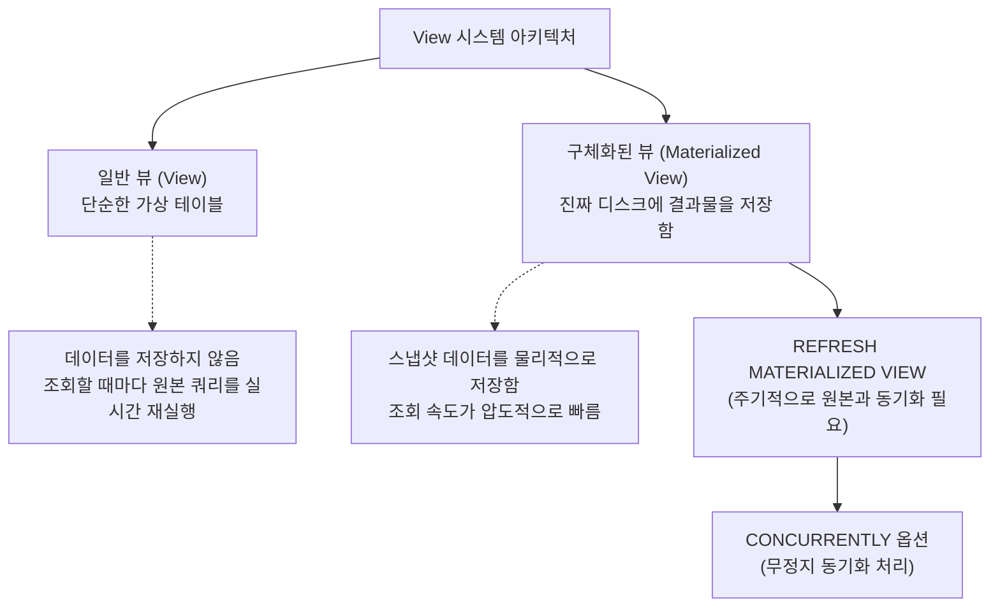

# 16강: 뷰와 구체화된 뷰 (Materialized View)

## 개요 
수십 개의 테이블이 얽힌 복잡한 조인(JOIN)과 통계 쿼리를 매번 타이핑하는 것은 비효율적입니다. 이를 해결하기 위해 쿼리 자체를 하나의 가상 테이블처럼 저장해두고 쓰는 **뷰(View)** 가 존재합니다. 더 나아가, 실시간 조회가 불가능할 정도로 무거운 빅데이터 분석 쿼리의 결과물 자체를 실제 물리적 디스크에 저장(캐싱)하여 초고속으로 읽어내는 PostgreSQL의 강력한 성능 튜닝 무기인 **구체화된 뷰(Materialized View)** 에 대해 학습합니다.



## 사용형식 / 메뉴얼 

**1. 일반 뷰 (View) 생성 및 수정**
자주 쓰는 복잡한 SELECT 쿼리문을 뷰로 묶어놓으면, 쿼리 길이가 한 줄로 압축됩니다.
```sql
CREATE VIEW 뷰이름 AS
SELECT 복잡한_조인문...;

-- 이미 있는 뷰를 덮어씌워서 수정할 때 (CREATE OR REPLACE)
CREATE OR REPLACE VIEW 뷰이름 AS
SELECT 수정된_조인문...;
```

**2. 구체화된 뷰 (Materialized View) 생성**
구문은 일반 뷰와 비슷하지만 `MATERIALIZED` 키워드가 붙으며, 생성되는 즉시 쿼리를 한 번 실행하여 그 '결과 건수'를 자신만의 깡통(디스크)에 복사하여 담아둡니다.
```sql
CREATE MATERIALIZED VIEW 구체화뷰이름 AS
SELECT 초고부하_실행문...;
```

**3. 구체화된 뷰 갱신 (Refresh)**
원본 테이블의 내용이 바뀌어도 구체화된 뷰는 스스로 업데이트되지 않습니다(과거 스냅샷 유지). 따라서 관리자나 스케줄러가 주기적으로 갱신 명령을 내려주어야 합니다.
```sql
-- 데이터를 통째로 날리고 새로 채움 (갱신되는 시간 동안 다른 조회자들 무한 대기 - Lock)
REFRESH MATERIALIZED VIEW 구체화뷰이름;

-- 서비스 무중단 갱신! (뒤에서 변경점만 싹 스왑함, 단 뷰에 Unique 인덱스가 존재해야 가능)
REFRESH MATERIALIZED VIEW CONCURRENTLY 구체화뷰이름;
```

## 샘플예제 5선 

[샘플 예제 1: 쿼리 복잡도를 줄여주는 일반 뷰 생성]
- 직원(e)과 부서(d), 급여 테이블 등 3개를 엮는 지저분한 쿼리를 `emp_details_view` 하나로 깔끔하게 묶어버립니다.
```sql
CREATE VIEW emp_details_view AS
SELECT e.emp_id, e.emp_name, d.dept_name, e.salary
FROM employees e
JOIN departments d ON e.dept_id = d.dept_id;
-- 사용할 때는 테이블처럼 가볍게 호출: SELECT * FROM emp_details_view;
```

[샘플 예제 2: 뷰를 이용한 보안 통제 (보안 뷰)]
- 외부 하청업체 직원에게 DB 접근을 허락할 때, 원본 `employees` 테이블을 바로 열어주면 연봉(`salary`) 등 민감 정보가 다 털립니다. 이름과 소속만 조회되도록 껍데기 뷰를 파서 권한을 줍니다.
```sql
CREATE VIEW emp_public_view AS
SELECT emp_name, dept_name 
FROM emp_details_view; -- 뷰 위에 뷰를 또 쌓기 가능
```

[샘플 예제 3: 대용량 분석을 1초 컷으로 끝내는 구체화된 뷰 (Materialized View)]
- 10년 치, 수천만 건의 판매(`sales`) 테이블을 묶어 연도별 통계를 냅니다. 원본에 `SELECT`를 치면 1분이 넘게 걸리겠지만, 구체화된 뷰로 빼놓으면 즉시 디스크에 결과 30줄이 영구 저장됩니다.
```sql
CREATE MATERIALIZED VIEW mv_yearly_sales_report AS
SELECT EXTRACT(YEAR FROM sale_date) AS yr, 
       SUM(amount) AS total_amount, 
       COUNT(*) AS tx_cnt
FROM massive_sales
GROUP BY EXTRACT(YEAR FROM sale_date);
```

[샘플 예제 4: 구체화된 뷰에 인덱스 걸기 (튜닝의 꽃)]
- 구체화된 뷰는 가짜 테이블(View)가 아닌 진짜 물리적 테이블로 취급되므로 **인덱스를 걸 수 있습니다**. 이것이 일반 뷰와의 가장 강력한 격차입니다.
```sql
CREATE UNIQUE INDEX idx_mv_yearly_sales_yr 
ON mv_yearly_sales_report (yr);
```

[샘플 예제 5: 무중단 리프레시 동기화 (CONCURRENTLY)]
- 야간에 통계를 다시 집계할 때, 새벽 앱 사용자가 `mv_yearly_sales_report`를 호출해도 대기 락이 걸려 화면이 멈추지 않도록 완전히 뒤편에서 백그라운드로 갱신을 진행합니다. (사전에 반드시 Unique 인덱스가 있어야 동작함을 염두에 두세요)
```sql
REFRESH MATERIALIZED VIEW CONCURRENTLY mv_yearly_sales_report;
```

*(실무 적용을 위한 스케줄링 개념과 10대 쿼리 세트는 `sample.sql` 파일을 확인해주세요.)*

## 주의사항 
- 뷰 구조 속에 또 뷰를 만들중첩 연결 뷰)는 피하세요. 관리가 불가능해질뿐더러, 옵티마이저가 최상위 뷰를 실행 계획으로 풀어내는 과정에서 인덱스를 포기하고 풀 스캔으로 돌아설 확률이 매우 높습니다.
- 일반 `VIEW` 의 성능은 그것을 구성하는 원본 `SELECT` 문의 성능과 100% 동일합니다. 뷰 자체에는 아무런 속도 향상 마법이 없습니다(그냥 텍스트 복사-붙여넣기입니다). 성능 향상을 원한다면 캐싱 역할을 하는 `MATERIALIZED VIEW` 를 써야 합니다.

## 성능 최적화 방안
[데이터 웨어하우스(DW) 아키텍처 - Materialized View 와 pg_cron 연동]
```sql
-- 1. [문제] 구체화된 뷰(MatView)는 갱신명령을 치지 않으면 영원히 어제 데이터에 머무름.
-- 2. [해결방안] 확장을 설치하여 새벽 3시마다(스케줄링) 자동으로 데이터가 갱신되도록 파이프라인 수립
CREATE EXTENSION pg_cron;

-- 크론(CRON) 탭 문법을 사용하여 매일 새벽 3시 정각에 MView를 무정지 리프레시 하도록 작업 예약
SELECT cron.schedule('nightly-mview-refresh', '0 3 * * *', 
  $$ REFRESH MATERIALIZED VIEW CONCURRENTLY mv_hourly_stats $$
);
```
- **성능 개선이 되는 이유**: 화면(Web/App)을 그릴 때 필요한 온갖 잡다한 Join 통계 쿼리를 WAS(서버)가 실시간으로 DB에 던져대면 DB CPU는 100%를 찍고 폭주합니다. 복잡한 연산은 모두 새벽 유휴 시간에 `pg_cron` 과 결합된 `MATERIALIZED VIEW (MVIEW)`를 갱신시켜 정답지 위주로 만들어 놓고, 화면 요청 시에는 API가 그 MVIEW에서 0.01초 만에 만들어진 응답 결과만 쏙 빼가는 패턴이 대용량 시스템 아키텍처(OLAP 최적화)의 필수 규칙입니다.
