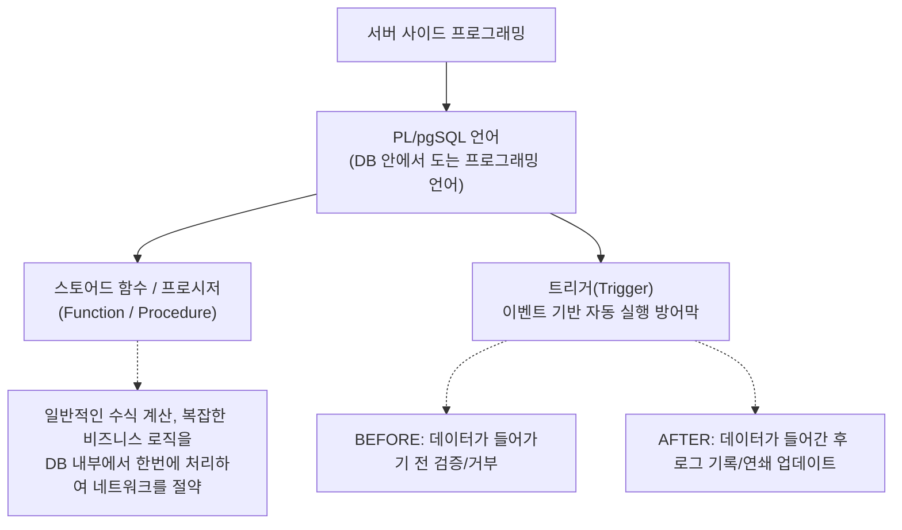

# 17강: 서버 사이드 프로그래밍 (PL/pgSQL)

## 개요 
자바나 문법에서 제공하는 `if`, `for`, `변수 할당` 같은 로직 흐름 제어를 데이터베이스 엔진 내부에서 직접 수행할 수 있게 해주는 데이터베이스의 프로그래밍 언어 절차 확장인 **PL/pgSQL(Procedural Language / PostgreSQL)** 에 대해 배웁니다. 이것을 활용하여 자주 사용하는 연산 모듈을 함수(Function)로 만들어 호출하거나, 어떤 데이터가 변경될 때마다 몰래 숨어서 자동으로 쿼리를 실행해주는 방어막인 **트리거(Trigger)** 시스템을 다루게 됩니다.



## 사용형식 / 메뉴얼 

**1. PL/pgSQL 기본 함수(Function) 생성 구조**
달러 기호(`$$`) 로 감싸진 거대한 문자열 블록 안에 코드를 작성하며, 선언부(`DECLARE`) 와 실행부(`BEGIN ~ END`)로 나뉩니다.
```sql
CREATE OR REPLACE FUNCTION 함수명(매개변수명 데이터타입)
RETURNS 리턴타입 AS $$ 
DECLARE
    -- 쓸 변수들을 미리 선언하는 구역
    v_result INT;
BEGIN
    -- 실제 논리적(if/loop) 비즈니스 로직 작성
    v_result := 매개변수명 * 10;
    RETURN v_result;
END;
$$ LANGUAGE plpgsql;
```

**2. 트리거(Trigger) 선언 과정**
트리거는 2단계로 이루어집니다. 1단계로 "어떤 짓을 할지" 코딩된 트리거용 함수를 만들고, 2단계로 "언제 작동할지" 테이블에 보초(Trigger)를 세워 함수와 연결합니다.
```sql
-- 1단계: 동작을 담은 특별한 반환형(TRIGGER) 함수 제작
CREATE OR REPLACE FUNCTION 트리거함수명() RETURNS TRIGGER AS $$
BEGIN
    -- NEW (들어온 신규 데이터), OLD (기존 데이터) 키워드 사용
    IF NEW.score < 0 THEN 
        RAISE EXCEPTION '음수는 불가합니다!';
    END IF;
    RETURN NEW; -- 문제 없으면 무사 통과
END;
$$ LANGUAGE plpgsql;

-- 2단계: 테이블에 보초 세우기
CREATE TRIGGER 트리거명
BEFORE INSERT OR UPDATE ON 검사할테이블
FOR EACH ROW EXECUTE FUNCTION 트리거함수명();
```

## 샘플예제 5선 

[샘플 예제 1: 단순 연산(비즈니스) 처리 함수]
- 부가세를 포함한 최종 결제 금액을 실시간으로 튀어나오게 해주는 커스텀 헬퍼(Helper) 함수를 생성합니다.
```sql
CREATE OR REPLACE FUNCTION calc_vat_inclusive(price NUMERIC)
RETURNS NUMERIC AS $$
BEGIN
    RETURN ROUND(price * 1.10, 2);
END;
$$ LANGUAGE plpgsql;

-- 사용: SELECT calc_vat_inclusive(1000); 
```

[샘플 예제 2: IF문과 분기 처리를 넣은 등급 판독기 함수]
- 복잡하게 CASE WHEN을 길게 쓰지 않고, 점수를 넣으면 등급 문자(A, B, C)를 뽑아주는 깨끗한 자바/파이썬스러운 프로그래밍 함수입니다.
```sql
CREATE OR REPLACE FUNCTION get_grade(score INT)
RETURNS VARCHAR AS $$
BEGIN
    IF score >= 90 THEN RETURN 'A';
    ELSIF score >= 80 THEN RETURN 'B';
    ELSE RETURN 'C';
    END IF;
END;
$$ LANGUAGE plpgsql;
```

[샘플 예제 3: FOR 루프를 통한 여러 줄 순회(Iteration) 처리]
- 파워포인트 목차처럼 데이터의 처음부터 끝까지 루프(Loop)를 돌면서 줄(Row)마다 특정 작업을 수행하게 합니다.
```sql
DO $$ -- DO 블록은 이름 없이 즉시 실행하는 1회용 스크립트입니다.
DECLARE 
    r RECORD; -- 한 줄을 통째로 담는 변수
BEGIN
    -- employees 테이블을 1줄씩 순회하며 꺼내 옴
    FOR r IN SELECT * FROM employees LOOP
        RAISE NOTICE '직원 이름: %, 급여: %', r.emp_name, r.salary;
    END LOOP;
END;
$$;
```

[샘플 예제 4: INSERT 되기 직전에 데이터를 강제 조작하는 트리거 (BEFORE)]
- 사용자가 소문자 대문자 엉망으로 이메일을 가입하려고 할 때, 테이블에 꽂히기 **직전(`BEFORE`)** 에 트리거가 낚아채서 모두 소문자로 강제로 고친 뒤 밀어넣어 무결성을 방어합니다.
```sql
CREATE FUNCTION trg_lower_email() RETURNS TRIGGER AS $$
BEGIN
    NEW.email := LOWER(NEW.email); -- 가로채서 소문자로 덮어쓰기!
    RETURN NEW;
END;
$$ LANGUAGE plpgsql;

CREATE TRIGGER prevent_upper_email
BEFORE INSERT ON users 
FOR EACH ROW EXECUTE FUNCTION trg_lower_email();
```

[샘플 예제 5: 회원 탈퇴 시 자동으로 탈퇴 이력을 남기는 트리거 (AFTER)]
- 누군가 `DELETE` 를 날려서 데이터가 성공적으로 지워진 **직후(`AFTER`)** 에 다른 아카이빙 테이블(`user_audit_log`) 에다가 `누가 언제 지워졌는지` 백그라운드 몰래 로그를 한 줄 새겨넣습니다.
```sql
CREATE FUNCTION trg_log_delete() RETURNS TRIGGER AS $$
BEGIN
    -- 지워진 옛날 데이터는 OLD 객체 안에 들어있음
    INSERT INTO user_audit_log (user_id, deleted_at) VALUES (OLD.id, NOW());
    RETURN OLD;
END;
$$ LANGUAGE plpgsql;

CREATE TRIGGER audit_user_deletion
AFTER DELETE ON users
FOR EACH ROW EXECUTE FUNCTION trg_log_delete();
```

*(상세한 쿼리와 동적 SQL, 프로시저 실용 10대 구문은 `sample.sql` 파일을 확인해주세요.)*

## 주의사항 
- `트리거(Trigger)` 는 데이터베이스 세계의 **"숨겨진 마법의 덫"** 입니다. 개발자가 자바나 파이썬 소스 코드만 보고 "나는 그냥 평범하게 한 줄 INSERT/DELETE만 했는데 왜 갑자기 자꾸 테이블 3개가 변경되고 온갖 다른 값이 지워지지?" 라며 디버깅 미로에 빠지게 만드는 주원인이기도 합니다. 시스템의 인수인계를 위해 아주 핵심적인 제약/보안 기능이 아니라면 비즈니스 로직에 트리거 남발은 절대 피해야 합니다.
- 함수(Function)에는 결과를 `RETURN` 키워드로 뱉어내야 한다는 특징이 있습니다. 반환 데이터 없이 그냥 업데이트 후 알아서 내부 트랜잭션(`COMMIT`)까지 통제하려면 데이터베이스 11버전에서 등장한 `프로시저(PROCEDURE)` 를 써야 합니다. 실무에선 '함수'는 `SELECT`용 값 도출기로, '프로시저'는 다중 테이블 데이터 강압 밀어넣기(배치) 용으로 구분 짓습니다.

## 성능 최적화 방안
[애플리케이션 N번 통신 VS 스토어드 함수 1번 호출의 네트워크 절약]
```sql
-- 1. [최악 - App Tier 반복 연산] 
-- 자바에서 for루프를 돌며 직원 10,000만명의 보너스를 계산하려 select -> if 로직 -> update 치느라
-- 네트워크 통신(TCP Ping)이 1만번 오가며 서버가 기절(Connection Pool 고갈)

-- 2. [최적화 - DB Tier 전담] 
-- 로직 자체를 calc_and_give_bonus() 라는 프로시저/함수로 만들어 DB에 통째로 심어두면, 
-- 자바에서는 단 1번 네트워크 통신("실행해!")만 쏘고 DB엔진이 자기 디스크 옆방에서 연산을 끝내므로 천 배 빠름
```
- **성능 개선이 되는 이유**: `서버 사이드 프로그래밍`의 근본적 태생 이유는 단순 계산이나 통계의 분기(If-Else) 처리를 위해 어마어마한 크기의 `Rows` 데이터를 톰캣이나 파이썬 램(RAM)으로 힘들게 퍼나르는 바보 같은 짓을 방지하기 위함입니다. 네트워크 지연(Network Latency)과 시리얼라이즈(Serialize) 비용 없이, **데이터가 저장된 바로 그 HDD/SSD 옆에 있는 DB 내부의 CPU를 써서 그 안쪽에서 로직을 끝내게** 만드는 것이 가장 이상적인 빅데이터 배치(Batch) 파이프라인 성능 튜닝의 교과서입니다.
