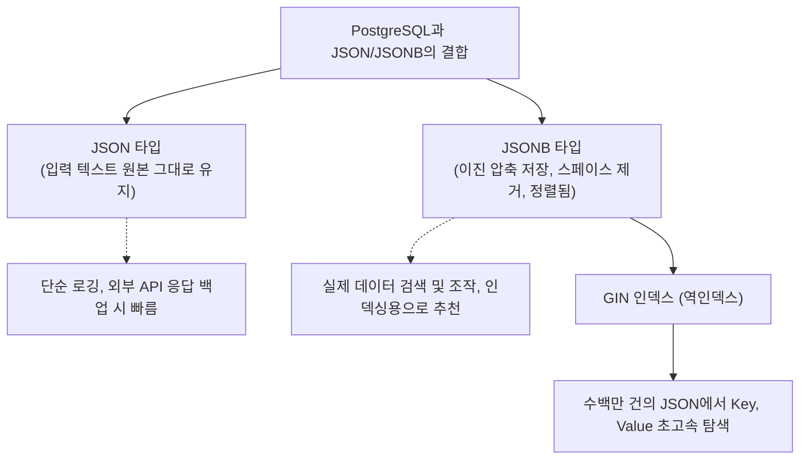

# 18강: NoSQL처럼 활용하기 (JSON/JSONB)

## 개요 
관계형 데이터베이스(RDBMS)의 빡빡한 스키마(표 구조) 제약을 무시하고, 컬럼 추가 없이도 유연하게 데이터를 저장하고 싶을 때 MongoDB 같은 NoSQL 데이터베이스를 도입하곤 합니다. 하지만 PostgreSQL은 관계형 구조 안에 완벽한 NoSQL 수준의 유연한 문서 저장 형식인 **JSON(Text)** 과 이를 이진 압축하여 극강의 인덱스 검색 성능마저 제공하는 **JSONB(Binary)** 데이터 타입을 내장하고 있습니다. 하나의 DB 엔진에서 정형/비정형 모델링 장점을 모두 취하는 강력한 하이브리드 활용 기술을 익힙니다.



## 사용형식 / 메뉴얼 

**1. JSONB 컬럼을 탑재한 테이블 생성**
```sql
CREATE TABLE products (
    id SERIAL PRIMARY KEY,
    name VARCHAR(100),
    attributes JSONB    -- NoSQL처럼 스키마 없는 무제한 확장 공간
);
```

**2. JSON 데이터 화살표(`->`, `->>`) 추출 연산자**
- `->` 연산자: 추출한 결과물을 여전히 JSON(B) 객체 상태 그대로 보존하여 꺼냅니다 (다음 뎁스로 계속 타고 들어갈 때 사용).
- `->>` 연산자: 추출한 결과물의 껍데기를 까고 일반적인 `TEXT`(문자열) 로 꺼냅니다. (WHERE에서 비교하거나 함수에 넣을 때 사용).
```sql
-- 1. name 이라는 Key의 Value를 텍스트로 꺼내기
SELECT attributes->>'name' FROM products;

-- 2. "specs" 객체 안으로 파고들어간 다음 "weight" 배열 중 0번째 값을 텍스트로 꺼내기
SELECT attributes->'specs'->'weight'->>0 FROM products;
```

**3. 부분 수정 및 병합 (JSONB 업데이트 - `||` 연산자 및 `jsonb_set`)**
```sql
-- 기존 attributes 덩어리에 새로운 컬러 코드를 병합(합치기) 하거나 이미 있으면 덮어씁니다.
UPDATE products 
SET attributes = attributes || '{"color": "RED", "size": "XL"}'::jsonb 
WHERE id = 1;

-- 특정 깊숙한 곳의 값만 콕 집어서 예쁘게 바꿉니다 (경로 지정 수정).
UPDATE products 
SET attributes = jsonb_set(attributes, '{specs, weight}', '"15.5 kg"')
WHERE id = 1;
```

## 샘플예제 5선 

[샘플 예제 1: 다양한 형태의 JSONB 데이터 삽입]
- 동일한 컬럼(`attributes`) 임에도 불구하고, 각 줄(행) 마다 집어넣는 Key의 이름이나 객체의 깊이(배열, 단일값)가 완전히 달라도 모두 수용합니다 (Schemaless).
```sql
INSERT INTO products (name, attributes) VALUES
('노트북', '{"cpu": "i7", "ram": "16GB", "storage": ["256GB SSD", "1TB HDD"]}'),
('스마트폰', '{"brand": "Apple", "battery": 3200, "is_5g": true}'),
('텀블러', '{"color": "Blue", "material": "Stainless"}');
```

[샘플 예제 2: 포함 여부 확인 (Contains 연산자 `@>`)]
- JSONB가 가진 사기적인 연산자로, "이 특성 블록을 완전히 포함하고 있는(=교집합이 있는) 자를 전부 찾아라" 를 지시합니다. MongoDB의 `find` 메서드와 동일합니다.
```sql
-- Apple 이라는 브랜드를 가진 속성 객체가 있는 행 전체를 찾는다
SELECT * FROM products 
WHERE attributes @> '{"brand": "Apple"}';
```

[샘플 예제 3: 특정 Key가 존재하는지만 찔러보기 (Exists 연산자 `?`, `?|`, `?&`)]
- "배터리 용량이 몇인지 값은 안 궁금하고, 일단 'battery' 라는 Key 항목 자체가 등록되어 있는 제품만" 뽑아냅니다.
```sql
-- 'battery' 키를 가진 데이터 검색
SELECT * FROM products WHERE attributes ? 'battery';

-- 'cpu' 나 'color' 둘 중 하나라도 항목이 등록된 제품 검색 (OR 조건)
SELECT * FROM products WHERE attributes ?| array['cpu', 'color'];
```

[샘플 예제 4: 화살표 연산자를 이용한 강제 형변환 검색]
- JSON에서 꺼낸 숫자나 Boolean 값은 기본적으로 텍스트(`->>`)입니다. 이를 다시 숫자나 불린형으로 캐스팅(`::`)해야 일반 관계형 비교(`>`, `<`)가 가능합니다.
```sql
-- 배터리 용량이 3000(숫자) 이상인 스마트폰 찾기
SELECT * FROM products 
WHERE (attributes->>'battery')::INT >= 3000;
```

[샘플 예제 5: 관계형 테이블(행/열) 자료를 도리어 거대한 JSON 문서 한 덩어리로 압축 말아버리기]
- DB에서 자바/노드(API 서버) 로 응답을 줄 때, 테이블의 모든 JOIN 결과를 애플리케이션 프레임워크 말고 아예 처음부터 DB 엔진단에서 예쁜 JSON 트리 구조 원-바디로 싸악 말아 던져줍니다. (통신 속도 파격 절감)
```sql
SELECT jsonb_build_object(
    'product_id', id,
    'product_name', name,
    'details', attributes
) AS api_response_json
FROM products;
```

*(더 많은 중첩 쿼리 배열 다루기 등 10선 쿼리는 `sample.sql` 파일을 확인해주세요.)*

## 주의사항 
- **JSON vs JSONB**: `JSON` 타입은 띄어쓰기 1칸조차도 전부 그대로 저장하는 아주 착실한 '단순 복붙 텍스트'입니다. 반면 `JSONB(Binary)` 는 입력받을 때 띄어쓰기 및 중복값을 지우고 구조를 기계어로 이진 압축합니다. 그래서 입력(Insert) 속도는 `JSON`이 빠르지만 그 속의 값을 검색(Select)하거나 가공할 땐 `JSONB`가 백 만 배 이상 압도적으로 빠르므로 **가급적 설계 시 무조건 `JSONB` 를 써야** 합니다.
- 유연하다고 해서 데이터베이스의 모든 컬럼을 JSONB 1개 덜렁 만들어놓고 온갖 데이터를 다 넣는 안티 패턴(Anti-Pattern)은 피해야 합니다. 검색이나 필터링에 자주 사용되는 고정 속성(ex: email, id, status, create_date)은 일반 컬럼으로 빼두고, 제품의 스펙처럼 변동이 심한 부가 정보들만 `JSONB` 에 격리시키는 것이 RDBMS와 NoSQL의 가장 완벽한 타협점입니다.

## 성능 최적화 방안
[깊숙한 JSON 데이터 풀 스캔을 1ms 로 줄여주는 GIN 역인덱스]
```sql
-- 1. 수백만 건 제품의 attributes 를 풀 스캔하며 찾는 미친 부하 쿼리
SELECT * FROM products WHERE attributes @> '{"cpu": "i7"}';

-- 2. 최적화: JSONB 구조체 전체를 낱낱이 해체해서 책갈피를 꽂는 GIN(Generalized Inverted Index) 인덱싱 선언
CREATE INDEX idx_products_attr_gin ON products USING GIN (attributes);

-- 3. 우회 최적화: 전체 속성 말고, 유독 'color' 값 하나만 WHERE 검색을 엄청나게 해댄다면, B-Tree 함수형 인덱스로 핀포인트 최적화
CREATE INDEX idx_products_color_btree ON products ((attributes->>'color'));
```
- **성능 개선이 되는 이유**: PostgreSQL이 MongoDB와 견주어 NoSQL 용도로 밀리지 않는 이유는 바로 **GIN 인덱스**의 존재 덕분입니다. GIN은 거대한 JSON 덩어리의 Key 와 Value를 수백 수천 개의 조각(Token)으로 분해해서 내부적으로 다대다(N:M) 맵핑 인덱스 트리를 전부 생성합니다. 그래서 포함 여부 연산자(`@>`) 나 키워드 존부(`?`)를 찔렀을 때, 디스크를 뒤지는 게 아니라 GIN 인덱스 메모리만 가볍게 훑으며 즉시 결과를 내뱉는 충격적인 `O(1)` 에 가까운 검색 퍼포먼스를 달성합니다.
