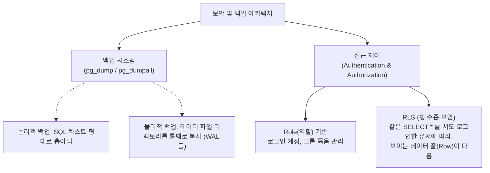

# 19강: 백업, 복구 및 접근 제어

## 개요 
시스템 장애, 랜섬웨어 공격, 혹은 개발자의 실수로 인한 `DROP TABLE` 대참사로부터 비즈니스를 사수하는 유일한 생명줄은 정기적인 **백업(Backup)과 복구(Restore)** 입니다. 또한 아무나 관리자 권한으로 들어와 데이터를 훼손하지 못하도록 막는 전통적인 **역할(Role)** 및 **권한(GRANT)** 관리부터, 하나의 테이블 안에서도 "자기가 쓴 게시물이나 정보만 보이게" 강제로 가려버리는 최신 보안 기술인 **RLS(행 수준 보안, Row-Level Security)** 까지, PostgreSQL의 철통같은 방어 시스템을 마스터합니다.



## 사용형식 / 메뉴얼 

**1. 논리적 백업과 복구 명령어 (터미널에서 실행)**
데이터베이스 밖(OS 터미널)에서 제공되는 유틸리티를 사용하여, 데이터를 순수한 SQL(`.sql` 파일) 형태로 뽑아내거나 압축된 바이너리 보관 포맷으로 밀어냅니다.
```bash
-- [백업] 특정 DB만 SQL 덤프 뜨기
pg_dump -U postgres -d mydb > mydb_backup.sql

-- [백업] 커스텀 압축 포맷 타입(-Fc)으로 무겁게 뜨기 (나중에 테이블 1개만 골라서 복구 가능)
pg_dump -U postgres -Fc -d mydb -f mydb_backup.dump

-- [복구] SQL 데이터 밀어넣기
psql -U postgres -d mydb < mydb_backup.sql
pg_restore -U postgres -d mydb -1 mydb_backup.dump
```

**2. 사용자(Role) 생성 및 권한 부여**
PostgreSQL에서는 `USER` 와 `GROUP` 모두가 **`ROLE(역할)`** 이라는 하나의 개념으로 통합되어 있습니다. 역할에 로그인 권한(`LOGIN`)을 주면 사용자가 되고, 안 주면 그냥 그룹명표가 됩니다.
```sql
-- 로그인 가능한 새 개발자 계정 생성
CREATE ROLE dev_user WITH LOGIN PASSWORD 'secret123';

-- 특정 테이블의 조회(SELECT), 수정(UPDATE) 권한만 주기 (DROP 금지)
GRANT SELECT, UPDATE ON products TO dev_user;
```

**3. RLS (Row-Level Security) 행 수준 보안**
테이블의 보안 스위치를 먼저 켜고(ENABLE), 어떤 룰(Policy)에 의해 데이터를 숨길지 설정합니다.
```sql
ALTER TABLE users ENABLE ROW LEVEL SECURITY;

CREATE POLICY user_isolation_policy ON users
    USING (username = current_user);
```

## 샘플예제 5선 

[샘플 예제 1: 그룹을 통한 일괄 권한 통제 관리]
- 사람 100명에게 일일이 SELECT 권한을 주는 대신, `reader` 라는 가상의 그룹 명찰(Role)을 만들고, 여기저기 권한을 달아둔 뒤, 사람(dev_user)을 이 그룹에 가입시킵니다.
```sql
-- 로그인 불가능한 빈 껍데기 그룹 역할 생성
CREATE ROLE readonly_group;

-- 이 껍데기에 SELECT 권한 발급
GRANT SELECT ON ALL TABLES IN SCHEMA public TO readonly_group;

-- dev_user 라는 실제 사람을 readonly_group 에 합류시킴 (권한 상속)
GRANT readonly_group TO dev_user;
```

[샘플 예제 2: 스키마 단위 접근 방어]
- 아무리 테이블에 SELECT 권한이 빵빵하게 있어도, 그 테이블을 둘러싸고 있는 `public` 스키마 껍데기에 접근(USAGE)할 권리 자체가 없으면 못 들어갑니다.
```sql
-- 스키마 사용권 허가
GRANT USAGE ON SCHEMA public TO dev_user;

-- 향후 "미래에" 만들어질 모든 테이블에 대해서도 자동으로 권한 위임
ALTER DEFAULT PRIVILEGES IN SCHEMA public 
GRANT SELECT ON TABLES TO readonly_group;
```

[샘플 예제 3: 테이블 일부 컬럼만 조회하게 권한 쪼개기]
- 급여(`salary`) 컬럼은 숨기고 오직 직원 이름(`name`)과 부서(`dept`) 컬럼만 Select 할 수 있도록 쪽집게 권한을 부여합니다 (굳이 보안 View를 안 만들어도 됨).
```sql
-- emp_name, dept_name 이외의 컬럼(ex. salary)을 SELECT 하려고 하면 거부됨
GRANT SELECT (emp_name, dept_name) ON employees TO dev_user;
```

[샘플 예제 4: 초강력 방패 RLS (Row Level Security) - 내 정보만 보인다!]
- 클라우드 SaaS(다중 입주자) 환경의 핵심입니다. Tenant A 회사 계정으로 접속하면 A 회사 데이터만, Tenant B 로그인 계정에선 B 회사 데이터만 보이게 테이블 레벨에서 원천적으로 가로막습니다.
```sql
-- 1. 방패 동작 스위치 ON
ALTER TABLE my_orders ENABLE ROW LEVEL SECURITY;

-- 2. 사용자 ID(current_user)가 테넌트 소유자와 일치할 때만 조회(USING) 되도록 허락
CREATE POLICY policy_tenant_isolation ON my_orders
FOR SELECT
USING (tenant_id = current_user); 
-- (수정/입력을 제어할 때는 WITH CHECK 옵션 추가)
```

[샘플 예제 5: 슈퍼 유저(관리자)의 RLS 무시 우회]
- RLS 정책은 너무나 강력해서 `postgres` 최고참 계정이 아니라면 테이블 소유자조차 자기 테이블의 데이터가 안 보이게 갇히는 불상사가 생깁니다. 강제로 RLS 정책을 무시하고 뚫어보려면 역할을 격상스위치 ON 합니다.
```sql
-- 현재 접속 중인 계정에게 RLS 보안망을 무시할 수 있는 마패(BYPASSRLS) 부여
ALTER ROLE db_admin WITH BYPASSRLS;
```

*(관리자(DBA) 운영을 위한 세션 감지 및 권한 10선 쿼리는 `sample.sql` 파일을 확인해주세요.)*

## 주의사항 
- `REVOKE (회수)` 명령어는 권한을 빼앗을 때 직통으로 찌른 권한만 뺐습니다. 만약 `dev_user` 가 개인 자격으로도 SELECT를 따내고, `readonly_group` 자격으로도 SELECT를 따내 총 2번 권한을 얻은 상태라면, 한 번 뺏었다고 방심하지 말고 양쪽 뿌리를 모두 걷어내야 데이터 유출 사고를 막습니다.
- 터미널 커맨드인 `pg_dump` 를 매일 밤 수행하도록 쉘 스크립트 작성 시 주의할 점은 백업 파일 용량이 누적되면 디스크 풀(Disk Full) 장애로 서버가 사망한다는 점입니다. 반드시 파이프라인에서 7일 전 백업 파일은 OS 단에서 삭제(`find -mtime +7 -delete`) 하는 순환 백업 스냅샷 정책이 동반되어야 합니다.

## 성능 최적화 방안
[대용량 백업과 복구 시간을 1/10 로 단축하는 파라미터 테크닉]
```bash
-- 1. [백업 압축 속도 최적화] -j 4 옵션 (CPU 코어 4개를 돌려서 병렬 멀티스레드 고속 백업)
-- 단, 디렉토리 포맷(-Fd) 형식에서만 병렬 코어 활용이 가능합니다.
pg_dump -U postgres -j 4 -Fd -d massive_db -f /backup/db_folder/

-- 2. [복구 속도 극한 성능업] 복구 시에도 코어를 풀가동(-j 4) 시키며, 
-- 복구 중엔 디스크를 두 번 쓰는 WAL 로그 남기기 기능을 임시 보류하여 I/O 오버헤드를 제로에 가깝게 폭발시킵니다.
pg_restore -U postgres -j 4 --disable-triggers -d massive_db /backup/db_folder/
```
- **성능 개선이 되는 이유**: 데이터가 몇 백 GB, 몇 TB 단위를 넘어가면 일반적인 `pg_dump` 단일 프로세스(싱글 코어 1개)로는 백엔드 파일 백업/밀어넣기를 며칠 밤낮을 새워도 못 끝냅니다. PostgreSQL 백업 유틸리티의 숨겨진 보검인 `-j (Jobs, 병렬 프로세스 개수)` 옵션을 주면 각 테이블별 데이터 청크를 코어 개수만큼 동시에 파이프라인으로 쏴버려 소요 시간을 극단적으로 압축할 수 있습니다. 무수한 인덱스 재생성 부하를 막기 위해 복구가 아예 끝난 맨 마지막 과정에 인덱스 빌드를 뭉쳐서 처리하는 것 또한 대용량 마이그레이션(복구) 튜닝의 꽃입니다.
