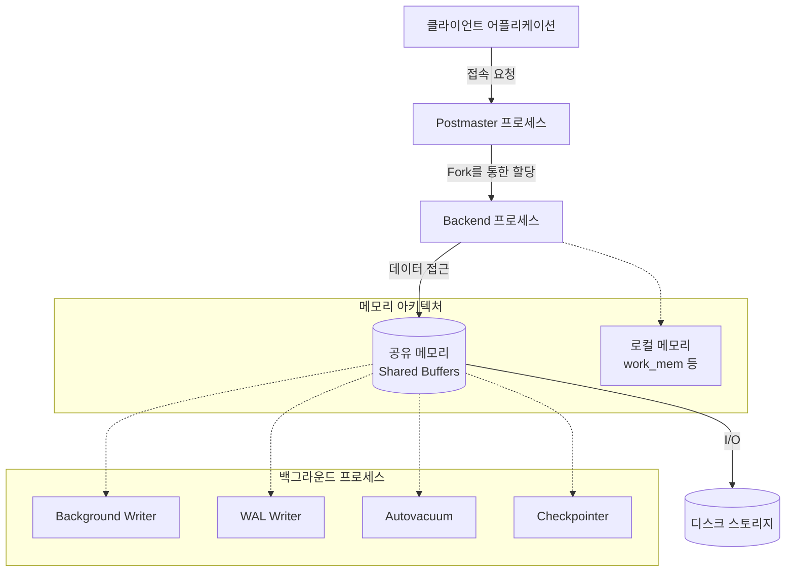

# 1강: PostgreSQL 아키텍처와 시작

*** 개요 ***
본 강의는 PostgreSQL 데이터베이스의 기본적인 아키텍처(프로세스 및 메모리 구조)를 이해하고, 설치 후 제공되는 강력한 커맨드라인 도구인 `psql`의 기본적인 사용법 및 서버 상태 확인 방법을 다룹니다.

데이터베이스 내부는 크게 **메모리 아키텍처**와 **프로세스 아키텍처**로 구분됩니다.
- **프로세스 아키텍처**: 클라이언트의 접속 요청을 받는 Postmaster(메인 프로세스), 각 접속마다 생성되는 Backend Process, 그리고 데이터의 안정성과 성능을 위한 Background Processes(WAL writer, Background writer, Checkpointer 등)가 존재합니다.
- **메모리 아키텍처**: 모든 프로세스가 공유하는 Shared Memory (Shared Buffers, WAL Buffers 등)와 개별 쿼리 연산 등 프로세스마다 독립적으로 할당되는 Local Memory (work_mem, maintenance_work_mem 등)로 나뉩니다.



*** 사용형식 / 메뉴얼 ***
PostgreSQL 관리 및 접속을 위해 `psql` 커맨드라인 접속 도구를 사용합니다.

**서버 접속 명령어**
```bash
# 기본 사용자인 postgres로 기본 데이터베이스에 접속
$ psql -U postgres

# 특정 데이터베이스 및 호스트 지정 접속
$ psql -h localhost -p 5432 -U myuser -d mydb
```

**psql 메타 명령어 (자주 쓰이는 기본 명령어)**
- `\l` : 전체 데이터베이스 목록 조회
- `\c [DB명]` : 다른 데이터베이스로 연결 전환
- `\d` : 현재 접속한 데이터베이스의 테이블, 뷰, 시퀀스 목록 조회
- `\d [테이블명]` : 특정 테이블의 상세 스키마(구조) 조회
- `\q` : psql 종료 및 빠져나가기
- `\timing` : 쿼리 실행 소요 시간 출력 토글

*** 샘플예제 10선 ***

[샘플 예제 1: PostgreSQL 버전 확인]
- 현재 설치된 PostgreSQL의 버전과 컴파일된 OS 환경 등의 정보를 확인합니다.
```sql
SELECT version();
```

[샘플 예제 2: 현재 세션의 접속 정보 확인]
- 자신이 접속한 데이터베이스 이름과 사용자 계정을 확인합니다.
```sql
SELECT current_database(), current_user;
```

[샘플 예제 3: 주요 설정 파일 위치 확인]
- PostgreSQL 운영 중 설정 파일(postgresql.conf)이 어느 경로에 위치하는지 찾습니다.
```sql
SHOW config_file;
```

[샘플 예제 4: 공유 메모리 버퍼(Shared Buffers) 크기 확인]
- DB 성능에 가장 큰 영향을 미치는 핵심 메모리의 현재 할당량을 확인합니다.
```sql
SHOW shared_buffers;
```

[샘플 예제 5: 현재 실행 중인 프로세스 및 쿼리 확인]
- 데이터베이스에 접속된 세션 목록과 활성화되어 실행 중인 쿼리를 실시간으로 모니터링합니다.
```sql
SELECT pid, usename, datname, state, query 
FROM pg_stat_activity 
WHERE state = 'active';
```

[샘플 예제 6: 현재 세션의 프로세스 ID 확인]
- 트러블슈팅 또는 락(Lock) 확인 시 기준이 되는 본인의 Backend 프로세스 ID(PID)를 호출합니다.
```sql
SELECT pg_backend_pid();
```

[샘플 예제 7: 특정 동적 시스템 설정 조회]
- pg_settings 뷰를 활용하여 메모리 할당 설정(work_mem) 값을 확인하고 단위를 함께 출력합니다.
```sql
SELECT name, setting, unit, short_desc 
FROM pg_settings 
WHERE name = 'work_mem';
```

[샘플 예제 8: 환경 설정 재시작 없이 적용하기]
- postgresql.conf 파일을 수정 후 DB를 완전히 내리지 않고 설정을 리로드합니다. 
```sql
SELECT pg_reload_conf();
```

[샘플 예제 9: 시스템 로그 및 데이터 디렉토리 위치 파악]
- 실제 데이터 파일이 저장되는 물리적 경로 확인에 사용됩니다.
```sql
SHOW data_directory;
```

[샘플 예제 10: 데이터베이스별 상태 통계 확인]
- 각 데이터베이스마다 커밋된 트랜잭션 수와 롤백 횟수, 접속자 수 등 통계를 확인합니다.
```sql
SELECT datname, numbackends, xact_commit, xact_rollback 
FROM pg_stat_database 
WHERE datname = current_database();
```

*** 주의사항 ***
- `psql` 환경에서 실행하는 일반 SQL 쿼리는 반드시 세미콜론(`;`)으로 끝내야 실행됩니다. 반면 `\d`, `\l` 등의 메타 명령어는 세미콜론이 필요하지 않습니다.
- PostgreSQL의 설정 파일(postgresql.conf) 및 환경 변수들은 DB 전체 또는 세션 별로 적용 범위가 다릅니다. 시스템 레벨 설정 변경시 장비의 가용 메모리를 초과하게 설정하면 데이터베이스가 기동하지 않을 수 있으므로 주의해야 합니다.
- `pg_stat_activity`를 조회할 때 관리자 권한(superuser)이 없으면 타 사용자의 실행 쿼리 내용을 확인할 수 없습니다.

*** 성능 최적화 방안 ***
[메모리 최적화 설정 예제]
```sql
-- 세션 단위로 복잡한 정렬(Sort)이나 해시(Hash) 연산을 위해 로컬 메모리를 증가
SET work_mem = '64MB';

-- 인덱스 생성, VACUUM 등의 작업을 더 빠르게 수행하기 위해 유지보수 메모리 할당 증가
SET maintenance_work_mem = '256MB';
```
- **성능 개선이 되는 이유**: `work_mem`이 부족하면, 쿼리 내에서 임시 데이터를 로컬 메모리 안에서 모두 처리하지 못하고 디스크(Temp 파일)를 사용하게 됩니다(Disk Spill). 디스크 입출력은 메모리보다 굉장히 느리기 때문에, 복잡한 정렬이 포함된 쿼리를 실행하기 전 워크 메모리를 임시로 늘려주면 디스크 대신 메모리에서 연산을 끝낼 수 있어 수십 배 이상의 속도 향상을 기대할 수 있습니다. 반면 너무 크게 전역 설정하면 다수의 사용자가 붙었을 때 Out-of-Memory(OOM) 오류를 일으킬 위험이 있으므로, 이와 같이 세션 레벨(`SET`)로 필요한 쿼리 앞에서만 제어해주는 것이 실무 모범 사례입니다.
