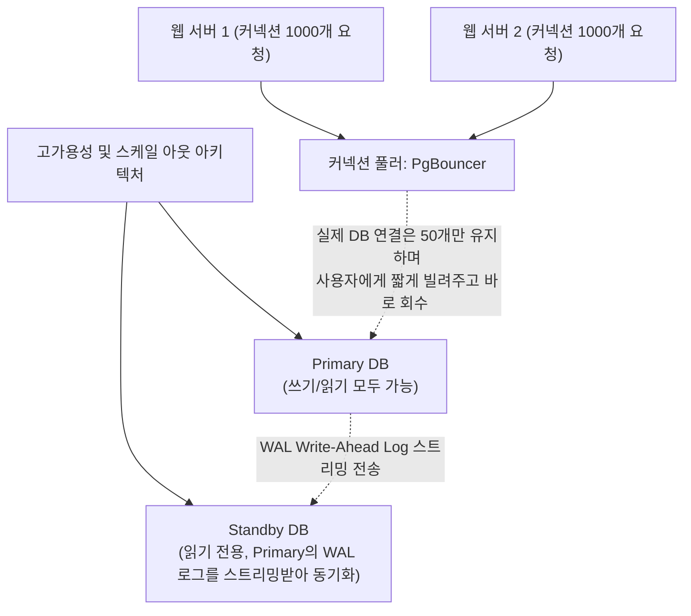

# 20강: 고가용성과 커넥션 풀링

## 개요 
단일 데이터베이스 서버가 하드웨어 고장으로 다운되었을 때 시스템 전체가 마비되는 것을 방지하기 위해, 원본(Master/Primary)의 변경 사항을 똑같이 따라 하는 복제본(Replica/Standby)을 구성하는 **고가용성(HA, High Availability)** 아키텍처를 학습합니다. 또한, 수만 명의 사용자가 동시에 접속할 때 데이터베이스 메모리가 터지는 것을 막고 효율적으로 연결선(Connection)을 빌려주고 회수하는 **커넥션 풀링(Connection Pooling - PgBouncer)** 의 핵심 메커니즘을 이해합니다.



## 사용형식 / 메뉴얼 

**1. 스트리밍 레플리케이션 (Streaming Replication)**
PostgreSQL에 내장된 기능으로, 물리적인 디스크 변경점(WAL, Write-Ahead Log)을 실시간으로(혹은 아주 짧은 지연시간을 두고) 예비 서버로 흘려보내 똑같은 쌍둥이 DB를 만듭니다. 
- 복제 서버는 **순수 읽기 전용(Read-Only)** 상태가 됩니다.
- 애플리케이션의 통계 집계 등 무거운 `SELECT` 트랜잭션을 복제 서버로 부하 분산(Load Balancing) 할 수 있어 성능이 2배로 뜁니다.
- `postgresql.conf`에서 `wal_level = replica` 등으로 설정하며, 설정은 OS 명령어가 동반됩니다.

**2. 논리적 복제 (Logical Replication)**
디스크 단위가 아니라, SQL 단위(또는 데이터 레코드 단위)로 변경 사항을 다른 서버나 다른 버전의 PostgreSQL로 발행(Publish)하고 구독(Subscribe)하는 고급 복제 방식입니다.
```sql
-- [소스 서버] 'users' 테이블의 변경 사항을 발행하겠다 선언
CREATE PUBLICATION my_pub FOR TABLE users;

-- [타겟 서버] 저쪽 서버(Host)를 바라보고 구독하여 데이터를 똑같이 실시간으로 빨아오겠다 선언
CREATE SUBSCRIPTION my_sub 
CONNECTION 'host=192.168.1.10 dbname=mydb user=rep_user password=123' 
PUBLICATION my_pub;
```

**3. 커넥션 풀링 (PgBouncer)**
DB는 한 사람이 연결(Connect)을 맺을 때마다 약 10MB 이상의 여유 램(RAM)을 떼어주게 됩니다. 3000명이 동시에 연결되면 DB는 램 부족(OOM)으로 기절합니다. 이를 막기 위해 중간에 `PgBouncer`라는 가벼운 문지기 프로그램을 세웁니다.
- PgBouncer는 앱의 연결 3000개를 다 받아준 다음, 실제 DB 뒷단으로는 100개의 선만 열어둡니다.
- 누군가 쿼리를 날릴 때만 100개 중 1개의 선을 0.01초 잠깐 빌려주고 쿼리가 끝나면 바로 회수하여 다른 사람에게 빌려줍니다. (트랜잭션 풀링 모드)

## 샘플예제 5선 

[샘플 예제 1: 물리적 복제(Streaming Replication) 상태 모니터링 뷰]
- [Primary 서버 전용] 현재 나에게 빨대(스트리밍)를 꽂고 데이터를 가져가고 있는 Replica 서버의 IP와 지연 상태(Lag)를 실시간으로 훔쳐봅니다.
```sql
SELECT client_addr, state, sync_state, 
       pg_wal_lsn_diff(pg_current_wal_lsn(), replay_lsn) AS replication_lag_bytes 
FROM pg_stat_replication;
```

[샘플 예제 2: 스탠바이 서버의 읽기 전용(Read-Only) 여부 확인 시스템 함수]
- [Standby 서버 전용] 내가 현재 마스터인지 아니면 읽기 전용으로 묶여있는 예비 서버인지 DB 커넥션 단에서 진단합니다. (t 퓨가 나오면 복제 서버임)
```sql
SELECT pg_is_in_recovery(); 
```

[샘플 예제 3: WAL(트랜잭션 로그) 파일 위치 조회]
- 모든 복제와 고가용성의 핵심은 '데이터를 지우거나 바꾸기 전에 하드디스크에 영수증(WAL)부터 먼저 기록한다'는 철학입니다. 그 영수증의 현재 지점을 봅니다.
```sql
SELECT pg_current_wal_lsn();
```

[샘플 예제 4: 논리적 복제(Logical Replication) - 특정 테이블 발행]
- DB 전체 복제가 너무 무거워서, 주문 알림을 위해 오직 `orders` 테이블 1개의 변동사항만 밖으로 쏴주고 싶을 때 적용하는 명령어입니다.
```sql
-- orders 와 payments 두 개의 테이블만 묶어서 하나의 채널(출판물)로 개통
CREATE PUBLICATION pub_sales FOR TABLE orders, payments;

-- 내가 뭘 발행하고 있는지 확인
SELECT pubname, tablename FROM pg_publication_tables;
```

[샘플 예제 5: 접속 중인 커넥션 수 파악방어막 세우기 시작]
- 현재 무거운 쿼리로 DB 연결을 차지한 채 반환하지 않는 좀비 커넥션들을 찾아내고 풀링 도구 도입 여부를 판단합니다.
```sql
SELECT datname, usename, state, COUNT(*) 
FROM pg_stat_activity 
GROUP BY datname, usename, state;
```

*(PgBouncer 관련 세팅 메커니즘 등은 SQL 단위보다는 인프라 단위이나 시뮬레이션 관련은 `sample.sql` 파일을 확인해주세요.)*

## 주의사항 
- 물리적 스트리밍 버전을 구성할 때는 Primary DB와 Replica DB의 디스크 덩어리 자체가 완전히 쌍둥이 물리 구조여야 하므로, 반드시 PostgreSQL 소프트웨어 버전 일치는 물론 OS 비트 수까지 맞춰야 합니다.
- `pgBouncer` 의 **Transaction Pooling Mode** 환경에서는 여러 사용자가 하나의 물리적 DB 커넥션을 0.01초 단위로 번갈아 가며 나눠 씁니다. 만약 애플리케이션 프레임워크가 DB 세션에 임시 테이블(`CREATE TEMP TABLE`)을 만들거나 세션 변수(`SET work_mem='1GB'`)를 먹여 놓고 커밋을 해버리면, 0.01초 뒤에 그 선을 물려받은 아무 상관없는 다음 사용자가 그 비정상 상태를 그대로 뒤집어쓰게 되는 대형 장애(Cross-Talk)가 발생하므로, 풀링 환경에서는 절대로 세션 영속성 기술을 쓰면 안 됩니다.

## 성능 최적화 방안
[Read / Write 쿼리 라우팅 (부하 분산 튜닝)]
```sql
-- DB 엔진에서 하는 것이 아니고, 스프링(Spring)이나 노드(Node.js) 애플리케이션 프레임워크 단에서 
-- 쿼리의 성격에 따라 보내는 URL 풀(Pool) 목적지를 라우팅하는 기술입니다.

-- 1. [쓰기 트랜잭션] INSERT, UPDATE, DELETE 구문은 반드시 아래 URL의 풀러(마스터 DB로 향함)를 태움
-- jdbc:postgresql://pgbouncer-master:6432/mydb 

-- 2. [읽기 트랜잭션] 통계 조회나 대량 SELECT 는 복제된 Standby DB 군단의 풀러 URL 로 라우팅하여 마스터의 CPU를 보호함
-- jdbc:postgresql://pgbouncer-replica-group:6432/mydb
```
- **성능 개선이 되는 이유**: `INSERT` 10개를 처리하는 동안 무거운 `SELECT` 통계 쿼리 1개가 테이블을 긁어버리면 마스터 DB는 I/O 지연으로 양쪽 모두 타임아웃을 뿜어냅니다. 이를 완벽히 타파하기 위해 복제본(Replica) 서버를 2대 띄운 후(`Read Replica`), 데이터 갱신 명령은 마스터에게만 보내고 화면에 뿌려주는 수만 건의 무지성 `SELECT` 나 일별 집계 쿼리는 무조건 레플리카 그룹 쪽으로 돌려버리는 **CQRS (Command and Query Responsibility Segregation)** 식 네트워크 분리 기법이야말로 수백만 트래픽을 감당하는 스타트업 인프라의 최종 종착지 튜닝입니다.
