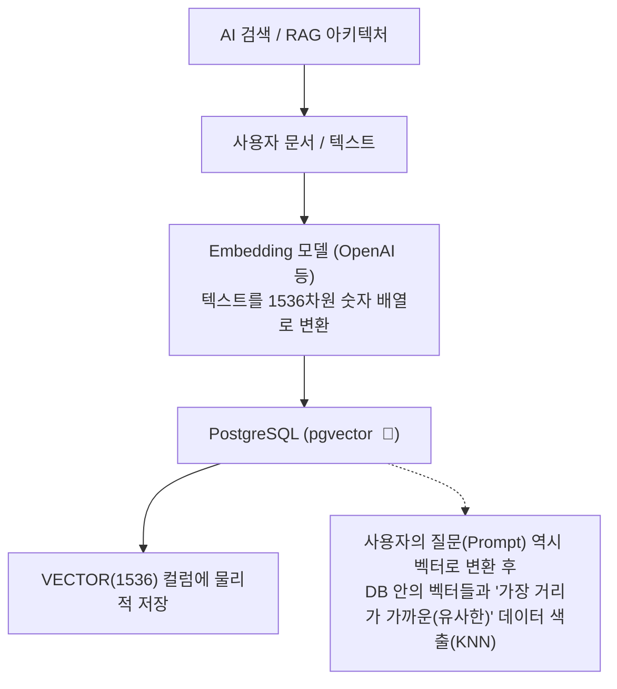

# 21강: pgvector 소개 및 설치

## 개요 
생성형 AI(Generative AI)와 대규모 언어 모델(LLM)의 발전으로 텍스트, 이미지, 오디오 등의 비정형 데이터를 숫자의 배열인 **벡터(Vector)** 로 변환하여 저장하는 기술이 핵심으로 자리 잡았습니다. PostgreSQL을 전용 벡터 데이터베이스(Vector DB)처럼 사용할 수 있게 만들어주는 강력한 공식 익스텐션인 **pgvector** 의 개념과 설치, 그리고 기본 동작 원리를 학습합니다.



## 사용형식 / 메뉴얼 

**1. pgvector 익스텐션 설치**
pgvector는 외부 플러그인이기 때문에, OS 레벨(혹은 Docker)에서 설치한 후 데이터베이스 단위로 `CREATE EXTENSION` 명령을 내려주어야 활성화됩니다.
```sql
-- 데이터베이스에 pgvector 익스텐션 활성화 (슈퍼 유저 권한 필요)
CREATE EXTENSION IF NOT EXISTS vector;

-- 설치된 버전 및 활성화 여부 확인
SELECT * FROM pg_extension WHERE extname = 'vector';
```

**2. 벡터 컬럼이 포함된 테이블 생성**
테이블 생성 시 일반적인 데이터 타입(INT, VARCHAR)처럼 `VECTOR(차원수)` 타입을 사용하여 컬럼을 뚫습니다. (OpenAI `text-embedding-ada-002` 모델은 보통 1536차원을 사용합니다.)
```sql
CREATE TABLE documents (
    id SERIAL PRIMARY KEY,
    title TEXT,
    content TEXT,
    embedding VECTOR(1536) -- 1536개의 실수가 들어갈 거대한 배열 공간
);
```

**3. 벡터 데이터 삽입 (INSERT)**
벡터 형식(대괄호 `[...]` 기호 사용)으로 된 숫자 배열을 문자열 캐스팅 형태로 집어넣습니다.
```sql
INSERT INTO documents (title, embedding) 
VALUES ('PostgreSQL Tutorial', '[0.1, 0.2, 0.3, ... 1536개]');
```

## 샘플예제 5선 

[샘플 예제 1: pgvector 익스텐션 셋업 및 기본 테이블 생성]
- 3차원(3칸 짜리) 배열을 다루는 아주 간단한 심플 벡터 테스트 테이블을 설계합니다.
```sql
CREATE EXTENSION IF NOT EXISTS vector;

CREATE TABLE items (
    id SERIAL PRIMARY KEY,
    category VARCHAR(50),
    vec VECTOR(3)
);
```

[샘플 예제 2: 텍스트 형태의 배열을 Vector 자료형으로 삽입]
- 파이썬이나 자바에서 만들어준 `[1.1, 2.2, 3.3]` 포맷의 텍스트를 바로 테이블에 꽂아 넣습니다.
```sql
INSERT INTO items (category, vec) VALUES 
('Apple', '[1.0, 2.0, 3.0]'),
('Banana', '[1.1, 2.1, 3.2]'), -- Apple과 매우 비슷함
('Car', '[9.0, 8.0, 7.0]'); -- 기하학적 거리가 완전히 다름
```

[샘플 예제 3: 유클리디안 거리(Euclidean Distance: `<->`) 를 이용한 가장 비슷한 값 찾기]
- 어떤 좌표 `[1.0, 2.0, 3.0]` 이 주어졌을 때, 테이블에서 거리가 가장 짧은(가까운=유사한) 데이터를 상위 2개 가져옵니다. **KNN (K-Nearest Neighbor)** 검색의 기초입니다.
```sql
-- <-> 연산자는 물리적 공간의 직선거리를 구합니다. (작을수록 비슷함)
SELECT category, vec, vec <-> '[1.0, 2.0, 3.0]' AS distance
FROM items
ORDER BY distance ASC  -- 거리가 짧은 순으로 정렬
LIMIT 2;
```

[샘플 예제 4: 코사인 거리(Cosine Distance: `<=>`) 를 활용한 문서 검색]
- 좌표 간의 단순 거리가 아니라 방향성(각도)을 중시하는 NLP(자연어 처리) 분야에서 주로 사용하는 연산자입니다.
```sql
-- <=> 연산자는 코사인 거리차를 구합니다. 
SELECT category, vec <=> '[1.2, 2.2, 3.2]' AS cosine_dist
FROM items
ORDER BY vec <=> '[1.2, 2.2, 3.2]' ASC
LIMIT 1;
```

[샘플 예제 5: 내부적 요소 거리(Inner Product: `<#>`) 연산]
- AI 모델에 따라 내적 거리로 유사도를 반환할 때 쓰는 특수 연산자입니다. (정렬할 때는 부호가 반대로 작동함을 유의해야 합니다.)
```sql
SELECT category, (vec <#> '[1.0, 2.0, 3.0]') * -1 AS inner_prod
FROM items
ORDER BY vec <#> '[1.0, 2.0, 3.0]' ASC;
```

*(AI 코사인 유사도 측정을 위한 다양한 10대 쿼리는 `sample.sql` 파일을 확인해주세요.)*

## 주의사항 
- `CREATE EXTENSION vector;` 명령은 단순 SQL 명령이지만, PostgreSQL이 깔린 실제 리눅스(또는 도커) 서버 내부에 `pgvector` 라이브러리(`make install` 등)가 물리적으로 컴파일되어 깔려 있어야만 동작합니다. AWS RDS나 Supabase 같은 관리형 서비스에서는 이미 깔려있어 구문 터치만으로 켤 수 있습니다.
- 벡터 비교 시 **차원 수(Dimensionality)** 가 반드시 일치해야 에러가 나지 않습니다. `VECTOR(1536)` 컬럼에 OpenAI 모델의 1536개짜리 배열을 넣어야지, 오픈소스 모델이 뽑아준 `384`개짜리 배열을 넣으면 즉시 에러가 발생합니다 (데이터 타입 불일치).

## 성능 최적화 방안
[데이터베이스 레벨 거리 계산의 압도적인 우위]
```sql
-- 1. [최악] 앱(자바/파이썬)에서 계산하기 위해 모든 DB 벡터 정보를 메모리로 퍼올림
-- DB에서 100만 건의 1536차원 벡터를 SELECT 한 뒤, 
-- 서버 램에 올려놓고 for 문을 돌며 Math.cosine(a, b) 계산 -> 서버 메모리 터짐(OOM)

-- 2. [최적화] 거리 연산자(<->)를 통해 DB 내부에서 정답 찾은 뒤 5개만 가져오기
SELECT content FROM documents
ORDER BY embedding <-> '[사용자의_질문_벡터]' ASC
LIMIT 5;
```
- **성능 개선이 되는 이유**: AI 챗봇(RAG) 구현 시 사용자의 질문(Prompt)과 가장 "관련 있는" 문서(문맥)를 찾으려면, 사용자의 질문도 1536차원 숫자로 바꾼 뒤 DB에 있는 수백만 건의 숫자들과 일일이 비교 연산을 돌려야 합니다. 이 수십억 번의 소수점 곱셈/덧셈 계산을 애플리케이션으로 끌고 와서 하지 않고, **데이터가 저장된 DB 엔진 내부에서 C언어 기반의 극도로 튜닝된 `pgvector` 연산자(`<->`, `<=>`)가 처리하게 위임**하는 것이 벡터 서치 아키텍처의 존재 이유이자 가장 완벽한 애플리케이션 최적화입니다.
