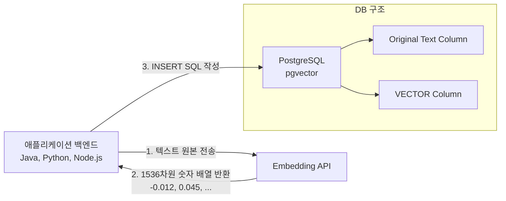

# 22강: 임베딩(Embedding) 생성과 데이터 적재

## 개요 
문자열이나 이미지 같은 비정형 데이터는 그 자체로는 컴퓨터가 의미(문맥)를 파악할 수 없습니다. 이를 AI 모델(OpenAI, HuggingFace 등)에 통과시켜 각 단어나 문장이 가진 '의미의 좌표값'을 숫자의 배열로 뽑아내는 과정을 **임베딩(Embedding)** 이라고 합니다. 본 장에서는 이렇게 만들어진 임베딩 벡터 데이터를 PostgreSQL의 `pgvector` 확장 기능을 통해 실제 테이블에 어떻게 안전하고 빠르게 적재(Insert)하는지를 학습합니다.



## 사용형식 / 메뉴얼 

**1. 임베딩을 저장할 테이블 구조 설계**
일반적으로 원본 텍스트(Chunk)와 그 텍스트를 변환한 벡터(Embedding)를 한 쌍으로 묶어서 저장합니다. 원본 문서가 길 경우, 수백 자 단위로 미리 잘게 쪼개는 작업(Chunking)이 선행되어야 합니다.
```sql
CREATE TABLE document_chunks (
    chunk_id BIGSERIAL PRIMARY KEY,
    document_title VARCHAR(200),
    page_number INT,
    chunk_text TEXT,
    embedding VECTOR(1536) -- 사용할 AI 모델의 차원 수와 완벽히 일치해야 함
);
```

**2. 단일 데이터 INSERT**
애플리케이션에서 받은 숫자 배열 리스트 파이썬의 `[0.1, 0.2, ...]` 를 문자열로 변환하여 밀어 넣습니다.
```sql
INSERT INTO document_chunks (document_title, chunk_text, embedding) 
VALUES ('안내서', '환불 정책은 30일 이내입니다.', '[0.001, -0.015, 0.022, ...]');
```

**3. 대량 데이터 Bulk 적재 (COPY 명령어)**
수백만 건의 초기 지식(Knowledge Base) 데이터를 구축할 때, `INSERT` 문을 수십만 번 날리면 네트워크 지연으로 세월아 네월아입니다. 파이썬이나 터미널에서 `COPY` 명령어를 써서 CSV 파일로 수 십만 건을 한 방에 붓는 것이 정석입니다.
```sql
-- CSV 파일에서 DB로 다이렉트 고속 복사
COPY document_chunks (document_title, chunk_text, embedding) 
FROM '/path/to/my_embeddings.csv' 
WITH (FORMAT csv, HEADER true);
```

## 샘플예제 5선 

[샘플 예제 1: 3차원 축소 모델을 가정한 기초 데이터 적재]
- 화면상에 긴 숫자를 표기할 수 없으므로 3차원으로 테스트 베드를 구성합니다.
```sql
CREATE TABLE faq_docs (
    id SERIAL PRIMARY KEY,
    question TEXT,
    answer TEXT,
    vec VECTOR(3)
);

INSERT INTO faq_docs (question, answer, vec) VALUES 
('비밀번호를 까먹었어요', '초기화 페이지로 가세요', '[0.11, 0.22, 0.33]');
```

[샘플 예제 2: 여러 행(Multi-Row) 동시 삽입]
- 네트워크 통신(TCP) 비용을 줄이기 위해, 배열 여러 개를 묶어 한 번의 `INSERT` 구문으로 발송합니다.
```sql
INSERT INTO faq_docs (question, answer, vec) VALUES 
('환불은 어떻게 하나요?', '고객센터로 전화주세요.', '[0.91, 0.82, 0.73]'),
('배송은 며칠 걸려요?', '평균 2일 소요됩니다.', '[0.88, 0.77, 0.66]');
```

[샘플 예제 3: 잘못된 차원의 데이터 방어 메커니즘 확인]
- PostgreSQL은 `VECTOR(3)` 이라고 명시된 곳에 길이나 짧은 배열이 들어오면 엄격하게 에러를 뿜어 데이터 정합성을 보호합니다.
```sql
-- 에러 발생: expected 3 dimensions, not 2
-- INSERT INTO faq_docs (question, vec) VALUES ('테스트', '[0.1, 0.2]');
```

[샘플 예제 4: UPSERT (Conflict) 를 활용한 벡터 데이터 갱신]
- 유니크한 키(문서 ID 등)가 동일한 게 들어오면 터지지 않고 최신 임베딩 값만으로 덮어치게 만듭니다. 지식 백과가 업데이트되었을 때 AI의 뇌도 함께 갈아끼우는 기법입니다.
```sql
ALTER TABLE faq_docs ADD CONSTRAINT unique_q UNIQUE (question);

INSERT INTO faq_docs (question, vec) 
VALUES ('비밀번호를 까먹었어요', '[0.15, 0.25, 0.35]')
ON CONFLICT (question) 
DO UPDATE SET vec = EXCLUDED.vec; -- 기존 질문이면 새로운 벡터로 교체!
```

[샘플 예제 5: 벡터 컬럼 값의 일부 업데이트]
- 원본 텍스트 내용이 `UPDATE` 되면 반드시 외부 임베딩 모델을 다시 호출해서 받아온 새로운 벡터값으로 `UPDATE` 구문을 병행해주어야 합니다.
```sql
UPDATE faq_docs 
SET answer = '마이페이지 > 비밀번호 초기화 버튼을 누르세요.',
    vec = '[0.12, 0.24, 0.36]' -- (새문서로 다시 받아온 새 임베딩)
WHERE id = 1;
```

*(실무 적용을 위한 CSV COPY 시뮬레이션 및 데이터 타입 테스트는 `sample.sql` 파일을 확인해주세요.)*

## 주의사항 
- `pgvector` 자체는 '입력된 텍스트를 스스로 벡터로 변환'해주는 마법의 도구가 아닙니다. DB는 그냥 어마어마하게 긴 숫자 배열을 고속으로 저장하고 비교해 줄 뿐, 임베딩을 추출하는 수학적 파이프라인(OpenAI API 호출 등)은 반드시 외부 백엔드 서버나 중간 파이프라인 툴(LangChain, LlamaIndex 등)이 수행해서 꽂아주어야 합니다 (단, `pgai` 같은 써드파티 익스텐션을 쓰면 DB 안에서 직접 호출도 가능하지만 구조적 부하가 심합니다).
- `varchar(255)` 같은 것에 제한을 두지 마세요. AI 모델이 잘라주는 Chunk 의 크기(보통 512 토큰 ~ 1000 토큰)는 생각보다 거대하기 때문에 원본 텍스트 컬럼은 넉넉하게 무제한 길이를 받아들이는 `TEXT` 타입을 쓰는 것이 좋습니다.

## 성능 최적화 방안
[임베딩 배열의 압축 캐스팅 (하프 플로팅 보관)]
```sql
-- 1. [문제점] 1536 차원의 실수는 1행당 어마어마한 디스크 용량과 램(RAM)을 차지합니다. 
-- 데이터가 수백만 건이면 디스크 공간이 폭발하여 검색 성능이 저하됩니다.

-- 2. [최적화 기법] Postgres 16버전과 pgvector 최신판부터 지원하는 'Half-Precision(반정밀도) 16비트' 저장 
CREATE TABLE documents_half (
    id SERIAL PRIMARY KEY,
    embedding HALFVEC(1536) 
    -- 기존 VECTOR 대신 HALFVEC 을 쓰면 정밀도는 미세하게 깎이지만(AI 정확도엔 별 지장 없음) 디스크와 램 점유율이 절반(50%)으로 뚝 떨어져 검색 속도가 2배 빨라집니다.
);
```
- **성능 개선이 되는 이유**: 거대한 소수점 데이터(예: 0.123456789)를 끝단까지 정교한 4바이트 32비트 실수계(`VECTOR/Float4`)로 다 들고 있으려면 수백만 데이터 환경에서 메인 메모리(RAM) 캐시 히트율이 박살 납니다. AI 모델의 특성상 유사도 거리 측정은 소수점 끝자리까지 정확할 필요가 거의 없기 때문에, 메모리를 절반만 먹는 `HALFVEC (16비트 Float)` 로 선언하여 동일한 메모리를 갖춘 서버에서 두 배 많은 데이터를 RAM 위에 캐싱시키는 것이 벡터 트래픽 방어의 승부수입니다.
