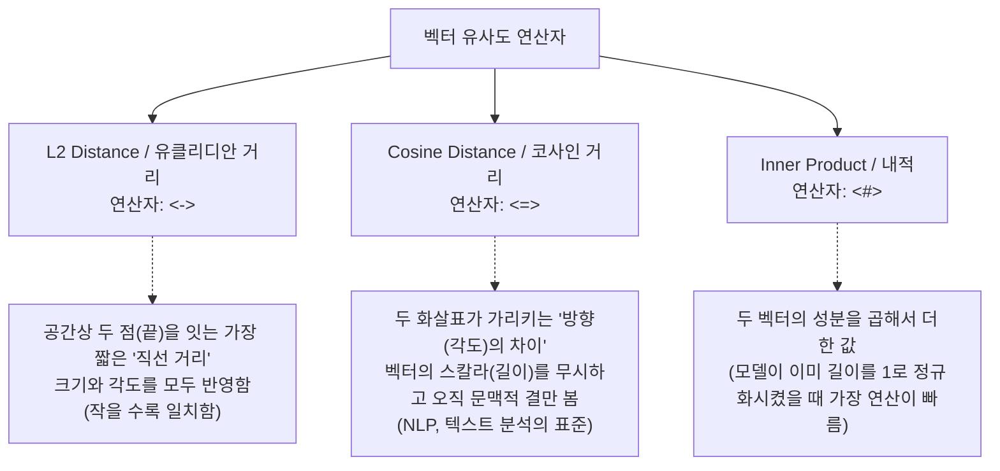

# 23강: 벡터 유사도 연산자

## 개요 
사용자의 질문(프롬프트)에 대해 어떤 문서가 가장 적절한 "정답에 가까운 문맥"인지 찾아내려면, 데이터베이스 안에 적재된 수백만 개의 숫자 배열(Vector)들을 사용자의 숫자 배열과 일일이 대조해봐야 합니다. pgvector는 이런 **수학적 공간에서의 기하학적 유사도(=거리)** 를 극도로 고속 연산할 수 있게 해주는 3대 핵심 연산자(L2 거리, 코사인 유사도, 내적)를 지원합니다.



## 사용형식 / 메뉴얼 

**1. Euclidean Distance (L2 점간 거리: `<->`)**
완전히 공간상 떨어져 있는 물리적 직선거리를 구합니다. 크기가 다르면 거리가 멀다고 판단하므로 문맥 분석보다는 이미지 차이나 물리적 객체를 판별할 때 씁니다.
```sql
-- 내 벡터([1,2,3])와 테이블(vec) 벡터 간의 기하학적 거리가 가까운 순으로 5개
SELECT content FROM items 
ORDER BY vec <-> '[1.0, 2.0, 3.0]' ASC 
LIMIT 5;
```

**2. Cosine Distance (코사인 거리: `<=>`)**
자연어 처리(NLP)와 RAG 시스템에서 LLM이 제일 좋아하는 1티어 연산자입니다. 두 문서의 단어들이 가리키는 `방향(=내용의 결)` 이 같으면, 길이가 아무리 차이나도(하나는 1줄, 하나는 100줄) 같은 의미로 판단합니다. 값이 **0에 가까울수록 방향이 완전히 일치(유사)** 함을 의미합니다.
```sql
SELECT content, vec <=> '[1.0, 2.0, 3.0]' AS distance
FROM items 
ORDER BY distance ASC 
LIMIT 5;
```

**3. Inner Product (내적 거리: `<#>`)**
성분끼리 모두 곱하고 더해서 값을 산출합니다. 원래 내적은 클수록(1) 비슷한 것인데, PostgreSQL에서는 인덱스 호환성(오름차순 통일)을 위해 내부적으로 `음수(-)` 를 곱해 값을 토해내므로, 가장 작은 값(오름차순 정렬) 최상단이 유사도가 높은 것입니다.
```sql
SELECT content FROM items 
ORDER BY vec <#> '[1.0, 2.0, 3.0]' ASC 
LIMIT 5;
```

## 샘플예제 5선 

[샘플 예제 1: 단순 텍스트 검색을 초월한 '의미 기반 검색(Semantic Search)']
- LIKE '%사과%' 처럼 텍스트가 정확히 표기되지 않더라도, 뜻이 통하는 문서를 찾아옵니다. (사용자 쿼리도 사전에 '[...]' 형태의 임베딩으로 만들었다고 가정)
```sql
-- 사용자의 질문: "아이폰 충전이 안돼요" (이를 임베딩 모델에 돌려 배열 '[...]' 획득)
SELECT faq_title, faq_answer
FROM knowledge_base
ORDER BY embedding <=> '[사용자_임베딩_배열]' ASC
LIMIT 3;
```

[샘플 예제 2: 기준점수(Threshold)를 둬서 엉뚱한 값 거르기]
- 상위 3개를 가져오라 했지만, 애초에 질문과 아무 상관 없는 쓰레기 문서 3개일 수도 있습니다. 그래서 코사인 거리가 `0.2` 미만인(매우 확신하는) 것만 추려내는 조건을 추가합니다.
```sql
SELECT faq_title, (embedding <=> '[사용자_배열]') AS dist
FROM knowledge_base
WHERE (embedding <=> '[사용자_배열]') < 0.20
ORDER BY dist ASC;
```

[샘플 예제 3: 하이브리드 서치 맛보기 (필터 + 벡터 검색)]
- 온 세상 문서를 다 벡터로 뒤지기 전에 일반 SQL 처럼 `WHERE`를 통해 날짜나 카테고리를 먼저 걸러주면(Pre-Filtering) 속도가 날아다닙니다.
```sql
SELECT doc_name 
FROM documents
WHERE category = 'IT' AND status = 'PUBLISHED' -- 여기서 범위를 100분의 1로 잘라버림
ORDER BY embedding <=> '[검색_배열]' ASC 
LIMIT 5;
```

[샘플 예제 4: 정규화(Normalization)된 벡터의 수학적 비밀 (Cosine == Inner Product)]
- OpenAI의 `text-embedding-ada-002` 모델 등은 반환해 주는 1536개의 숫자들의 전체 크기(길이)를 항상 `1`로 치환(정규화)하여 쏩니다. 이 경우 수학적으로 Cosine 계산과 Inner Product 계산식은 결과가 일치합니다.
- 내적(`Inner`) 연산이 수학적으로 가장 곱셈이 적어 연산이 가벼우므로, OpenAI 모델 사용 시 `<#>` (내적 연산자)를 쓰는 게 궁극의 최적화입니다.
```sql
SELECT content 
FROM documents 
ORDER BY embedding <#> '[정규화된_사용자_배열]' ASC 
LIMIT 5;
```

[샘플 예제 5: 반환된 거리를 직관적인 '유사도 퍼센트(%)'로 화면에 뿌려주기]
- 유저에게 '코사인 거리 0.15' 라고 하면 못 알아듣습니다. 1에서 빼주어 '85% 유사도 매칭' 같은 UI를 구성합니다.
```sql
SELECT title, 
       ROUND((1 - (embedding <=> '[검색_배열]')) * 100, 2) AS similarity_score
FROM documents
ORDER BY similarity_score DESC 
LIMIT 3;
```

*(각 연산자의 수치적 차이 증명과 활용 쿼리는 `sample.sql` 파일을 확인해주세요.)*

## 주의사항 
- `pgvector` 의 모든 거리 연산자 결괏값은 **오름차순(`ASC`) 일수록 정답과 흡사**합니다. (유클리디안도 거리가 0에 가까워야 하고, 코사인도 거리가 0에 가까워야 하며, 내적 연산자는 원래 큰 게 좋은 거지만 프레임워크가 앞에 강제로 마이너스 - 를 붙여놔서 작을수록 좋은 걸로 통일시켜 버렸습니다). 따라서 ORDER BY에 절대 `DESC` 를 쓰지 마세요.
- 위 샘플 쿼리들처럼 `ORDER BY 벡터 <-> 벡터` 만 수행하면 내부적으로 **순차 스캔(Sequential Scan)** 을 돕니다. 테이블에 1만 개 정도면 눈에 안 띄지만 100만 개가 넘어가면 쿼리 하나에 5초가 넘어가는 지옥도가 열립니다. 이를 타개하기 위해 다음 장 24강에서 인덱스(HNSW/IVFFlat)를 배우게 됩니다.

## 성능 최적화 방안
[임베딩 벡터의 정규화 강제 (L2 Normalization)]
```sql
-- 1. 자신이 만든 개인 AI 모델 등은 벡터의 길이가 제각각일 수 있으며, 이 때 Cosine 연산은 무겁습니다.
-- 2. 강제로 테이블에 저장된 벡터를 정규화(크기를 1 단위로 통일) 시키면 연산 부하가 훅 꺼집니다.
UPDATE documents 
SET embedding = vector_norm(embedding);

-- 정규화가 끝난 상태라면 이후 시스템에서는 코사인 거리(<=>) 대신 무조건 내적 연산자(<#>)를 씁니다.
```
- **성능 개선이 되는 이유**: `Cosine Similarity` 계산 공식은 "(A와 B의 내적)을 (A크기 * B크기)로 나눈 값" 입니다. 즉 매번 무거운 나눗셈을 해야 합니다. 그런데 만약 저장된 벡터와 검색 벡터의 크기가 수학적으로 정확히 1(정규화 단위 벡터)이라면 분모가 생략되어 나눗셈을 안 하고 분자(내적) 연산 1번으로 끝납니다. 따라서 OpenAI 등에서 내보내는 규격화된 정규 벡터 데이터는 값비싼 `<=>` 코사인 연산자 대신 `<#>` 내적 연산자로 바꿔치기 하는 순간 DB의 검색 스루풋이 급격하게 상승합니다.
