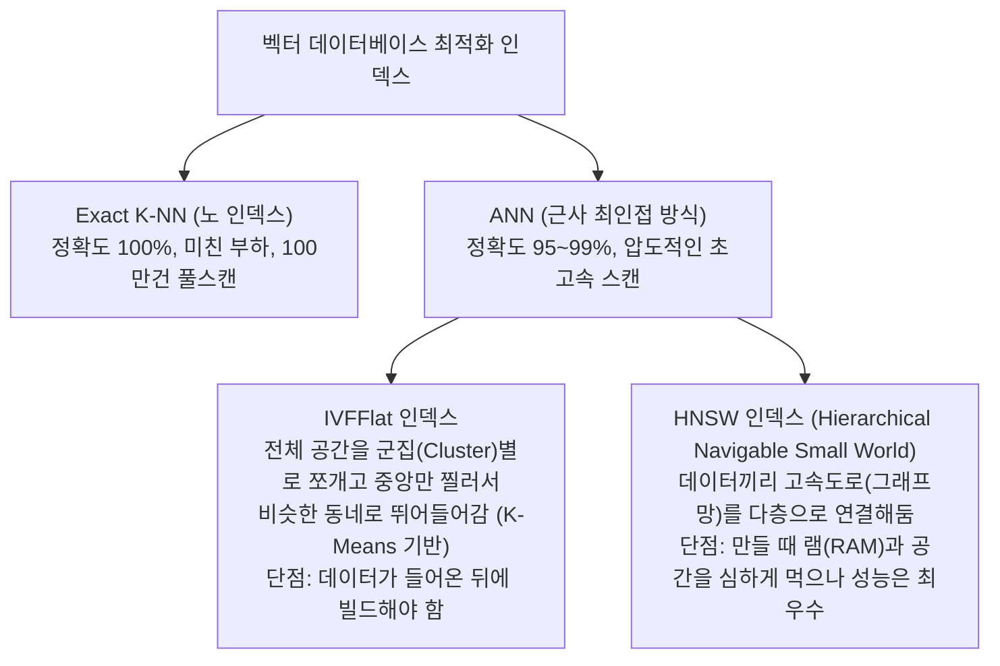

# 24강: pgvector 인덱스 최적화 (IVFFlat & HNSW)

## 개요 
벡터를 활용한 거리를 계산(`ORDER BY vec <=> 쿼리`)할 때 테이블 안에 1,000만 건의 데이터가 있다면, 데이터베이스는 1,000만 번의 기하학적 유사도 수학 공식을 하나씩 다 두들겨보고(가장 무식하고 정확한 K-NN, 즉 Sequential Scan) 상위 3개를 뽑습니다. 이는 시스템 마비를 유발하므로 1,000만 건을 다 뒤지지 않고 **'근사치(대략적으로 비슷해 보이는 무리들만 찔러서)'** 초고속으로 빼내는 **ANN(Approximate Nearest Neighbor)** 인덱싱 기법인 **IVFFlat** 과 완전무결한 1티어 대세 그래프 인덱싱 **HNSW** 에 대해 파헤칩니다.



## 사용형식 / 메뉴얼 

**1. IVFFlat 인덱스 구축**
테이블의 데이터를 K-Means 군집으로 미리 N등분 쳐놓고, 질문이 들어오면 "이 질문은 강남구 우편번호에 가깝네, 그럼 강남구 데이터만 뒤지자!" 라고 범위를 버리는 방식입니다. `lists` 파라미터로 몇 등분 할 지 정합니다. (데이터가 한 10만 개 쯤 찼을 때 선언해야 군집이 똑바로 형성됩니다.)
```sql
CREATE INDEX idx_vector_ivfflat 
ON documents USING ivfflat (embedding vector_cosine_ops)
WITH (lists = 100); -- 테이블 데이터를 100군데 구역으로 찢어놓음
```

**2. HNSW 인덱스 구축 (최신 트렌드)**
pgvector 0.5.0 부터 도입된 인공지능/벡터 서치계의 가장 완벽한 인덱싱 알고리즘입니다. 데이터 간의 연결망 그물(Graph)을 촘촘히 짜서 검색 시 그물망을 타고 초고속으로 가장 가까운 이웃을 찾아냅니다. 데이터가 텅 비었을 때 미리 선언해두고 이후에 `INSERT`가 무수히 발생해도 똑똑하게 알아서 그물을 짭니다.
```sql
CREATE INDEX idx_vector_hnsw 
ON documents USING hnsw (embedding vector_cosine_ops)
WITH (m = 16, ef_construction = 64);
-- m: 노드당 그물을 몇 가닥 뻗을 것인가 (클수록 정확/무거움)
-- ef_construction: 그물을 짤 때 램을 얼마나 써가면서 촘촘히 짤 것인가 (생성 시간 좌우)
```

**3. 인덱스 매칭 오퍼레이터 (OpClass)**
인덱스를 만들 때 `vector_cosine_ops`, `vector_l2_ops`, `vector_ip_ops` 등 "내가 나중에 무슨 연산자로 검색(Query)할 것인가"를 미리 정해 주어야 옵티마이저가 그 모양새에 맞추어 인덱스 트리를 조립합니다.

## 샘플예제 5선 

[샘플 예제 1: 코사인 검색에 특화된 HNSW 인덱스 만들기]
- 오픈소스 LLM 문서를 적재하는 `chunks` 테이블을 설계하고, 검색할 때 `<=>` (코사인 연산자)를 잦게 쓸 것이므로 `vector_cosine_ops` 방침으로 그래프망을 짭니다.
```sql
CREATE INDEX idx_chunks_hnsw_cosine 
ON chunks USING hnsw (embedding vector_cosine_ops);
```

[샘플 예제 2: 검색 세션의 재현율(Recall) 조절 파라미터]
- HNSW 인덱스를 타고 검색할 때, DB가 그물망을 이웃 노드로 얼마나 깊게 파고들지(탐색 횟수) 정해줍니다. `hnsw.ef_search` 크기를 높이면 검색 속도가 늦어지는 대신, 정답 풀스캔 정확도(Recall)와 99% 똑같아집니다.
```sql
-- 내 세션의 HNSW 검색 정밀도를 올리기 (기본값 보통 40)
SET hnsw.ef_search = 100;

SELECT content FROM chunks 
ORDER BY embedding <=> '[사용자_질문_배열]' 
LIMIT 5;
```

[샘플 예제 3: IVFFlat 인덱스와 probe 조절]
- IVFFlat 은 여러 구역(List) 중 단 1개의 군집만 찍어 검사하는 것이 기본입니다. 그런데 "강남구"가 정답인 줄 알았더니 진짜 정답이 "서초구" 경계선에 있으면 정답을 놓칩니다(정확도 하락). 이를 막기 위해 한 번에 주변군집 몇 개(Probes)를 찔러볼지 조절합니다.
```sql
-- 검색 정밀도를 높이기 위해 상위 10개 구역(List)을 동시 검토 지시 (기본값 1)
SET ivfflat.probes = 10;

SELECT content FROM chunks 
ORDER BY embedding <=> '[사용자_질문_배열]' 
LIMIT 5;
```

[샘플 예제 4: EXPLAIN 으로 인덱스 스캔을 확실히 타는지 증명하기]
- 아무리 인덱스를 걸어놨더라도 쿼리가 꼬이면 `Sequential Scan` 모드로 동작해 DB가 터집니다. 반드시 실행계획 검증 절차를 거칩니다.
```sql
-- "Index Scan using idx_chunks_hnsw_cosine" 가 계획에 찍혀야 성공.
EXPLAIN ANALYZE 
SELECT content FROM chunks 
ORDER BY embedding <=> '[0.1, 0.2, ...]' 
LIMIT 10;
```

[샘플 예제 5: Inner Product (내적) 전용 인덱싱]
- OpenAI 모델 등 크기가 1인 정규화 백터를 쓸 거라 `<#>` 만 쓴다면, 인덱스도 `vector_ip_ops` 로 만들어야 아귀가 맞아 스캔에 투입됩니다.
```sql
CREATE INDEX idx_vec_ip ON my_docs USING hnsw (embedding vector_ip_ops);

SELECT * FROM my_docs ORDER BY embedding <#> '[0.1, 0.2]' LIMIT 1;
```

*(각 인덱스의 생성 타이밍 제어와 디테일한 성능 파라미터 제어 구문은 `sample.sql` 파일을 확인해주세요.)*

## 주의사항 
- **IVFFlat 생성 타이밍의 함정**: 테이블이 `텅 빈 상태`에서 `CREATE INDEX USING ivfflat ...` 을 날려버리면 테이블에 데이터가 없어 중심(Center) 파악을 못하고 엉뚱한 한 점에 모든 인덱스가 모여서 박혀버립니다. 이러면 이후 100만 건을 INSERT 해도 항상 모든 데이터가 뒤죽박죽이라 결국 검색할 때 매번 풀스캔을 도는 버그를 유발합니다. IVFFlat 은 **"반드시 대표 데이터 수십만 건이 미리 들어와 있는 숙성된 상태"**에서 선언해야 제 능력을 발휘합니다.
- 코사인 거리(`<=>`)로 `ORDER BY`를 할 거면서 인덱스는 유클리디안(`vector_l2_ops`)으로 만들어놓으면 옵티마이저가 인덱스를 패스(Ignore)하고 테이블을 날것으로 긁습니다. 용도와 연산자의 오퍼레이션 조립 세트는 완벽한 짝 맞추기 게임입니다.

## 성능 최적화 방안
[HNSW 알고리즘의 빌딩용 메모리(maintenance_work_mem) 펌핑]
```sql
-- 1. [문제] 100만 건 테이블에 대해 처음으로 HNSW 인덱스를 돌리면 
-- C언어 그래프 모듈이 램에서 연산을 못 버티고 디스크 스왑을 치다가 1시간이 넘게 멈춰 서 있습니다.

-- 2. [최적화 파라미터] 인덱스를 만들 때만, 현재 서버의 유후 램(RAM)을 미친듯이 긁어 쓰라고 마개를 대폭 열어주기
SET maintenance_work_mem = '4GB'; -- (기본값은 고작 수십 MB 짜리에 불과함)

-- 3. [빌드 후] 메모리 둑이 터진 상태에서 강력하게 물살을 타 10분 만에 인덱스 빌드(그래프 치기) 완료
CREATE INDEX idx_massive_hnsw ON massive_docs USING hnsw (embedding vector_cosine_ops);
```
- **성능 개선이 되는 이유**: PostgreSQL 은 메모리를 나눠 쓰는 방식(Shared Buffers) 외에 단일 세션이 청소나 인덱스 빌드(Vacuum, Create Index)를 할 때 쓰라고 허용한 독방 메모리(`maintenance_work_mem`)가 있습니다. HNSW 같은 수백만 건의 점과 선 연결(Navigable Graph) 작업은 엄청난 임시 램 구조체를 요구하므로, 저 독방 크기를 임시로 기가바이트(GB) 단위로 크게 풀어주고 인덱스를 생성하면 디스크 I/O 없이 램 영역에서 튜닝이 마무리되어 인덱싱 생성 속도가 수백 퍼센트 경이롭게 폭증합니다. 생성이 끝나면 세션 설정은 원래 증발하므로 안전합니다.
