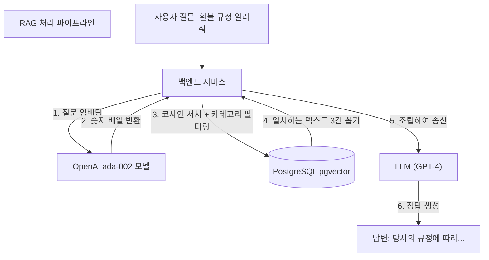

# 25강: RAG 구현 실습 (하이브리드 서치 시스템)

## 개요 
단순한 형태의 AI 챗봇은 자기가 아웃데이트(구형) 정보로 착각하여 없는 내용을 지어내는 환각(Hallucination) 현상을 겪습니다. 이를 해결하기 위해 회사만의 폐쇄된 도메인 데이터를 벡터로 밀어넣고, 사용자의 질문에 부합하는 문서(Context)를 추출한 뒤 이를 LLM에게 프롬프트로 덧대어(Augmented) 던져주는 시스템인 **RAG(Retrieval-Augmented Generation)** 의 백엔드 DB 측면 실무 설계와 **하이브리드 서치(Full-Text Search + Vector Search)** 구현 전략을 실습합니다.



## 사용형식 / 메뉴얼 

**1. DB 측단 검색 지식 통합 저장소(Vector Document Store) 테이블 수립**
메타데이터(필터링용 텍스트, 사용자 접근권한 ID, 날짜 범위), 원본 청크 텍스트, 그리고 1536차원의 벡터값을 한곳에 모아 하이브리드 인덱싱 아키텍처를 세웁니다.
```sql
CREATE EXTENSION IF NOT EXISTS vector;

CREATE TABLE corporate_knowledge (
    chunk_id BIGSERIAL PRIMARY KEY,
    tenant_id UUID NOT NULL,        -- B2B 보안용 식별자
    category VARCHAR(50),           -- HR, TECH, SALES 등 필터링 전용
    updated_date DATE,              -- 구/신규 문서 판별용
    chunk_text TEXT NOT NULL,       -- LLM에게 토스해 줄 생생한 원본 텍스트 조각
    embedding VECTOR(1536)          -- 유사도 서치를 뛸 벡터 덩어리
);

-- 검색 가속 메인 엔진들 장착
CREATE INDEX idx_corp_tenant ON corporate_knowledge (tenant_id);
CREATE INDEX idx_corp_hnsw ON corporate_knowledge USING hnsw (embedding vector_cosine_ops);
```

**2. DB 측단 사용자가 질문했을 때 날리는 단일 Retrieval(검색) 쿼리 뼈대**
RAG의 R (Retrieval) 과정은 온전히 DB의 코어를 태웁니다. 
```sql
SELECT chunk_text 
FROM corporate_knowledge
WHERE tenant_id = '우리회사코드ID' 
  AND category = 'HR'              
ORDER BY embedding <=> '[사용자의_질문을_임베딩한_배열]' ASC
LIMIT 3; 
```

## 샘플예제 5선 

[샘플 예제 1: 단순 벡터 서치의 맹점 (신/구 문서 오염 현상)]
- 과거 규정 문서와 새 규정 문서는 내용이 비슷하기 때문에 벡터 공간에서 뭉쳐 있습니다.
```sql
-- 과거의 폐기된 데이터까지 상위권에 잡혀 끌려 올라오는 문제 발견
SELECT updated_date, chunk_text FROM corporate_knowledge 
ORDER BY embedding <=> '[주택 자금 규정 필터]' LIMIT 3; 
```

[샘플 예제 2: 타임라인 메타데이터 필터링 결합]
- 무거운 HNSW 인덱스를 터치하기 전에, 모수 집단을 2024년 이후 수정된 새 문서만 남깁니다.
```sql
SELECT chunk_text, (embedding <=> '[질문_임베딩]') AS similarity
FROM corporate_knowledge
WHERE updated_date > '2024-01-01'
ORDER BY similarity ASC
LIMIT 3;
```

[샘플 예제 3: 권한 기반(ACL/RLS 연계) 검색 격리]
- A회사 직원이 물어봤을 땐 A회사의 사규만 나와야 합니다.
```sql
SELECT chunk_text
FROM corporate_knowledge
WHERE tenant_id = 'TENANT_A_ID'
ORDER BY embedding <=> '[질문_임베딩]' ASC 
LIMIT 3;
```

[샘플 예제 4: 임계값(Threshold) 거절 처리]
- 거리(Distance)가 0.2 미만으로 매우 견고한 정답 문서가 아닐 경우, 서치 결과를 텅 빈 채로 리턴합니다.
```sql
SELECT chunk_text, (embedding <=> '[비트코인_가격_임베딩]') AS dist
FROM corporate_knowledge
WHERE tenant_id = 'TENANT_A_ID'
  AND (embedding <=> '[비트코인_가격_임베딩]') < 0.20 
ORDER BY dist ASC;
```

[샘플 예제 5: 풀텍스트 서치(FTS) 와 벡터(VS)의 하이브리드 조합]
- 단순히 환불 이라는 키워드 자체를 찍어서 포함하는 강력한 텍스트 파워와, 문맥의 부드러움을 찾는 Vector 파워 양쪽을 각각 서브쿼리로 구하고 랭킹을 합산(Reciprocal Rank Fusion; RRF) 합니다. (상세 구현은 sample.sql에 수록)

## 주의사항 
- 벡터 서치와 `WHERE` 절 스칼라 데이터를 결합(Pre-Filtering) 할 때, 데이터 분포에 따라 HNSW 그래프 탐색이 다소 느려지는 한계가 존재합니다. Postgres 엔진이 갈팡질팡하지 않게 확실한 단일 Tenant 단위로 데이터를 파티셔닝 하는 것이 최선입니다.

## 성능 최적화 방안
[RAG 스루풋 방어를 위한 pgvector 하프-벡터(HALFVEC) 인덱싱 아키텍처]
```sql
-- 1. 디스크 공간, 램, HNSW 인덱싱 부담을 절반 가위치기 하는 차세대 구조 탑재
CREATE TABLE corp_knowledge_opt (
    chunk_id BIGSERIAL PRIMARY KEY,
    document_title VARCHAR(200),
    chunk_text TEXT,
    embedding HALFVEC(1536) 
);

-- 2. HNSW 그래프 그물 역시 HALF 용량으로 정교하게 짜여짐
CREATE INDEX idx_corp_half_hnsw 
ON corp_knowledge_opt USING hnsw (embedding halfvec_cosine_ops);
```
- **성능 개선이 되는 이유**: 실제 오픈 AI 챗봇이 서비스에 런칭되고 10만 치의 규정이 들어가면 일반 B-Tree 인덱스 대신 HNSW 그래프 인덱스가 서버의 모든 램을 먹어 치웁니다. `HALFVEC`을 사용하여 벡터 정밀도를 16비트로 떨어뜨리더라도, LLM이 문맥을 찾고 대답하는 성능 체감엔 거의 왜곡이 발생하지 않았습니다. 저장 효율과 인덱스 로드 I/O 병목을 단번에 2배 향상시켜 주는 극강의 세팅입니다.
