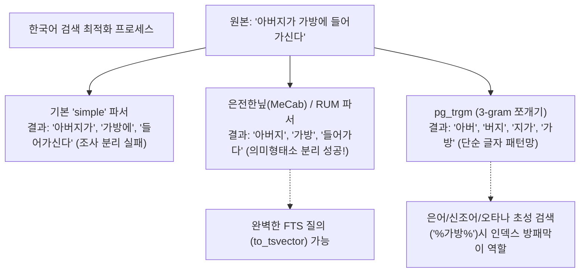

# 27강: 한국어 형태소 분석기 연동

## 개요 
PostgreSQL의 내장 Full-Text Search 엔진은 영어 사전(Dictionary) 위주로 설계되어 있어, 조사가 붙는 한국어("아버지가", "가방에")를 제대로 쪼개지(Tokenizing) 못합니다. 이 장에서는 한국어의 어근을 뽑아내는 가장 대표적인 두 가지 방식인 **은전한닢(morp)** 과 같은 외부 플러그인 컴파일 연동 방식과 확장 모듈 **pg_trgm(N-gram)** 을 이용한 초성/글자 단위 검색 접근법의 구조적 이해도를 높입니다.



## 사용형식 / 메뉴얼 

**1. pg_trgm 익스텐션 활성화 및 GIN 활용 (쉬운 형태)**
복잡한 컴파일 없이 바로 Postgres 만으로 "오타"와 `%Like%` 를 방어하고 싶을 때 쓰는 n-gram 도구입니다. 글자를 3개 단위(Tri-gram)로 잘라서 통계망을 만듭니다.
```sql
CREATE EXTENSION IF NOT EXISTS pg_trgm;

-- 게시판 제목 컬럼에 일반 GIN 이 아닌 trgm_ops 트리그램 인덱스를 덮어씌움
CREATE INDEX idx_board_title_trgm 
ON board USING GIN (title gin_trgm_ops);

-- 중간에 글자가 포함된 LIKE 검색을 해도 테이블 풀스캔을 면해버림
SELECT * FROM board WHERE title ILIKE '%가방%';
```

**2. 형태소 분석기 플러그인 설치 루틴 (아키텍처 관점)**
은전한닢(mecab-ko), PGroonga 부류의 플러그인은 Linux(DB 서버 머신)의 `루트 권한` 터미널에 접속하여 소스 코드를 빌드(`make & make install`)해야만 합니다. (AWS RDS에서는 별도로 지원하는 버전이나 파라미터를 사용해야 함)
```bash
# 터미널 OS 레벨 설치 개념도
wget https://bitbucket.org/eunjeon/mecab-ko/downloads/mecab-0.996-ko-0.9.2.tar.gz
make && sudo make install
...
```
```sql
-- OS 설치 후 DB 측 모듈 on
CREATE EXTENSION textsearch_ko; 

-- 파서 테스트
SELECT to_tsvector('korean', '치킨이 무지하게 맛있습니다요');
-- ('치킨':1 '맛있':2) 명사와 동사 원형만 축출됨.
```

## 샘플예제 5선 

[샘플 예제 1: 단순 공백 분리가 한국어에 미치는 치명적 맹점 파악]
- "호수" 를 찾으려고 쳤는데 조사 '에' 가 붙은 글을 영어 규격(simple)으로 찾으면 놓치게 됨.
```sql
SELECT to_tsvector('simple', '오리가 호수에 떠있다') @@ to_tsquery('simple', '호수'); 
-- 결과: false (영어 스페이스 기준 파싱은 '호수에' 를 하나의 긴 영단어로 취급함)
```

[샘플 예제 2: pg_trgm (Tri-gram) 의 글자 쪼개기 원리 관찰]
- 3글자씩 덩어리를 묶어서 배열을 리턴해 주어, 오타나 띄어쓰기 오류에도 너그럽게 검색을 찾아주는 퍼지(Fuzzy) 망입니다.
```sql
CREATE EXTENSION pg_trgm;
SELECT show_trgm('아버지가');
-- 결과: {"  아"," 아버","버지가","지가 "}  (이 조합들로 GIN 인덱스 방을 만듬)
```

[샘플 예제 3: Trigram 유사도 측정(<->, % 연산) 과 검색]
- "데이타베스" 처럼 오타가 심하게 나도 3글자 패턴 겹침의 확률 망을 뒤져서 "데이터베이스" 본문을 정답으로 찾습니다.
```sql
-- % 연산자는 Trigram이 판단할 때 철자가 일정 비율 이상 비슷하면(true) 건져올림
SELECT word, word <-> '데이타베스' AS typo_distance 
FROM dictionary_table
WHERE word % '데이타베스' 
ORDER BY typo_distance ASC;
```

[샘플 예제 4: 정식 한국어 파서가 깔렸을 때의 FTS 검색 (가상 시뮬레이션)]
- `korean` (또는 플러그인 이름) 파서로 변환하면 "떠있다" 란 글자에서 불용어 접두사 "어/있다" 를 끊고 원형 "뜨" / "오리" 명사를 분자화합니다.
```sql
SELECT to_tsvector('korean', '오리가 호수에 떠있다') @@ to_tsquery('korean', '호수'); 
-- 결과: true! (한국어 사전을 통해 '호수' + '에' 를 정확히 나눗셈함)
```

[샘플 예제 5: Trigram GIN 인덱스를 역이용한 ILIKE 풀스캔 면제 튜닝]
- `WHERE name ILIKE '%홍길%'` 같은 쿼리는 무조건 1천만 건의 데이터를 풀스캔합니다. 하지만 `gin_trgm_ops` 를 미리 걸어두면 인덱스 스캔을 타고 들어갑니다!
```sql
-- (주의: Trigram은 한 글자('%홍%') 짜리 검색엔 인덱스를 타지 못하고 무조건 3글자 조각 이상만 스캔 방어망이 발동됩니다.)
EXPLAIN 
SELECT * FROM users WHERE address ILIKE '%서울특별시 강남구%'; 
-- Index Scan using idx_users_address_trgm ... (완벽한 성능 통과!)
```

*(pg_trgm 설치 및 텍스트 빗겨치기 쿼리는 `sample.sql` 을 참조하세요)*

## 주의사항 
- `pg_trgm` GIN 인덱스는 문자열을 3글자 조각으로 다 찢어발겨 인덱스로 거대하게 보관하기 때문에, 원본 테이블 용량보다 인덱스 용량이 2배, 3배 더 커지는 엄청난 공간 낭비(Space Overhead)와 더불어 INSERT가 극심하게 느려지는 치명적인 단점이 존재합니다. 쓰기가 잦은 시스템에는 도입에 신중해야 합니다.
- 관리형 DB인 AWS RDS나 Aurora에서는 은전한닢(Mecab)을 루트 권한으로 수동 설치할 수 없으므로, 지원을 끊거나 다른 파서 호환팩을 우회 적용하는 등(아마존 측 메뉴얼) 각 퍼블릭 클라우드 사정마다 한국어 전문 검색의 제약 조건이 크게 다름을 인지해야 합니다.

## 성능 최적화 방안
[한국어 검색 구조의 최종 1티어 튜닝: ParadeDB (pg_search) 차용]
```sql
-- 1. [과거의 방식] Trigram 은 공간을 너무 많이 먹고, Mecab 은 클라우드 설치가 뚫기 어렵고 유지보수가 지옥입니다.

-- 2. [최신 인프라 설계] Postgres 전용 Rust 기반 'Elasticsearch' 대체 모듈인 ParadeDB(pg_search)를 도입하면, 
-- Postgres DB 테이블 바로 곁에 백그라운드로 루씬(Lucene/Tantivy) 급의 한국어 전용 Nori 파서를 통한 강력한 BM25 포맷이 붙습니다.
-- 즉, 28강 ~ 30강에서 배울 하이브리드 RAG 솔루션의 토크나이저를 아예 엘라스틱서치급으로 갈아치워 버리는 결단이 나옵니다.
```
- **성능 개선이 되는 이유**: 한국어는 어근과 조사의 분리, 스페이스 등 텍스트 파싱의 난이도가 영어의 수백 배입니다. PostgreSQL 에 기본 내장된 B-Tree나, FTS 파서들은 C언어 기반의 가벼운 탐색 수준에 머물러 있어 진성 검색 엔진(ElasticSearch/Solr)의 집요한 한국어 스코어링을 억지로 따라가려다 메모리와 디스크 공간이 폭발합니다. 때문에 한국어에 한정된 풀 텍스트 서치는 DB 내장 기능보다 최신 기술인 PG 전용 BM25 전문 확장 플러그인(`paradedb`)으로 책임을 확실히 위임하는 것이 아키텍트의 올바른 시선입니다.
