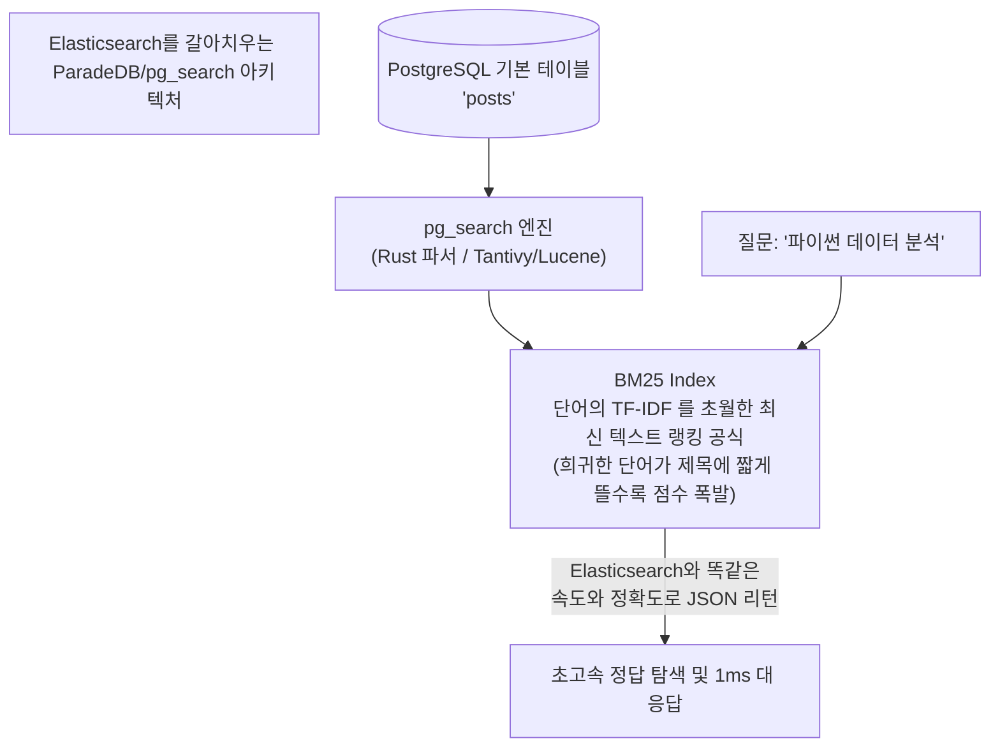

# 28강: pg_search 확장 활용 (ParadeDB 기반 BM25 전문 검색)

## 개요 
단순한 형태소 쪼개기(`to_tsvector`)나 조각내기(`pg_trgm`)만으로는 ElasticSearch 가 자랑하는 세계 최고 수준의 검색 알고리즘인 **BM25** (단어 빈도와 문서 길이를 결합한 최상급 스코어링 공식)를 따라갈 수 없습니다. 최근 PostgreSQL 진영에 혁명을 일으키고 있는, Postgres를 Elasticsearch처럼 만들어주는 Rust 기반 공식 확장 기능인 **ParadeDB (pg_search)** 의 코어 원리와 초고속 BM25 전문 검색 구현 방식을 학습합니다.



## 사용형식 / 메뉴얼 

**1. pg_search 익스텐션 활성화 및 BM25 인덱스 생성 (ParadeDB 환경 기준)**
이 플러그인은 클라우드 관리형(ParadeDB 등)이나 Docker에 장착되어 있다고 전제합니다. 테이블 옆구리에 루씬(Lucene/Tantivy) 급의 인덱스를 통째로 붙입니다.
```sql
CREATE EXTENSION IF NOT EXISTS pg_search;

-- posts 테이블의 id를 PK로 식별하고, title과 body 컬럼에 BM25 검색망 구축
CALL paradedb.create_bm25(
  index_name => 'idx_posts_bm25',
  table_name => 'posts',
  key_field => 'id',
  text_fields => '{title, body}'
);
```

**2. BM25 특수 문법 검색 (@@@ 연산자)**
기존 Postgres의 `@@` 연산자가 아니라, `pg_search` 전용의 `@@@` 오퍼레이터를 통해 백그라운드에 엮인 전문 검색 엔진에 "Elasticsearch 처럼 찾아줘!" 라고 질의합니다.
```sql
-- 'database' 라는 단어를 본문과 제목 등에서 긁어오기
SELECT id, title, body 
FROM posts 
WHERE id @@@ paradedb.parse('database');
```

**3. 검색 결과에 스코어(점수) 매기기 - paradedb.score()**
Elasticsearch에서 나오는 저마다의 _score 점수값을 그대로 끌고 수면 위로 올라옵니다. 가장 점수가 높은 녀석이 맨 위에 섭니다.
```sql
SELECT title, paradedb.score('idx_posts_bm25', id) AS bm25_score
FROM posts 
WHERE id @@@ paradedb.parse('postgres & optimization')
ORDER BY bm25_score DESC 
LIMIT 5;
```

## 샘플예제 5선 

[샘플 예제 1: BM25 인덱스 구성 및 텍스트/숫자 필터 등 다중 타입 인덱싱]
- 텍스트 뿐만 아니라, 검색할 때 필터로 사용할 날짜, 숫자, 카테고리도 인덱스 안에 욱여넣어 복합 검색(Pre-filtering)을 가능케 합니다.
```sql
CALL paradedb.create_bm25(
  index_name => 'idx_products_search',
  table_name => 'products',
  key_field => 'id',
  text_fields => '{name, description}',    -- 전문 검색(BM25) 치고 들어갈 영역
  numeric_fields => '{price, rating}'      -- 숫자 범위 컷오프용 (가격, 별점) 필드 등록
);
```

[샘플 예제 2: 가격 필터와 텍스트(BM25)의 무자비한 하이브리드 결합 서치]
- "스마트폰" 관련 문자 검색을 돌리면서, 가격(price)이 1000 불 이하인 제품만 ElasticSearch 스피드로 깎아내는 질의.
```sql
SELECT name, price, paradedb.score('idx_products_search', id) AS relevance
FROM products 
WHERE id @@@ paradedb.parse('name:smartphone AND price:<1000')
ORDER BY relevance DESC;
```

[샘플 예제 3: 띄어쓰기(Phrase) 정확도 매치 서치]
- "black dog" 라고 그냥 던지면 black 도 찾고 dog 도 흩어져 찾지만, 큰따옴표나 구문 전용 연산을 쓰면 "black dog" 란 글씨가 정확히 연달아 붙어 있는 덩어리를 콕 찍어 찾아냅니다. (Phrase Query)
```sql
SELECT title FROM posts 
WHERE id @@@ paradedb.parse('"machine learning"'); -- 따옴표 활용
```

[샘플 예제 4: 엘라스틱서치급의 형태소 오타 자동 방어 (Fuzzy Query: ~)]
- "databaase" 처럼 'a' 하나를 잘못 쳐서 스펠링이 틀렸어도, 물결표(`~`) 틸드 연산자를 붙이면 BM25 인덱스가 유도리를 발휘해 'database' 단어로 자의적 치환해서 정답을 살려냅니다.
```sql
SELECT title FROM posts 
WHERE id @@@ paradedb.parse('databaase~'); 
```

[샘플 예제 5: 하이라이팅(Highlighting) 기능 - 웹 검색 노출용]
- 구글 검색 결과 보면 제목 안에 `<em>데이터베이스</em>` 라고 단어가 노란색 칠해져 나옵니다. 백엔드가 할 일 없이 애초에 DB 검색 엔진단에서 HTML 태그를 씌워서 반환해 줍니다.
```sql
SELECT paradedb.highlight('idx_posts_bm25', id, 'body') AS snip_text 
FROM posts 
WHERE id @@@ paradedb.parse('cat OR dog');
-- 결과: "나는 <b>cat</b>을 키우고 옆집은 <b>dog</b>를..."
```

*(Elastic 문법과 Rust 기반 엔진을 태운 인덱스 동작의 쿼리 10선은 `sample.sql` 파일을 확인해주세요.)*

## 주의사항 
- `pg_search` (ParadeDB) 모듈은 아직 RDS 같은 폐쇄적인 완전 관리형 클라우드나 구버전 Postgres 환경(13 버전 이하)에는 임의로 올리기 힘든 최상급 서드파티 오픈소스입니다. 회사의 인프라 환경이 도커(Docker) 컨테이너 기반이거나 직접 구축한 EC2 서버일 때 그 잠재력이 폭발합니다.
- `BM25` 인덱스는 ElasticSearch 와 동일하게 데이터가 INSERT / UPDATE 되면 백그라운드 큐(큐워커)에서 인덱스 덩어리들을 결합하고 병합(Merge)하는 작업을 치릅니다. 실시간으로 글을 쓰자마자 0.1초 만에 바로 검색을 때리면 인덱스 동기화 렉(Lag)에 의해 아직 노출이 씹힐 수 있습니다(Eventually Consistent 룰). 

## 성능 최적화 방안
[데이터베이스 + 엘라스틱서치의 이중 아키텍처 박살내기 (통일화)]
```sql
-- 과거의 슬픈 IT 인프라 파이프라인 (RDBMS와 NoSQL 검색엔진의 강제 동거)
-- 1. 유저가 글을 씀 -> Postgres (INSERT) -> Kafka CDC 전송 -> Logstash 변환 -> ElasticSearch (PUT) 수신
-- 2. 장애 생김: ES 뻑남, Kafka 큐 막힘, RDBMS엔 글이 있는데 ES엔 글이 없어 유저가 화를 냄 (데이터 정합성 붕괴).

-- 최적화: 아키텍처의 혁명 (더 이상 나눌 필요가 없다)
-- pg_search(ParadeDB) 하나만 올리면 Postgres 안에서 모든 생태계가 종료. 
SELECT title, body, paradedb.score() 
FROM users 
WHERE id @@@ ... 
```
- **성능/운영 개선이 되는 이유**: PostgreSQL만으로는 Full-Text Search 의 스코어 순위/오타 방어 등 한계가 명확하여, 100만 유저가 넘어가는 IT 기업은 무조건 검색을 위해 옆에 거대한 ElasticSearch 분산 클러스터를 띄우고 데이터파이프라인 관리자(Data Engineer)를 달아 피말리는 데이터 동기화 동접 방어를 해야 했습니다. `pg_search(ParadeDB)` 플러그인은 RDBMS 테이블을 덮은 백그라운드에 Rust 컴파일러로 짠 루씬(Lucene/Tantivy) 스탠다드의 초거대 검색망을 다이렉트로 결박해 결합해버려, 별도의 ES 데이터베이스 클러스터 구축 비용 1,000만 원과 데이터 파편화 싱크 불량 이슈를 0(Zero)으로 소멸시키는 운영 최적화의 대혁명입니다.
