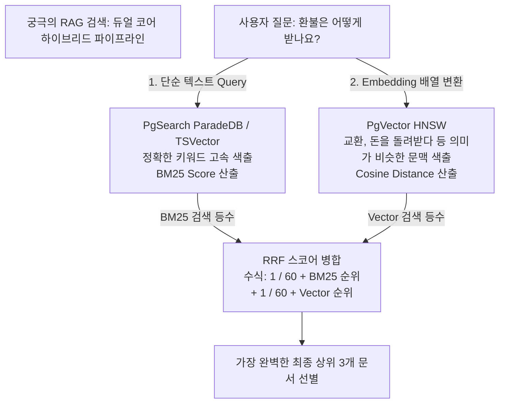

# 29강: 하이브리드 검색 구현 (Vector + Keyword)

## 개요 
사용자의 질문(프롬프트)에 "정확한 단어가 포함된 결과(Full-Text Search / BM25)"와 "단어는 다르지만 의미와 맥락이 비슷한 결과(Vector Similarity Search / pgvector)"를 완전히 결합시키는 아키텍처의 최종형, **하이브리드 서치(Hybrid Search)** 를 구현합니다. 두 가지 다른 세계의 랭킹 점수를 하나의 일관된 공식으로 도출하고 조합하는 **RRF (Reciprocal Rank Fusion)** 알고리즘을 SQL 레벨에서 깔끔하게 녹여냅니다.



## 사용형식 / 메뉴얼 

**1. [벡터 랭킹] 구하기 서브쿼리 모듈 (Vector Search)**
사용자의 1536차원 질문 배열에 대해, `HNSW` 인덱스를 타며 가장 코사인 각도가 비슷하게 좁힌(거리값이 작은) 놈들부터 줄을 세워서 `ROW_NUMBER()` 로 순위 번호표(1등, 2등...)를 발급합니다.
```sql
-- "환불은 어떻게 받나요?" 에 대한 질문 임베딩: [-0.1, 0.4, ...]
SELECT id, 
       ROW_NUMBER() OVER(ORDER BY embedding <=> '[-0.1, 0.4, ...]' ASC) as vector_rank
FROM knowledge_base
ORDER BY embedding <=> '[-0.1, 0.4, ...]' ASC 
LIMIT 50; -- 너무 깊게 찾지 않고 딱 상위 50개만 번호표 부여
```

**2. [키워드 랭킹] 구하기 서브쿼리 모듈 (BM25 or TSVector Search)**
질문에서 명사 키워드인 '환불' 이 들어간 문서를, `pg_search` 나 내장 `to_tsvector` 를 통해 빈도수와 정확도를 기반으로 줄을 세워서 역시 `ROW_NUMBER()` 번호표를 줍니다.
```sql
SELECT id, 
       ROW_NUMBER() OVER(ORDER BY paradedb.score('idx_kb_bm25_search', id) DESC) as keyword_rank
FROM knowledge_base
WHERE id @@@ paradedb.parse('환불')
ORDER BY keyword_rank ASC 
LIMIT 50; 
```

**3. RRF (Reciprocal Rank Fusion) 점수 결합**
RRF는 서로 다른 점수 체계를 가진 두 엔진(하나는 음수/양수 범위, 하나는 0~1 거리 범위)을 공평하게 합산하기 위해, "내가 몇 등을 했느냐" 는 절대 순위로 점수를 통일시키는 마법의 공식입니다. 
- 수학 공식: RRF = `1.0 / (K상수 + 키워드_순위) + 1.0 / (K상수 + 벡터_순위)` (상수 K는 보통 60 사용)
```sql
-- 두 엔진의 결과를 JOIN 시키고 공식을 돌림
SELECT COALESCE(1.0 / (60 + k_rank), 0.0) + COALESCE(1.0 / (60 + v_rank), 0.0) AS final_score
```

## 샘플예제 5선 

[샘플 예제 1: 단순 벡터 서치의 약점(Out-of-Vocabulary) 확인]
- 벡터 모델은 신조어나 특정 회사만의 품번/고유명사(예: "Galaxy S25 Ultra Plus 모델" 을 "핸드폰"으로 치부해버림)를 정확히 잡아내지 못하고 두루뭉술한(가산점 낮은) 문장을 잡아옵니다. 하이브리드의 당위성이 나타나는 순간입니다.

[샘플 예제 2: BM25 키워드 서치의 약점(Synonym) 확인]
- 반대로 키워드(BM25) 전용 엔진은 "돈을 돌려받고 싶어요" 라고 질문하면, 정답인 "환불 규정" 이라는 사규 문서에 '돈' 이라는 글자가 하나도 없어서 아예 검색 결과(0건)에서 탈락시켜 버립니다. (단어의 유의어/동의어 맥락을 모름)

[샘플 예제 3: CTE(공통 테이블 식) 를 이용한 하이브리드 결합 뼈대 (RRF)]
- 위의 두 약점을 상상도 못 할 파워로 상호 보완해 버리는 SQL의 꽃.
```sql
WITH keyword_search AS (
    -- 키워드 검색 엔진 (예: ts_rank) 상위 30위
    SELECT id, ROW_NUMBER() OVER(ORDER BY ts_rank(fts_tokens, to_tsquery('korean', '환불 | 정책')) DESC) as k_rank
    FROM kb WHERE fts_tokens @@ to_tsquery('korean', '환불 | 정책') LIMIT 30
),
vector_search AS (
    -- 의미망 벡터 검색 엔진 상위 30위
    SELECT id, ROW_NUMBER() OVER(ORDER BY embedding <=> '[사용자_질문_벡터]' ASC) as v_rank
    FROM kb ORDER BY embedding <=> '[사용자_질문_벡터]' LIMIT 30
)
SELECT k.id, k.k_rank, v.v_rank 
FROM keyword_search k 
FULL OUTER JOIN vector_search v ON k.id = v.id; -- 한쪽에만 검색된 것도 버리지 않기 위해 FULL JOIN 수행
```

[샘플 예제 4: COALESCE 를 이용한 RRF Null 방어 합산]
- 키워드로만 찾아지고 벡터로는 30위 밖으로 밀려서 v_rank 가 `NULL` 일 때, 에러나 감점이 아니라 해당 점수를 0점 처리하고 키워드 점수만 온전히 발라내는 합산 기술.
```sql
COALESCE(1.0 / (60 + k_rank), 0.0) + COALESCE(1.0 / (60 + v_rank), 0.0) AS rrf_total
```

[샘플 예제 5: 하이브리드 서치 속 오직 "한 부서(Category)"만 허용하는 메타 필터 장착]
- 전술(25강)한 바와 같이, 아무리 멋진 RRF를 짰어도 수천만 건에 태우면 늦습니다. 서브 쿼리 2개의 WHERE 절 안에 공통된 `Tenant_ID` 나 `Updated_Date` 범위를 박아버려 수만 건으로 모수를 축소시켜(Pre-filter) 부하를 죽여버려야 합니다.

*(가상의 RAG 실무 하이브리드 풀 세트 쿼리는 `sample.sql` 파일을 확인해주세요.)*

## 주의사항 
- `FULL OUTER JOIN` 은 대규모 집합에 사용 시 메모리 킬러가 됩니다. 그래서 반드시 서브쿼리(`WITH` 절 안) 에서 무지성 합성을 하지 말고, 각 엔진별로 `LIMIT 50` 또는 `LIMIT 100` 으로 결과물(행) 수를 단호하게 싹둑 잘라 축소한 채 꺼내와서 교집합/합집합을 맞춰야 서버가 터지지 않습니다.
- RRF 공식에서 K값(기본 60)은 키워드와 벡터 엔진의 "아웃라이어 점수 벌어짐"을 부드럽게 방어(스무딩)하는 역할을 합니다. 논문들의 결과에서 보편적으로 K=60 이 최적의 RAG 검색 만족도 점수를 이끌어냈습니다.

## 성능 최적화 방안
[응답이 느리면 LLM 이 무너진다 - 벡터 병렬 스캐닝 한도(ef_search) 다운 그레이드]
```sql
-- 1. [문제 발생] RRF 는 서브 쿼리를 2개 다 돌려야 하므로 검색 속도가 단일 대비 1.5배~2배 정도 느려집니다.
-- 사용자는 챗봇이 2초 이상 검색중 핑핑이를 돌리면 탭창을 꺼버립니다 (UX 최악).

-- 2. [최적화 튜닝] HNSW 벡터 엔진의 탐욕스러운 깊이 탐색 한계점을 확 떨궈 타협하기
SET LOCAL hnsw.ef_search = 15; -- (기본 40에서 15로 떨구기)

-- 3. BM25 키워드 서치 역시 최적화 
SET LOCAL work_mem = '32MB';

-- 4. 그 직후에 RRF 쿼리 실행
SELECT RRF_HYBRID_QUERY ... 
```
- **성능 개선이 되는 이유**: 하이브리드 검색의 위대함은 두 검색 엔진이 서로의 부족함을 순위(Rank)로 폭풍처럼 덮어씌워 보완(Fusion)한다는 점에 있습니다. 즉, 벡터 검색 엔진 쪽에서 내가 찾으려는 정답이 탐색이 짧게 끝나 30위나 50위 밖으로 약간 밀려나(Recall 하락) 있더라도, 키워드 검색 엔진(BM25)이 바깥쪽 풀에서 기가 막히게 그 문서를 식별해 1위로 끌어올려 합산 시켜 줍니다. 따라서 **단일 벡터 검색의 정확도를 위해 HNSW 탐색 망을 무겁게 잡지 말고(`ef_search 낮춤`), 아주 얕고 빠르게만 스캔(속도 극강화)하도록 옵션을 낮추어도 최종 결합 정답 퀄리티(Accuracy)는 거의 안 떨어집니다. 이것이 하이브리드의 힘입니다.**
