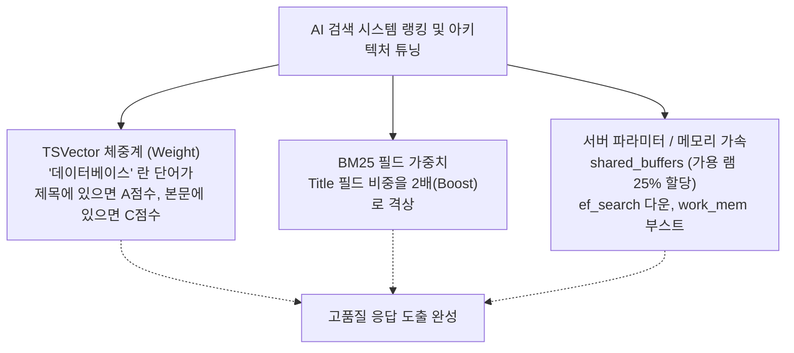

# 30강: 검색 성능 및 랭킹 튜닝 (RAG Q&A 프로젝트)

## 개요 
단순히 "된다" 를 넘어 "상용화 가능한 퀄리티의 빠른 서비스"를 달성하기 위해, 하이브리드 AI 검색의 등수(랭킹)를 조율하고 메모리를 파라미터단에서 제어하는 **RAG(Retrieval-Augmented Generation) 시스템의 백업 튜닝**을 총망라합니다. 문서의 특정 컬럼(제목 vs 본문)에 더 큰 수학적 가중치(Weight)를 부여하고, 시스템 캐시 스왑 등을 막아 밀리초 단위의 챗봇 쾌적성을 보장하는 기술이 적용된 최종장입니다.



## 사용형식 / 메뉴얼 

**1. [내장 FTS 방식 튜닝] TSVector 글자에 위치 태그(A, B, C, D) 달기 (가중치)**
제목, 키워드 해시태그 등은 본문 내용보다 훨씬 더 중요하게 대우받아야 합니다. 파싱 과정에서 제목에는 `A`등급, 본문에는 `D`등급을 꼬리표로 쥐여주고 합체시킵니다.
```sql
UPDATE my_knowledge 
SET rank_tokens = 
    setweight(to_tsvector('korean', title), 'A') || 
    setweight(to_tsvector('korean', content), 'D');
```

**2. [내장 FTS 방식 튜닝] 검색 순위(ts_rank) 에 스코어링 반영**
그냥 검색(`@@`)만 하는 게 아니라, `ts_rank` 를 돌릴 때 `A`등급 단어에 수학적으로 엄청난 가산점(예를 들어 수십배 뻥튀기)을 줘서 제목에 일치한 문서를 최상단에 강력히 꽂아버립니다. (이를 하지 않으면 너무 긴 스팸 문서가 검색 1등 먹는 지옥의 핑핑이가 됩니다)

**3. [pg_search 튜닝] 필드별 부스트(Boost) 부여 (ParadeDB BM25 기준)**
BM25 에서는 텍스트 필드를 정의할 때 아예 옆에 `^2` (가중치 2배 상승), `^0.5` (중요도 반감) 같은 점수 펌핑 수식을 적어 둡니다. (문법은 Elasticsearch 와 100% 흡사)
```sql
SELECT title, paradedb.score() 
FROM my_knowledge
WHERE id @@@ paradedb.parse('title:검색어^2.0 OR content:검색어');
-- 제목에 맞은 녀석 스코어를 2배로 뻥튀기!
```

## 샘플예제 5선 

[샘플 예제 1: 문서 태깅 등급 가중치를 통한 오정렬 방어]
- AI 챗봇의 "RAG 힌트 윈도우 조립(Context Injection)" 시, 제목(A)에 "연차 규정" 이라 쓰인 글이 내용 중간에 어쩌다 "연차"가 들어간 구내식당 식단표 공지(C)를 뚫고 올라옵니다.
```sql
-- title(A등급) 1번 일치 vs content(D등급) 1번 일치 -> A가 무조건 1등
SELECT title, 
       ts_rank(rank_tokens, to_tsquery('연차')) AS relevancy 
FROM my_knowledge 
ORDER BY relevancy DESC;
```

[샘플 예제 2: BM25 와 Vector RRF 검색 최종 조립의 K상수 다이어트]
- 29강에서 배운 하이브리드 `RRF = 1 / (K + Rank)` 공식의 상수 K=60 대신, 데이터 종류나 쪼개진 AI 청크(Chunk)량에 따라 K=10, K=100 등 실험(A/B 테스트)을 통해 랭킹 분포도를 최적화합니다. K가 낮으면 상위권 문서들의 점수 격차가 팍팍 벌어지고, 높으면 부드럽게 모든 문서가 도토리 키재기가 됩니다.

[샘플 예제 3: 검색 정합성 보장을 위한 텍스트 청킹(Chunking) 사이즈 통일]
- 한 문서가 1만 자(100 페이지짜리 PDF)면 단어가 너무 꽉 차 있어 BM25 검색을 하면 항상 1등 먹습니다. 한 문서당 512~1000토큰(글자 수 300~500 단어) 정도로 텍스트 파이프라인에서 쪼개서 `chunk_id 1, 2, 3...` 으로 DB에 밀어 넣어야 모든 문서 청크 간의 크기가 규격화되어 공정한 벡터/BM25 랭킹 승부가 발생합니다.

[샘플 예제 4: HNSW + BM25 + 메타 권한/날짜 필터 결합 = 현업의 가장 무거운 쿼리를 가볍게]
- 아무리 좋은 하이브리드라도 CPU 사용량이 어마합니다.
```sql
-- 1. 무조건 Tenant 나 권한 ID, 날짜 단위의 범위를 먼저 잘라버려야 인덱스 이점을 챙깁니다.
WHERE company_id = 999 
  AND published_date > CURRENT_DATE - INTERVAL '1 year'
```

[샘플 예제 5: 하프 벡터(HALFVEC) + 디스크의 영혼을 끌어 쓰는 메모리 튜닝 (postgresql.conf)]
- 실질적인 물리 엔진 레벨에서의 방어력 향상 세팅입니다 (아래 성능 튜닝 섹션 참조).

*(A/B 가중치 조합 랭킹 쿼리와 시스템 부스트는 `sample.sql` 파일을 확인해주세요.)*

## 주의사항 
- HNSW 와 같은 1536차원 이상의 복잡한 **벡터 데이터베이스(Vector DB)나 그래프 인덱스**는 사실상 RAM 에 적재(캐시) 되어 있을 때만 압도적인 검색 속도와 ANN 알고리즘의 진가가 발휘됩니다. 만약 RAM(shared_buffers)이 부족하여 데이터베이스가 SSD(혹은 HDD)에서 매 쿼리마다 벡터를 스왑(Swap/Read)하기 시작하면 IO Wait 타임아웃 지옥이 펼쳐지고 하이브리드 쿼리는 즉각 0.05초가 20초 응답 속도로 사망(Spike)하게 됩니다. 하드웨어 스펙 투자가 핵심입니다.
- HNSW 인덱스 옵션(`m`, `ef_construction`)을 너무 촘촘하게(크게) 잡으면 인덱스 용량 비대화로 RAM 밖으로 밀려나는(Eviction) OOM 직행 열차를 탑니다. 적당한 성능 타협이 기술입니다.

## 성능 최적화 방안
[데이터베이스 서버 파라미터 (postgresql.conf) 영혼의 최후 튜닝 - 벡터 머신 스펙업]
```bash
# 1. Shared Buffers 펌핑
# 가용 시스템 RAM의 약 25% ~ 40% 할당 (예: 64GB 램 서버면 16GB)
shared_buffers = 16GB

# 2. HNSW와 Sort 연산 캐시를 위해 1 커넥션당 쏟아부을 작업 램 개방
# 복잡한 하이브리드 RRF 교집합 JOIN 도 이 위에서 폭주하듯 빠르게 수행됨
work_mem = 64MB        # (기본 4MB에서 극적 부스트)

# 3. 디스크가 빠르다는 것을(NVMe SSD) Optimizer 에게 어필
# 무작위 읽기 비용(Random Page Cost)을 순차 읽기 비용(Seq Page Cost) 수준으로 떨어뜨리기
random_page_cost = 1.1 # (기본 4.0을 버리고 거의 1에 맞춰 SSD의 이점을 빨아먹음)

# 4. HNSW 그물망 탐색 범위를 살짝 내려 RAM 부하 제거
# (앱 구동이나 DB 세션 단위의 스크립트로 제어)
SET hnsw.ef_search = 15;
```
- **성능 개선이 되는 이유**: `random_page_cost` 를 내려주면 "디스크 여기저기 흩어진 점(그래프, 역색인 GIN)을 읽어오는 행위가 그리 비싸지 않네!" 라며 옵티마이저가 인덱스를 아주 광적으로 선호하고 타게 됩니다 (즉, 최신 SSD 시대의 필수 튜닝). 나아가 `shared_buffers` 에 HNSW 덩어리와 BM25 단어 사전을 몽땅 올려두고, 연결 세션 단위의 `work_mem` 을 넉넉히 주어 무거운 하이브리드 정렬(`ORDER BY 코사인 랭킹 + 텍스트 랭킹`)을 디스크 스왑 파일이 아닌 RAM 위에서 통틀어 쳐내 버리면 궁극의 검색 퍼포먼스(Latency < 30ms 이하)를 완성해 냅니다.
