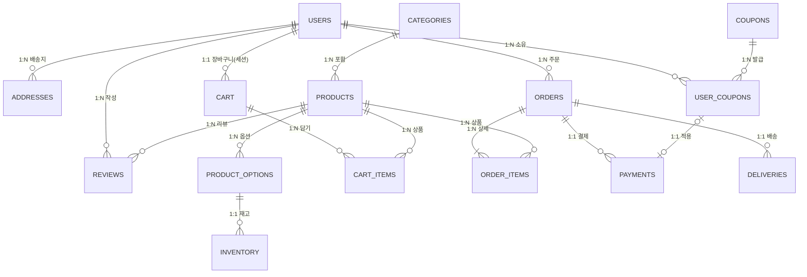

# 31강: 쇼핑몰 요구사항 도출 및 논리적 ERD 설계

## 개요 
이번 31강에서는 PostgreSQL의 고급 스킬(JSONB, 파티셔닝, GIN 인덱스, 동시성 제어, 전문 검색 FTS 등)을 종합적으로 활용하기 위해, 현업 이커머스 쇼핑몰의 요구사항을 분석하고 논리적 ERD(Entity Relationship Diagram)를 설계하는 개념 단계를 다룹니다. 총 15개의 핵심 테이블을 구상하며, 회원, 상품, 장바구니, 주문, 결제, 리뷰의 6개 주요 도메인을 설계합니다.

## 사용형식 / 메뉴얼 
논리적 ERD는 다대다(N:M) 관계를 해소하고 1:N 관계로 풀어내는 정규화 과정을 거칩니다. Mermaid를 사용하여 설계된 구조를 다이어그램으로 표기합니다.



## 샘플예제 5선 

[샘플 예제 첫번째] 논리적 설계를 위한 회원(users) 골격 생성
```sql
-- 회원 테이블 DDL 스케치
CREATE TABLE users (
    user_id UUID PRIMARY KEY,
    email VARCHAR(255) UNIQUE NOT NULL,
    password_hash VARCHAR(255) NOT NULL,
    role VARCHAR(50) DEFAULT 'CUSTOMER',
    created_at TIMESTAMP DEFAULT CURRENT_TIMESTAMP
);
```
- 샘플 예제 설명: UUID를 기본키로 사용하는 일반 회원 테이블의 기본 설계입니다.

[샘플 예제 두번째] 카테고리(categories) 계층 구조 테이블 설계
```sql
-- Ltree를 활용할 카테고리 테이블
CREATE EXTENSION IF NOT EXISTS ltree;

CREATE TABLE categories (
    category_id SERIAL PRIMARY KEY,
    name VARCHAR(100) NOT NULL,
    path ltree NOT NULL
);
```
- 샘플 예제 설명: Ltree 확장을 사용하여 대/중/소 분류를 무한 뎁스로 처리할 수 있는 카테고리 테이블입니다.

[샘플 예제 세번째] 상품(products)과 JSONB 옵션
```sql
-- 상품 및 옵션 테이블 설계
CREATE TABLE products (
    product_id UUID PRIMARY KEY,
    category_id INT REFERENCES categories(category_id),
    title VARCHAR(200) NOT NULL,
    price NUMERIC(10, 2) NOT NULL,
    attributes JSONB
);
```
- 샘플 예제 설명: 가변적인 상품 특성(색상, 사이즈 등)을 JSONB 형태로 유연하게 저장합니다.

[샘플 예제 네번째] 주문(orders) 파티셔닝 계획
```sql
-- 월별 파티셔닝을 위한 주문 테이블 뼈대
CREATE TABLE orders (
    order_id UUID NOT NULL,
    user_id UUID REFERENCES users(user_id),
    total_amount NUMERIC(12, 2) NOT NULL,
    status VARCHAR(50) DEFAULT 'PENDING',
    order_date TIMESTAMP NOT NULL
) PARTITION BY RANGE (order_date);
```
- 샘플 예제 설명: 시간에 따라 급증하는 주문 데이터를 분산하기 위한 Range 파티셔닝 구조입니다.

[샘플 예제 다섯번째] 결제(payments) 시 쿠폰 연동
```sql
-- 결제 테이블 스케치
CREATE TABLE payments (
    payment_id UUID PRIMARY KEY,
    order_id UUID REFERENCES orders(order_id),
    coupon_id UUID NULL, -- User_Coupons FK
    amount_paid NUMERIC(12, 2) NOT NULL,
    payment_method VARCHAR(50),
    paid_at TIMESTAMP
);
```
- 샘플 예제 설명: 주문과 1:1로 매핑되며 쿠폰 할인 처리를 위해 쿠폰 적용 내역을 기록하는 결제 테이블입니다.

## 주의사항 
- 식별자로 UUID를 사용할 경우, B-Tree 인덱스의 특성 상 순차적인 삽입이 이뤄지지 않아 페이지 분할(Page Split)이 빈번해질 수 있습니다. v7 UUID를 고려하는 것이 좋습니다.
- JSONB 내부에 검색 조건으로 자주 사용되는 필드는 GIN 인덱스를 생성해야합니다.

## 성능 최적화 방안
[UUID v7 활용을 통한 B-Tree 최적화]
```sql
-- PostgreSQL 17 혹은 커스텀 함수로 순차적 UUID 생성
-- 정렬 가능한 UUID 사용 예시
```
- 성능 개선이 되는 이유: 시간 순으로 정렬된 UUID를 사용하면 B-Tree 인덱스에 데이터 추가 시 단편화를 줄이고 Write 퍼포먼스를 크게 향상시킬 수 있습니다.
